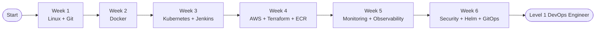

# DevOps Starter Kit — Learning Path

---

## Outcomes

| Week | You Can |
|------|---------|
| 1 | Navigate Linux, write shell scripts, manage code with Git |
| 2 | Containerise any app, write Dockerfiles, run multi-service stacks |
| 3 | Deploy to Kubernetes, build a full CI/CD pipeline with Jenkins |
| 4 | Provision AWS infrastructure as code with Terraform |
| 5 | Add metrics, logs, and alerts — see what is happening in production |
| 6 | Harden with RBAC, package with Helm, deploy via GitOps |

---

## Prerequisites

- Basic computer skills (no coding experience required)
- A computer running Linux, macOS, or Windows with WSL2
- Free accounts: [GitHub](https://github.com), [Docker Hub](https://hub.docker.com), [AWS Free Tier](https://aws.amazon.com/free)

---

## How Long Does It Take?

Designed for **4–6 hours per day** of focused practice:

- 6 weeks to complete all content
- Capstone project goes on your resume and GitHub portfolio

At 1–2 hours per day, expect 12–14 weeks.

---

## What to Do After This

- **Programming** — Python for automation and scripting, Go for tooling and CLIs
- **Cloud Certifications** — AWS Solutions Architect Associate, CKA
- **Advanced GitOps** — Flux, Argo Rollouts
- **Platform Engineering** — Backstage, internal developer portals
- **Service Mesh** — Istio, Linkerd
