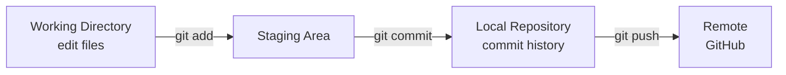

# Day 4 — Git Basics

## Why Git?

Git solves three problems:
1. **History** — track every change ever made and who made it
2. **Collaboration** — multiple people can work on the same codebase without overwriting each other
3. **Recovery** — you can always go back to a working version

**Git** is the tool. **GitHub/GitLab/Bitbucket** are websites that host Git repositories. They are not the same thing.

---

## Core Concepts

- **Repository (repo)** — a folder that Git is tracking
- **Commit** — a saved snapshot of your changes
- **Branch** — a separate line of development
- **Staging area (index)** — where you prepare changes before committing
- **Remote** — a copy of the repo on a server (e.g., GitHub)

---

## Setup

```bash
# Set your identity (required before first commit)
git config --global user.name "Ankit Singh"
git config --global user.email "ankit@example.com"

# Set default editor
git config --global core.editor "vim"
git config --global core.editor "nano"  # Use this instead if you're not comfortable with vim

# Verify config
git config --list
```

---

## Starting a Repository

```bash
# Start fresh
mkdir my-project && cd my-project
git init

# Clone an existing repo
git clone https://github.com/username/repo.git
git clone git@github.com:username/repo.git   # SSH (preferred)
```

---

## The Basic Workflow



```bash
# 1. Check what changed
git status

# 2. See the actual changes
git diff                    # Changes not yet staged
git diff --staged           # Changes staged but not committed

# 3. Stage your changes
git add file.txt            # Stage a specific file
git add .                   # Stage all changes (use carefully)
git add -p                  # Interactively choose what to stage (advanced — learn after you're comfortable with git add .)

# 4. Commit
git commit -m "feat: add login endpoint"

# 5. Push to remote
git push origin main
```

---

## Writing Good Commit Messages

A good commit message tells future-you (and teammates) **why** the change was made.

**Format:**
```
<type>: <short summary in imperative mood>

<optional body — what and why, not how>
```

**Types:**
- `feat` — new feature
- `fix` — bug fix
- `docs` — documentation change
- `refactor` — code change that neither fixes a bug nor adds a feature
- `chore` — maintenance (dependencies, configs)
- `ci` — CI/CD changes

**Good examples:**
```
feat: add health check endpoint for load balancer
fix: correct S3 bucket policy for cross-region access
docs: add setup instructions to README
chore: upgrade nginx from 1.22 to 1.24
```

**Bad examples:**
```
fix stuff
wip
changes
update
```

---

## Branches

Branches let you work on features or fixes without touching the main codebase.

```bash
# List branches
git branch              # Local branches
git branch -a           # All branches including remote

# Create and switch to a new branch
git checkout -b feature/add-login

# Switch between branches
git checkout main
git switch main         # Modern syntax

# Merge a branch into current branch
git merge feature/add-login

# Delete a branch
git branch -d feature/add-login        # Safe delete (won't delete if unmerged)
git branch -D feature/add-login        # Force delete
git push origin --delete feature/add-login  # Delete remote branch
```

### Why Branches?

Without branches everyone commits directly to `main`, causing constant conflicts and broken code. With branches:

- `main` — always working, production-ready code
- `feature/xxx` — new features in development
- `fix/xxx` — bug fixes
- `release/xxx` — release preparation

---

## Viewing History

```bash
git log                       # Full commit history
git log --oneline             # One line per commit
git log --oneline --graph     # With branch visualization
git log --oneline -10         # Last 10 commits
git log -- file.txt           # History for a specific file
git show abc1234              # Show changes in a specific commit
git blame file.txt            # Who last changed each line
```

---

## Undoing Changes

```bash
# Discard changes in working directory (not staged)
git restore file.txt          # Modern syntax
git checkout -- file.txt      # Old syntax

# Unstage a file (keep changes)
git restore --staged file.txt

# Undo last commit (keep changes staged)
git reset --soft HEAD~1

# Undo last commit (keep changes unstaged)
git reset HEAD~1

# Create a new commit that reverses a previous one (safe for shared branches)
git revert abc1234
```

---

## .gitignore

Tell Git which files to never track.

```bash
# Create .gitignore in repo root
touch .gitignore
```

Common `.gitignore` patterns:

```gitignore
# Dependencies
node_modules/
vendor/

# Build output
dist/
build/
*.o
*.pyc
__pycache__/

# Environment and secrets
.env
.env.local
*.pem
*.key

# OS files
.DS_Store
Thumbs.db

# IDE files
.idea/
.vscode/
*.swp
```

**Important:** If you accidentally committed a secret, removing it from `.gitignore` and the file isn't enough — it's in the history. You need to rotate the secret immediately.

---

## Naming Conventions

| Style | Example | Use case |
|-------|---------|----------|
| kebab-case | `my-feature` | Branch names, file names |
| snake_case | `my_variable` | Python variables, file names |
| camelCase | `myVariable` | JavaScript variables |
| PascalCase | `MyClass` | Class names |
| UPPER_CASE | `MAX_RETRIES` | Constants |

Branch names should be: `type/short-description`
- `feature/user-authentication`
- `fix/login-redirect-bug`
- `chore/upgrade-dependencies`

---

## Exercises

1. Create a new directory, initialize a Git repo, and make 3 commits.
2. Create a branch called `feature/hello`, add a file, commit, and merge it back to `main`.
3. Write a `.gitignore` that excludes `.env` files and `node_modules/`.
4. Use `git log --oneline --graph` to visualize your commit history.
5. Make a bad commit, then undo it with `git reset HEAD~1`.
6. Practice writing 5 proper commit messages for these scenarios: adding a README, fixing a typo, adding a health check route, upgrading a package, removing unused code.

---

## Key Takeaways

- **Stage → Commit → Push** is the daily workflow
- Commit messages should explain **why**, not what
- Always branch off `main` for new work
- `.gitignore` your secrets, dependencies, and build artifacts
- `git log --oneline --graph` is your best friend for understanding history
