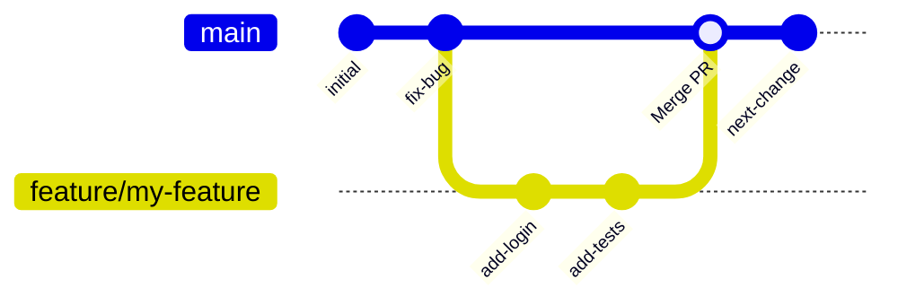

# Day 5 — GitHub and Team Collaboration

## Git vs GitHub

| Git | GitHub |
|-----|--------|
| The tool that tracks changes | The website that hosts repos |
| Runs on your machine | Runs in the cloud |
| Free, open source | Free (with paid tiers) |
| Works without internet | Needs internet |

Alternatives to GitHub: **GitLab**, **Bitbucket**, **Gitea** (self-hosted).

---

## Connecting to GitHub via SSH

Using SSH is more secure than HTTPS and doesn't require a password each time.

```bash
# 1. Generate an SSH key (if you haven't already)
ssh-keygen -t ed25519 -C "your_email@example.com"

# 2. Copy your public key
cat ~/.ssh/id_ed25519.pub

# 3. Add it to GitHub:
#    GitHub → Settings → SSH and GPG keys → New SSH key → Paste

# 4. Test the connection
ssh -T git@github.com
# Expected: "Hi username! You've successfully authenticated..."
```

---

## The Pull Request Workflow

This is how professional teams work with Git. No one pushes directly to `main`.



**Step by step:**

```bash
# 1. Create a branch from main
git checkout main
git pull origin main           # Always start from latest
git checkout -b feature/add-login

# 2. Make your changes and commit
# ... edit files ...
git add .
git commit -m "feat: add login endpoint with JWT auth"

# 3. Push your branch to GitHub
git push origin feature/add-login

# 4. Open a Pull Request on GitHub
# Go to GitHub → your repo → "Compare & pull request" button

# 5. After PR is merged, clean up
git checkout main
git pull origin main
git branch -d feature/add-login
```

---

## Writing a Good Pull Request

### PR Title

Same rules as commit messages — short, imperative, clear.

```
# Good
feat: add user authentication with JWT
fix: resolve race condition in deployment script

# Bad
WIP
my changes
updates
```

### PR Description

A good PR description answers:
1. **What** does this change do?
2. **Why** is it needed?
3. **How** was it tested?
4. **Anything** reviewers should pay attention to?

**Template:**

```markdown
## What
Brief description of the changes.

## Why
Context: why is this needed? Link to ticket if applicable.

## How to Test
1. Step one
2. Step two
3. Expected result

## Notes
- Any breaking changes?
- Any follow-up work needed?
- Screenshots if UI changed
```

---

## Merge Strategies

When merging a PR, you have three options. Know the difference.


### 1. Merge Commit (Create a merge commit)

- Preserves all commits from the feature branch
- Creates an extra "merge commit" (M)
- History shows exactly when branches diverged and merged
- **Use when:** you want to preserve full history

### 2. Squash and Merge


- All feature branch commits become **one** commit on main
- Clean, linear history
- Individual commits from the branch are lost
- **Use when:** feature branch has messy WIP commits you want to clean up

### 3. Rebase and Merge


- Feature commits are replayed on top of main
- Perfectly linear history, no merge commit
- Changes commit SHAs
- **Use when:** your team prefers linear history and you rebase regularly

**Recommendation for beginners:** Use **Squash and Merge** for small features. Use **Merge Commit** for long-running feature branches.

---

## Resolving Merge Conflicts

A conflict happens when two people change the same line in the same file.

```bash
git merge feature/other-branch
# ERROR: Merge conflict in app.py
```

Open the conflicted file and look for conflict markers:

```python
<<<<<<< HEAD
return "hello from main"
=======
return "hello from feature"
>>>>>>> feature/other-branch
```

- `HEAD` = your current branch (main)
- Below `=======` = the incoming branch (feature)

**Resolve it:**
1. Edit the file to keep what you want (delete the markers)
2. `git add app.py`
3. `git commit -m "resolve merge conflict in app.py"`

---

## Tags

Tags mark specific points in history — usually releases.

```bash
# Create a tag
git tag v1.0.0                             # Lightweight tag
git tag -a v1.0.0 -m "Initial release"     # Annotated tag (recommended)

# List tags
git tag

# Push tags to GitHub
git push origin v1.0.0         # Push specific tag
git push origin --tags         # Push all tags

# Delete a tag
git tag -d v1.0.0
git push origin --delete v1.0.0

# Checkout a tag (creates detached HEAD)
git checkout v1.0.0
```

**Semantic versioning** — `MAJOR.MINOR.PATCH`:
- `v1.0.0` → first stable release
- `v1.1.0` → new feature (backwards compatible)
- `v1.1.1` → bug fix
- `v2.0.0` → breaking change

---

## Remote Operations

```bash
git remote -v                        # View remotes
git remote add origin git@github.com:username/repo.git

git fetch origin                     # Download changes without merging
git pull origin main                 # Fetch + merge
git pull --rebase origin main        # Fetch + rebase (cleaner)

git push origin main                 # Push to main
git push -u origin feature/my-branch # Push and set upstream tracking
```

---

## Exercises

1. Create a repo on GitHub. Clone it using SSH.
2. Create a branch `feature/readme-update`, edit the README, push the branch, and open a Pull Request.
3. In the PR description, write a proper what/why/how-to-test section.
4. Merge the PR using Squash and Merge. Check the commit history on main.
5. Create a tag `v0.1.0` on your main branch and push it to GitHub.
6. Simulate a merge conflict: create two branches that both edit the same line, merge one into main, then try to merge the second one. Resolve the conflict.

---

## Key Takeaways

- Never commit directly to `main` — always use a branch + PR
- PR description = communication to your team, not just a formality
- Know the three merge strategies and when to use each
- Tags mark releases — use semantic versioning
- SSH is better than HTTPS for GitHub authentication
