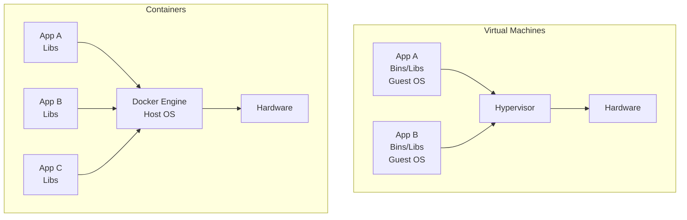
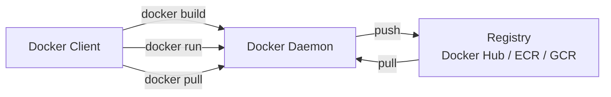

# Day 6 — What is Docker?

## The Problem Docker Solves

> "It works on my machine."

Before containers, deploying an application meant:
- Installing the right version of Python/Node/Java on every server
- Managing conflicting dependencies across applications
- Different behavior between dev, staging, and production environments

Docker packages your application **and everything it needs** into a single, portable unit called a **container**.

---

## Containers vs Virtual Machines

| | Virtual Machine | Container |
|--|----------------|-----------|
| What it virtualizes | Entire hardware (CPU, RAM, disk) | Just the application and its dependencies |
| Size | Gigabytes | Megabytes |
| Startup time | Minutes | Seconds |
| Isolation | Full OS isolation | Process-level isolation |
| Overhead | High | Very low |
| Use case | Run different operating systems | Run different applications on same OS |

**Key insight:** Containers share the host OS kernel. They are just processes running in isolation. VMs have their own kernel.



---

## Docker Architecture



**Components:**
- **Docker Client** — the `docker` command you type
- **Docker Daemon** (`dockerd`) — the background service that does the work
- **Image** — a read-only template (like a class in OOP)
- **Container** — a running instance of an image (like an object)
- **Registry** — a place to store and share images (Docker Hub, AWS ECR, etc.)

---

## Installing Docker

### Ubuntu / Debian

```bash
# Remove old versions
sudo apt remove docker docker-engine docker.io containerd runc

# Install
sudo apt update
sudo apt install -y ca-certificates curl gnupg
curl -fsSL https://get.docker.com | sudo sh

# Run Docker without sudo
sudo usermod -aG docker $USER
newgrp docker
# Or log out and back in — group membership won't apply to existing terminal sessions

# Verify
docker --version
docker run hello-world
```

### Verify Installation

```bash
docker version          # Client and server version
docker info             # Detailed system info
docker run hello-world  # Download and run test container
```

---

## Core Concepts

### Image

An image is a blueprint for a container. It's built in layers (we'll cover this on Day 8).

```bash
docker images           # List local images
docker pull nginx       # Download nginx image from Docker Hub
docker pull ubuntu:22.04 # Specific version (tag)
docker rmi nginx        # Remove an image
```

### Container

A container is a running image.

```bash
docker run nginx                    # Run nginx (stays in foreground)
docker run -d nginx                 # Run in background (detached)
docker run -d -p 8080:80 nginx      # Map port 8080 on host to 80 in container
docker run -it ubuntu:22.04 bash    # Interactive terminal inside container

docker ps                   # List running containers
docker ps -a                # List all containers (including stopped)
docker stop <id or name>    # Stop a container
docker start <id or name>   # Start a stopped container
docker rm <id or name>      # Delete a container
docker rm -f <id or name>   # Force delete (even if running)
```

### Useful Run Flags

```bash
docker run \
  -d \                        # Detached (background)
  -p 8080:80 \               # Port mapping (host:container)
  -v /data:/app/data \       # Volume mount (host:container)
  --name myapp \             # Give the container a name
  --env DATABASE_URL=... \   # Set environment variable
  --restart always \         # Always restart if it crashes
  nginx
```

---

## Debugging Containers

```bash
docker logs <container>         # View logs
docker logs -f <container>      # Follow logs (like tail -f)
docker exec -it <container> bash  # Open a shell inside a running container
docker exec <container> ls /app   # Run a command in a container
docker inspect <container>      # All details about a container (JSON)
docker stats                    # Live resource usage (CPU, memory)
docker top <container>          # Processes running inside a container
```

---

## Docker Hub

Docker Hub is the default public registry. You can push and pull images for free.

```bash
# Log in
docker login

# Pull a public image
docker pull python:3.11-slim

# Tag your image for Docker Hub
docker tag myapp:latest yourusername/myapp:latest

# Push
docker push yourusername/myapp:latest
```

Popular official images:
- `ubuntu`, `debian`, `alpine` — base OS images
- `python`, `node`, `golang` — language runtimes
- `nginx`, `redis`, `postgres`, `mysql` — services
- `alpine` — tiny 5MB base image (great for production)

---

## Exercises

1. Install Docker on your machine (or use a cloud VM).
2. Run `docker run hello-world` and explain what happened.
3. Pull the `nginx` image and run it on port 8080. Visit `http://localhost:8080`.
4. Open a shell inside the running nginx container and find the default HTML file.
5. Stop and remove the container. Verify it's gone with `docker ps -a`.
6. List all images on your machine. Remove the ones you no longer need.

---

## Key Takeaways

- Containers share the host kernel — they are NOT mini VMs
- Image = blueprint, Container = running instance
- Docker Hub is the default registry
- Use `-d` for background, `-p` for ports, `-it` for interactive shell
- `docker logs` and `docker exec` are your main debugging tools
