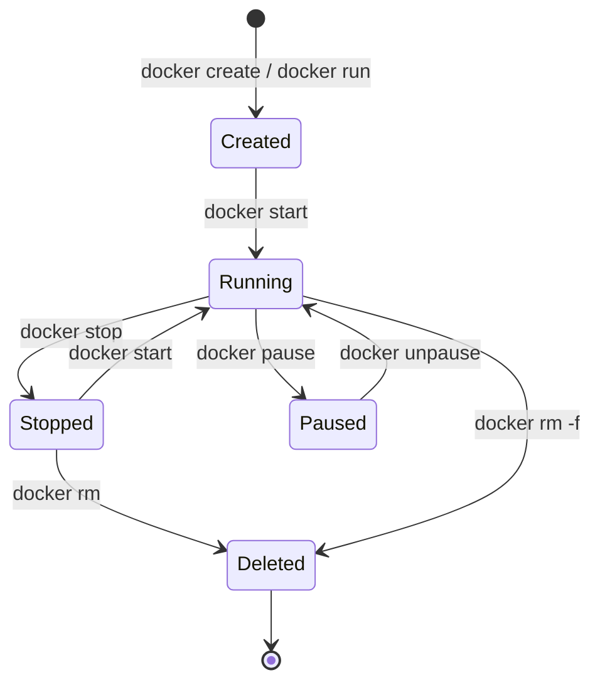

# Day 7 — Working with Images and Containers

## Image Layers

Docker images are built in **layers**. Each layer represents a change from the previous one.

```
Layer 4: COPY app.py /app/          ← your code
Layer 3: RUN pip install -r req.txt ← dependencies
Layer 2: RUN apt update             ← OS packages
Layer 1: ubuntu:22.04               ← base image
```

**Why layers matter:**
- Layers are **cached** — if layer 3 hasn't changed, Docker reuses it
- Layers are **shared** — if two images use the same base, they share those layers on disk
- Layers are **immutable** — every container gets a fresh, writable layer on top

```bash
docker image inspect nginx          # See layers and config
docker history nginx                # View the layers of an image
```

---

## Container Lifecycle



```bash
docker create nginx                 # Create but don't start
docker start <id>                   # Start created container
docker pause <id>                   # Pause (freeze) a container
docker unpause <id>                 # Resume
docker stop <id>                    # Graceful stop (SIGTERM, then SIGKILL after 10s)
docker kill <id>                    # Immediate stop (SIGKILL)
docker rm <id>                      # Delete stopped container
docker rm -f <id>                   # Force delete (even if running)
docker container prune              # Delete all stopped containers
```

---

## Running Containers Effectively

### Port Mapping

```bash
# -p host_port:container_port
docker run -d -p 8080:80 nginx      # http://localhost:8080 → nginx on :80
docker run -d -p 5432:5432 postgres
docker run -d -p 0.0.0.0:3000:3000 node-app  # Explicit bind address

# Let Docker choose the host port
docker run -d -P nginx              # -P = publish all exposed ports randomly
docker port nginx                   # See the port mapping
```

### Environment Variables

```bash
docker run -d \
  -e POSTGRES_USER=admin \
  -e POSTGRES_PASSWORD=secret \
  -e POSTGRES_DB=mydb \
  postgres

# From a file
docker run --env-file .env myapp
```

### Resource Limits

```bash
docker run -d \
  --memory="512m" \      # Max 512MB RAM
  --cpus="0.5" \         # Max 50% of one CPU core
  nginx
```

### Naming Containers

```bash
docker run -d --name webserver nginx
docker stop webserver
docker start webserver
docker logs webserver
```

Always name your containers — `docker ps` is much easier to read.

---

## Copying Files

```bash
# Copy from host to container
docker cp file.txt mycontainer:/app/file.txt

# Copy from container to host
docker cp mycontainer:/app/logs/app.log ./app.log
```

---

## Inspecting Containers

```bash
docker inspect mycontainer                    # Full JSON config
docker inspect mycontainer | grep IPAddress   # Get IP address
docker inspect --format '{{.State.Status}}' mycontainer  # Format output

docker stats                    # Live CPU/memory for all containers
docker stats mycontainer        # Just one container

docker top mycontainer          # Running processes inside
docker diff mycontainer         # Files changed since container started
```

---

## Image Management

```bash
docker images                   # List images
docker images -a                # Include intermediate layers
docker image inspect nginx      # Detailed image info
docker image prune              # Remove dangling (untagged) images
docker image prune -a           # Remove all unused images
docker rmi nginx                # Remove specific image

# Tagging
docker tag myapp:latest myapp:v1.0.0              # Add a tag
docker tag myapp:latest registry.io/team/myapp    # Tag for private registry
```

### Image Naming Format

```
registry/username/image:tag

docker.io/library/nginx:latest   # Official Docker Hub image (full path)
nginx:latest                     # Short form of the above
nginx                            # Tag defaults to :latest
myusername/myapp:v2.1.0          # Your Docker Hub image
123456.dkr.ecr.us-east-1.amazonaws.com/myapp:latest  # AWS ECR
```

> **Private registries:** Docker Hub is public by default. For production workloads, use a private
> registry like AWS ECR (covered in Week 4, Day 20), GitHub Container Registry, or Google Artifact Registry.

---

## Saving and Loading Images (Offline Transfer)

```bash
# Save image to a .tar file
docker save nginx:latest -o nginx.tar

# Load image from file
docker load -i nginx.tar

# Export container filesystem (different from save)
docker export mycontainer -o mycontainer.tar
```

---

## Exercises

1. Run a PostgreSQL container with these environment variables: user=`admin`, password=`secret`, db=`testdb`. Map port 5432.
2. Connect to the running PostgreSQL container with `docker exec -it <container> psql -U admin testdb`.
3. Run an nginx container with a memory limit of 256MB. Verify with `docker stats`.
4. Run two nginx containers with different names on ports 8080 and 8081. Stop only one of them.
5. Use `docker inspect` to find the internal IP address of a running container.
6. Tag an image with a fake registry path: `myregistry.io/myteam/nginx:v1.0`.

---

## Key Takeaways

- Images are made of immutable, cached layers
- Always name your containers (`--name`)
- Set resource limits in production (`--memory`, `--cpus`)
- Use environment variables for config, not hardcoded values
- `docker inspect` tells you everything about a container or image
