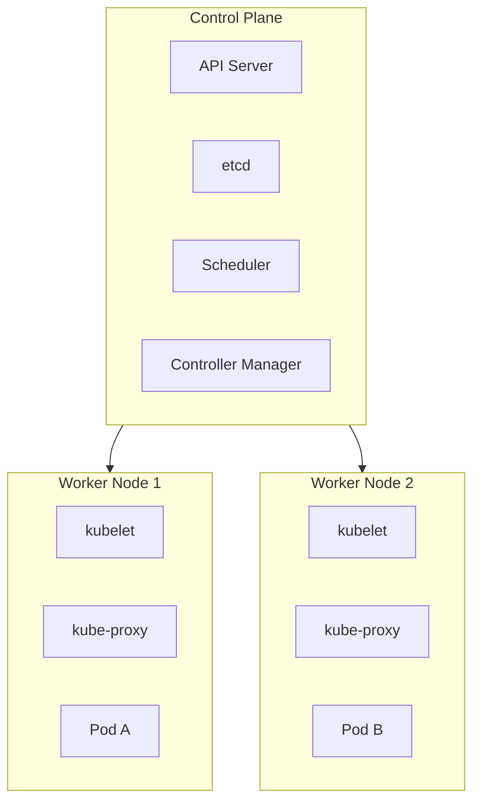

# Day 11 — Kubernetes Concepts

## Why Kubernetes?

Docker is great for running one container on one machine. But production apps need:

- **High availability** — if a container crashes, restart it automatically
- **Scaling** — run 10 copies of your app under load, scale down at night
- **Rolling updates** — deploy new version with zero downtime
- **Self-healing** — replace unhealthy containers automatically
- **Load balancing** — distribute traffic across all instances

Kubernetes (K8s) is the industry-standard system for doing all of this.

> K8s = K + 8 letters + s (Kubernetes). Yes, that's why.

---

## Architecture



### Control Plane Components

| Component | What it does |
|-----------|-------------|
| **API Server** | The front door to K8s. All `kubectl` commands go here. |
| **etcd** | The database. Stores all cluster state. |
| **Scheduler** | Decides which worker node runs which Pod. |
| **Controller Manager** | Watches the cluster and makes the actual state match the desired state. |

### Worker Node Components

| Component | What it does |
|-----------|-------------|
| **kubelet** | Agent on each worker. Manages containers on that node. |
| **kube-proxy** | Manages networking rules for Services. |
| **Container Runtime** | Actually runs containers (containerd, CRI-O). |

---

## Core Objects

| Object | What it is |
|--------|------------|
| **Pod** | Smallest unit. One or more containers running together. |
| **Deployment** | Manages Pods — desired count, rolling updates, rollback. |
| **ReplicaSet** | Ensures N copies of a Pod are always running. (Managed by Deployment) |
| **Service** | Stable network endpoint to reach Pods. |
| **ConfigMap** | Store configuration (env vars, config files). |
| **Secret** | Store sensitive data (passwords, tokens). |
| **Ingress** | HTTP routing rules — expose Services via domain names. |
| **Namespace** | Logical partition of the cluster. |
| **Node** | A worker machine (VM or physical). |

---

## kubectl — The Command Line Tool

```bash
# Check connection to cluster
kubectl cluster-info
kubectl get nodes

# Get resources
kubectl get pods                    # Pods in default namespace
kubectl get pods -n kube-system     # Pods in kube-system namespace
kubectl get pods --all-namespaces   # All namespaces
kubectl get all                     # All resource types

# Describe (detailed info, great for debugging)
kubectl describe pod mypod
kubectl describe node mynode

# Logs
kubectl logs mypod
kubectl logs mypod -c mycontainer   # Specific container (if multiple)
kubectl logs -f mypod               # Follow logs

# Execute commands
kubectl exec -it mypod -- bash
kubectl exec mypod -- ls /app

# Apply/delete resources
kubectl apply -f manifest.yaml
kubectl delete -f manifest.yaml
kubectl delete pod mypod

# Get YAML of an existing resource
kubectl get pod mypod -o yaml
kubectl get deployment myapp -o yaml
```

### Useful Shortcuts

```bash
# Short names
kubectl get po          # pods
kubectl get deploy      # deployments
kubectl get svc         # services
kubectl get ns          # namespaces
kubectl get cm          # configmaps
kubectl get ing         # ingresses

# Context (which cluster am I talking to?)
kubectl config get-contexts
kubectl config use-context my-cluster
kubectl config current-context
```

---

## Setting Up a Local Cluster

For learning, use one of these:

### kind (Kubernetes IN Docker) — Recommended for learning

```bash
# Install kind
# Replace X.X.X with the latest version from https://github.com/kubernetes-sigs/kind/releases
curl -Lo ./kind https://kind.sigs.k8s.io/dl/v0.22.0/kind-linux-amd64
chmod +x ./kind && mv ./kind /usr/local/bin/

# Create a cluster
kind create cluster --name devops-lab

# Delete cluster
kind delete cluster --name devops-lab
```

### minikube

```bash
# Install
curl -LO https://storage.googleapis.com/minikube/releases/latest/minikube-linux-amd64
sudo install minikube-linux-amd64 /usr/local/bin/minikube

# Start
minikube start --driver=docker

# Stop
minikube stop
```

### kubeadm (Production-grade setup)

Used to set up real clusters. Covered in the [Week 4 bonus section](../week-4/README.md).

---

## Namespaces

```bash
kubectl get namespaces

kubectl create namespace staging
kubectl delete namespace staging

# Run commands in a namespace
kubectl get pods -n staging
kubectl apply -f app.yaml -n staging

# Set default namespace for your session
kubectl config set-context --current --namespace=staging
```

Built-in namespaces:
- `default` — where resources go if you don't specify
- `kube-system` — Kubernetes internal components
- `kube-public` — public resources (rarely used)
- `kube-node-lease` — node heartbeats

---

## Exercises

1. Install `kind` or `minikube` and create a cluster.
2. Run `kubectl get nodes` and `kubectl cluster-info`. What do you see?
3. Create a namespace called `workshop`.
4. Run `kubectl get all -n kube-system` — identify the components you learned about today.
5. Run a pod manually: `kubectl run nginx --image=nginx`. Describe it and view its logs.
6. Delete the pod. Did it come back? Why not?

---

## Key Takeaways

- K8s solves: auto-restart, scaling, rolling updates, load balancing
- Control Plane = brain (API Server, etcd, Scheduler, Controller Manager)
- Workers = muscle (kubelet runs pods, kube-proxy handles networking)
- `kubectl apply -f file.yaml` is how you create everything
- `kubectl describe` and `kubectl logs` are your main debugging tools
