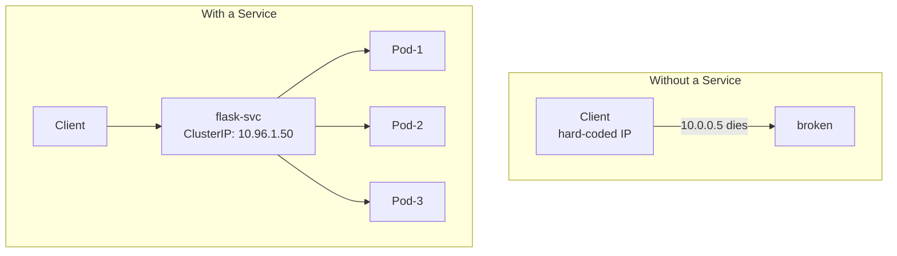
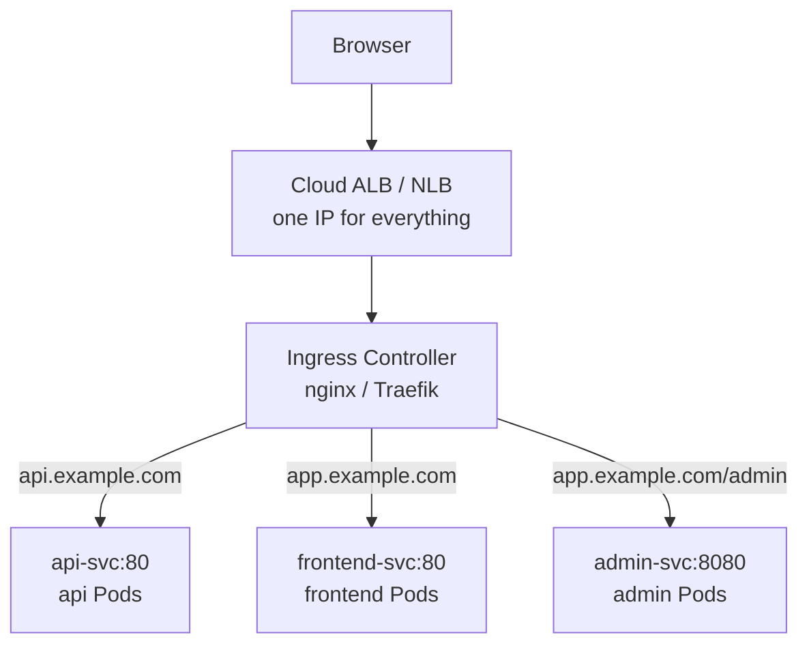
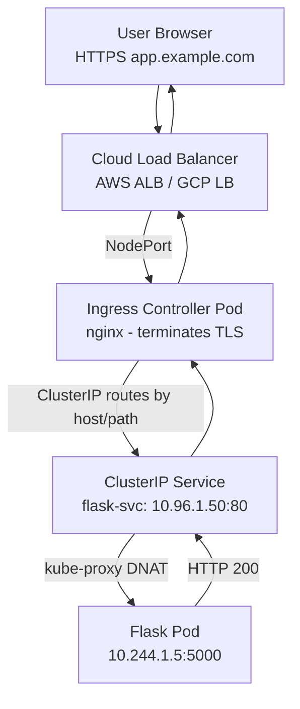

# Day 13 — Kubernetes Services, ConfigMaps, Secrets, and Ingress

## What You Will Learn

- How Kubernetes Services expose Pods and the difference between ClusterIP, NodePort, and LoadBalancer
- How kube-proxy implements Services under the hood
- How to use ConfigMaps to inject configuration into Pods
- How to use Secrets for sensitive data and why Git is not a secret store
- What an Ingress is and how host/path-based routing works
- Full traffic flow from a browser to your Pod

---

## 1. Kubernetes Services — Stable Network Access to Pods

Pods are ephemeral. Their IP addresses change every time they restart. A Service provides a stable virtual IP (ClusterIP) and DNS name that always points to a set of healthy Pods, selected by labels.



### Service YAML — Basic Structure

```yaml
apiVersion: v1
kind: Service
metadata:
  name: flask-svc
  namespace: default
spec:
  selector:
    app: flask          # Selects all Pods with this label — must match Pod labels exactly
  ports:
    - protocol: TCP
      port: 80          # Port on the Service (what clients connect to)
      targetPort: 5000  # Port on the Pod container
  type: ClusterIP       # Default type — internal only
```

---

## 2. Service Types — ClusterIP, NodePort, LoadBalancer

### ClusterIP (default)

Accessible only from within the cluster. Use for internal service-to-service communication.

```
Pod A ──► ClusterIP (10.96.1.50:80) ──► Pod B
              (internal only — not reachable from outside the cluster)
```

```yaml
spec:
  type: ClusterIP
  selector:
    app: flask
  ports:
    - port: 80
      targetPort: 5000
```

### NodePort

Opens a port (30000-32767) on every node's IP. External traffic can reach the Service via `<NodeIP>:<NodePort>`. Use for local clusters (Minikube, kubeadm) during development.

```
Browser ──► NodeIP:31000 ──► kube-proxy ──► Pod
```

```yaml
spec:
  type: NodePort
  selector:
    app: flask
  ports:
    - port: 80
      targetPort: 5000
      nodePort: 31000    # Fixed port on every node (omit to auto-assign)
```

```bash
# Access via Minikube
minikube service flask-svc --url
```

### LoadBalancer

Provisions an external load balancer in a cloud provider (AWS NLB, GCP TCP LB, Azure LB). Use in production cloud environments. On bare metal, this does nothing unless you use MetalLB.

```
Internet ──► Cloud LB (203.0.113.5:80) ──► NodePort ──► Pod
```

```yaml
spec:
  type: LoadBalancer
  selector:
    app: flask
  ports:
    - port: 80
      targetPort: 5000
```

```bash
# Get the external IP (may take a minute in cloud)
kubectl get service flask-svc
# NAME        TYPE           CLUSTER-IP    EXTERNAL-IP      PORT(S)
# flask-svc   LoadBalancer   10.96.1.50    203.0.113.5      80:31000/TCP
```

### When to Use Each Type

```
ClusterIP    → Internal communication between microservices
NodePort     → Dev/test on local clusters, exposing for debugging
LoadBalancer → Prod on cloud when you want direct TCP/UDP access
Ingress      → Prod on cloud when you want HTTP/HTTPS with host and path routing
```

---

## 3. How kube-proxy Implements Services

kube-proxy runs on every node and watches the Kubernetes API for Service and Endpoint changes. It programs iptables (or IPVS) rules on each node so that traffic to a ClusterIP is DNAT'd to one of the backing Pods.

```
Pod sends request to ClusterIP (10.96.1.50:80)
    │
    ▼
iptables rule on the node (installed by kube-proxy)
    │
    ▼
DNAT to Pod IP (e.g., 10.244.1.5:5000)  ← chosen via round-robin
    │
    ▼
Traffic arrives at the target Pod
```

When a Pod is added or removed (health check fails, scaling event), the API server updates the `Endpoints` object, kube-proxy sees the change, and updates the iptables rules within seconds.

```bash
# See the Endpoints object backing a Service
kubectl get endpoints flask-svc
kubectl describe endpoints flask-svc
```

---

## 4. ConfigMap — Inject Configuration Without Rebuilding Images

A ConfigMap stores non-sensitive configuration as key-value pairs. It decouples configuration from the container image so the same image can run in dev, staging, and production with different config.

### Create a ConfigMap

```bash
# From literal values
kubectl create configmap flask-config \
  --from-literal=APP_ENV=production \
  --from-literal=LOG_LEVEL=info \
  --from-literal=MAX_CONNECTIONS=50

# From a .env file
kubectl create configmap flask-config --from-env-file=config.env

# From a file (the whole file becomes one key)
kubectl create configmap nginx-config --from-file=nginx.conf
```

### ConfigMap YAML

```yaml
apiVersion: v1
kind: ConfigMap
metadata:
  name: flask-config
  namespace: default
data:
  APP_ENV: "production"
  LOG_LEVEL: "info"
  MAX_CONNECTIONS: "50"
  # Multi-line value (e.g., a config file)
  app.properties: |
    server.port=5000
    cache.ttl=300
    feature.flag=true
```

### Use ConfigMap as Environment Variables

```yaml
spec:
  containers:
    - name: flask
      image: myrepo/flask-app:1.0.0

      # Inject all keys as env vars
      envFrom:
        - configMapRef:
            name: flask-config

      # Or inject specific keys
      env:
        - name: APP_ENV
          valueFrom:
            configMapKeyRef:
              name: flask-config
              key: APP_ENV
```

### Use ConfigMap as a Mounted File

```yaml
spec:
  volumes:
    - name: config-volume
      configMap:
        name: flask-config

  containers:
    - name: flask
      image: myrepo/flask-app:1.0.0
      volumeMounts:
        - name: config-volume
          mountPath: /etc/flask-config    # Each key becomes a file in this directory
          readOnly: true
```

```bash
# Verify the mounted files
kubectl exec -it <pod-name> -- ls /etc/flask-config
kubectl exec -it <pod-name> -- cat /etc/flask-config/LOG_LEVEL
```

---

## 5. Secret — Sensitive Configuration

Secrets are structurally similar to ConfigMaps but are meant for sensitive data: passwords, tokens, keys. Values are base64-encoded (not encrypted by default at rest, unless you configure encryption at rest with KMS).

### Create a Secret

```bash
# From literal values (values are base64-encoded automatically)
kubectl create secret generic flask-secret \
  --from-literal=DB_PASSWORD=supersecret123 \
  --from-literal=API_KEY=abcdef-ghijkl

# From files
kubectl create secret generic tls-secret \
  --from-file=tls.crt=./server.crt \
  --from-file=tls.key=./server.key
```

### Secret YAML (manually encoded)

Base64 is an encoding, not encryption. Anyone who can read the Secret can decode it.

```bash
# Encode a value
echo -n "supersecret123" | base64
# c3VwZXJzZWNyZXQxMjM=

# Decode a value
echo -n "c3VwZXJzZWNyZXQxMjM=" | base64 --decode
```

```yaml
apiVersion: v1
kind: Secret
metadata:
  name: flask-secret
  namespace: default
type: Opaque
data:
  DB_PASSWORD: c3VwZXJzZWNyZXQxMjM=    # base64("supersecret123")
  API_KEY: YWJjZGVmLWdoaWprbA==         # base64("abcdef-ghijkl")
```

### Use Secret as Environment Variables

```yaml
spec:
  containers:
    - name: flask
      image: myrepo/flask-app:1.0.0

      # Inject all secret keys as env vars
      envFrom:
        - secretRef:
            name: flask-secret

      # Or inject a specific key
      env:
        - name: DB_PASSWORD
          valueFrom:
            secretKeyRef:
              name: flask-secret
              key: DB_PASSWORD
```

### Never Store Secrets in Git

Secrets committed to Git are compromised, full stop — even if you delete the commit later (git history is public on most repos).

```
BAD:  secrets.yaml with base64 values committed to Git
GOOD: Secrets created by CI/CD pipelines from a secure vault
```

**Alternatives for production secret management:**

| Tool | How It Works |
|---|---|
| HashiCorp Vault | External secret store; pods authenticate via service account |
| AWS Secrets Manager + External Secrets Operator | Syncs AWS secrets into K8s Secrets automatically |
| Sealed Secrets (Bitnami) | Encrypt secrets with a cluster key; safe to commit to Git |
| SOPS + Age | Encrypt files at rest; decrypt at deploy time |

```bash
# Example: External Secrets Operator creates a K8s Secret from AWS Secrets Manager
# (ExternalSecret CRD)
apiVersion: external-secrets.io/v1beta1
kind: ExternalSecret
metadata:
  name: flask-secret
spec:
  refreshInterval: 1h
  secretStoreRef:
    name: aws-secretsmanager
    kind: ClusterSecretStore
  target:
    name: flask-secret
  data:
    - secretKey: DB_PASSWORD
      remoteRef:
        key: prod/flask/db
        property: password
```

---

## 6. Ingress — HTTP Routing into the Cluster

A LoadBalancer Service gives you one IP per service. With 20 services, you'd pay for 20 load balancers. An Ingress consolidates all HTTP/HTTPS traffic behind a single entry point and routes by hostname or URL path.



### Ingress Controller vs Ingress Resource

- **Ingress Controller** — a running Pod (nginx, Traefik) that watches Ingress resources and configures itself to route traffic. You install this once per cluster.
- **Ingress resource** — a YAML object that declares routing rules. The controller reads these and acts on them.

```bash
# Install nginx ingress controller (Minikube)
minikube addons enable ingress

# Install nginx ingress controller (generic)
# Check latest version at: https://github.com/kubernetes/ingress-nginx/releases
# Then install with:
kubectl apply -f https://raw.githubusercontent.com/kubernetes/ingress-nginx/controller-v1.11.0/deploy/static/provider/cloud/deploy.yaml
# Or for minikube:
minikube addons enable ingress

# Install Traefik (Helm)
helm repo add traefik https://traefik.github.io/charts
helm install traefik traefik/traefik
```

### Host-Based Routing

Different hostnames route to different Services.

```yaml
apiVersion: networking.k8s.io/v1
kind: Ingress
metadata:
  name: flask-ingress
  namespace: default
  annotations:
    nginx.ingress.kubernetes.io/rewrite-target: /
spec:
  ingressClassName: nginx              # Which ingress controller handles this
  rules:
    - host: api.example.com
      http:
        paths:
          - path: /
            pathType: Prefix
            backend:
              service:
                name: api-svc
                port:
                  number: 80

    - host: app.example.com
      http:
        paths:
          - path: /
            pathType: Prefix
            backend:
              service:
                name: frontend-svc
                port:
                  number: 80
```

### Path-Based Routing

One hostname, multiple path prefixes route to different Services.

```yaml
apiVersion: networking.k8s.io/v1
kind: Ingress
metadata:
  name: flask-ingress-paths
  namespace: default
spec:
  ingressClassName: nginx
  rules:
    - host: app.example.com
      http:
        paths:
          - path: /api
            pathType: Prefix
            backend:
              service:
                name: api-svc
                port:
                  number: 80

          - path: /admin
            pathType: Prefix
            backend:
              service:
                name: admin-svc
                port:
                  number: 8080

          - path: /
            pathType: Prefix
            backend:
              service:
                name: frontend-svc
                port:
                  number: 80
```

### TLS Termination

The Ingress Controller handles TLS. Pods receive plain HTTP. The TLS certificate is stored in a Kubernetes Secret.

```bash
# Create TLS secret from cert files
kubectl create secret tls example-tls \
  --cert=./tls.crt \
  --key=./tls.key

# Or use cert-manager to auto-issue Let's Encrypt certificates
# Check latest version at: https://github.com/cert-manager/cert-manager/releases
kubectl apply -f https://github.com/cert-manager/cert-manager/releases/latest/download/cert-manager.yaml
```

```yaml
apiVersion: networking.k8s.io/v1
kind: Ingress
metadata:
  name: flask-ingress-tls
  namespace: default
  annotations:
    cert-manager.io/cluster-issuer: "letsencrypt-prod"   # auto-renew via cert-manager
spec:
  ingressClassName: nginx
  tls:
    - hosts:
        - app.example.com
      secretName: example-tls         # Ingress controller reads the cert from here
  rules:
    - host: app.example.com
      http:
        paths:
          - path: /
            pathType: Prefix
            backend:
              service:
                name: frontend-svc
                port:
                  number: 80
```

---

## 7. Full Traffic Flow Diagram



```bash
# Check your Ingress
kubectl get ingress
kubectl describe ingress flask-ingress

# Test locally with /etc/hosts
echo "127.0.0.1 app.example.com" | sudo tee -a /etc/hosts
curl http://app.example.com

# Minikube — get ingress IP
minikube ip
```

---

## Exercises

### Exercise 1 — ClusterIP Service and Intra-Cluster Communication

Deploy two Pods: `nginx` (label `app=nginx`) and `busybox` (label `app=client`).
Create a ClusterIP Service for nginx.
From the busybox Pod, curl the Service's DNS name.

```bash
kubectl apply -f nginx-deployment.yaml
kubectl apply -f nginx-service.yaml    # type: ClusterIP, port: 80 → targetPort: 80

# Note: Service DNS names like flask-svc.default.svc.cluster.local only resolve
# from inside the cluster. Run this from within a pod, not from your local machine.
# Example: kubectl run test --image=busybox --rm -it -- wget -qO- http://flask-svc
kubectl run busybox --image=busybox --rm -it --restart=Never -- \
  wget -qO- http://nginx-svc.default.svc.cluster.local
```

**Expected:** nginx welcome page HTML returned from within the cluster.

---

### Exercise 2 — NodePort and External Access

Change the nginx Service type to `NodePort`.
Access nginx from your local machine browser using the node IP and NodePort.

```bash
kubectl patch service nginx-svc -p '{"spec":{"type":"NodePort"}}'
kubectl get service nginx-svc   # note the NodePort (3xxxx)

# Minikube
minikube service nginx-svc --url

# Generic
curl http://<node-ip>:<nodeport>
```

**Expected:** nginx page loads from outside the cluster.

---

### Exercise 3 — ConfigMap as Environment Variables and as a File

Create a ConfigMap with three keys: `APP_ENV=staging`, `LOG_LEVEL=debug`, `MAX_CONN=10`.
Deploy a pod that injects all keys as environment variables.
Also mount the ConfigMap as a volume and verify the files are created.

```bash
kubectl create configmap app-config \
  --from-literal=APP_ENV=staging \
  --from-literal=LOG_LEVEL=debug \
  --from-literal=MAX_CONN=10

kubectl apply -f pod-with-configmap.yaml

kubectl exec -it <pod-name> -- env | grep -E "APP_ENV|LOG_LEVEL|MAX_CONN"
kubectl exec -it <pod-name> -- ls /etc/config
kubectl exec -it <pod-name> -- cat /etc/config/LOG_LEVEL
```

**Expected:** Env vars present. `/etc/config/` has three files, each containing the value.

---

### Exercise 4 — Create and Use a Secret

Create a Secret with key `DB_PASSWORD=mysecretpass`.
Deploy a Pod that reads the secret as an environment variable.
Verify the env var is present (and not base64-encoded) inside the running container.

```bash
kubectl create secret generic db-secret --from-literal=DB_PASSWORD=mysecretpass

kubectl apply -f pod-with-secret.yaml

kubectl exec -it <pod-name> -- env | grep DB_PASSWORD
# Output: DB_PASSWORD=mysecretpass  (decoded — Kubernetes decodes it for you)
```

**Expected:** `DB_PASSWORD=mysecretpass` appears as-is inside the container.

---

### Exercise 5 — Ingress with Path-Based Routing

Deploy two Services: `hello-svc` (returns "Hello") and `world-svc` (returns "World").
Create an Ingress that routes:
- `GET /hello` → `hello-svc`
- `GET /world` → `world-svc`

```bash
kubectl apply -f hello-deployment.yaml
kubectl apply -f world-deployment.yaml
kubectl apply -f path-ingress.yaml

curl http://localhost/hello
curl http://localhost/world
```

**Expected:** Each path returns a different response from a different Service.

---

### Exercise 6 — TLS Ingress with Self-Signed Certificate

Generate a self-signed certificate.
Create a TLS Secret from it.
Add a `tls` block to your Ingress.
Verify HTTPS access (using `-k` to skip cert verification for self-signed).

```bash
# Generate self-signed cert
openssl req -x509 -nodes -days 365 \
  -newkey rsa:2048 \
  -keyout tls.key \
  -out tls.crt \
  -subj "/CN=app.example.com"

# Create TLS secret
kubectl create secret tls app-tls --cert=tls.crt --key=tls.key

# Apply Ingress with TLS block
kubectl apply -f tls-ingress.yaml

# Test (add app.example.com to /etc/hosts first)
curl -k https://app.example.com
```

**Expected:** HTTPS connection succeeds; response is served through the Ingress.

---

## Key Takeaways

- ClusterIP is internal-only; NodePort opens a host port; LoadBalancer provisions a cloud LB
- A Service's selector must exactly match Pod labels — mismatches mean zero traffic
- kube-proxy programs iptables rules on every node to implement Service routing
- ConfigMaps store non-sensitive config; inject as env vars or volume-mounted files
- Secrets are base64-encoded, not encrypted — treat them as sensitive and never commit to Git
- Use External Secrets Operator, Vault, or Sealed Secrets in production
- Ingress replaces one LB per service with one LB for the whole cluster + HTTP routing rules
- The Ingress Controller is the actual running component; the Ingress resource is just config
- TLS terminates at the Ingress Controller — Pods receive plain HTTP
