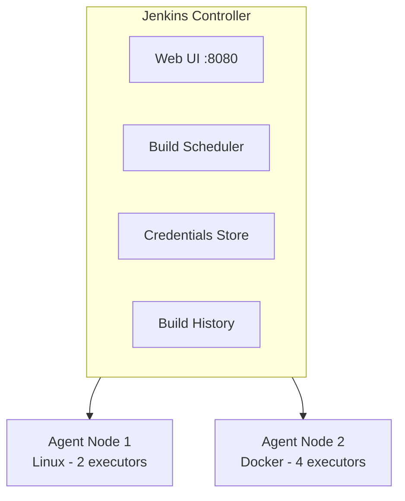

# Day 14 — Jenkins: Installation, Jobs, Pipelines, and Credentials

## What You Will Learn

- What Jenkins is and why teams use it for CI/CD
- How Jenkins is structured (master, agents, executors)
- How to install Jenkins on Ubuntu and complete first-time setup
- The difference between Freestyle and Pipeline jobs
- How to write a declarative Jenkinsfile
- How to store and use credentials securely
- How to trigger builds automatically
- Which plugins matter and why

---

## 1. What Is Jenkins

Jenkins is an open-source automation server written in Java. It runs CI/CD pipelines: when a developer pushes code, Jenkins checks it out, runs tests, builds a Docker image, and deploys it — automatically, every time.

Jenkins has been around since 2011 (forked from Hudson) and remains the most widely deployed CI/CD tool in enterprise environments, despite competition from GitHub Actions, GitLab CI, and Tekton.

**What Jenkins does well:**
- Highly customizable via 1800+ plugins
- Runs anywhere (on-prem, cloud, bare metal)
- Fine-grained access control
- Long-running pipelines with complex conditional logic

**What Jenkins requires:**
- A server to run on (it does not host itself)
- Ongoing maintenance (plugin updates, JVM tuning)
- Jenkinsfile to be version-controlled alongside your code

---

## 2. Jenkins Architecture



- **Master (Controller):** Orchestrates everything. Never runs builds in production setups — delegates to agents.
- **Agent (Node):** A machine that runs build steps. Can be a bare VM, a Docker container, or a Kubernetes Pod.
- **Executor:** A slot on an agent where a single build step runs. An agent with 4 executors can run 4 concurrent jobs.
- **Workspace:** A directory on the agent where the job checks out code and produces artifacts.

---

## 3. Installing Jenkins on Ubuntu

```bash
# 1. Install Java (Jenkins requires Java 17 or 21)
sudo apt update
sudo apt install -y fontconfig openjdk-21-jre

java -version
# openjdk version "21.0.x" ...

# 2. Add Jenkins APT repository
sudo wget -O /usr/share/keyrings/jenkins-keyring.asc \
  https://pkg.jenkins.io/debian-stable/jenkins.io-2023.key

echo "deb [signed-by=/usr/share/keyrings/jenkins-keyring.asc]" \
  https://pkg.jenkins.io/debian-stable binary/ | \
  sudo tee /etc/apt/sources.list.d/jenkins.list > /dev/null

# 3. Install Jenkins
sudo apt update
sudo apt install -y jenkins

# 4. Start and enable Jenkins
sudo systemctl enable jenkins
sudo systemctl start jenkins
sudo systemctl status jenkins

# 5. Get the initial admin password
sudo cat /var/lib/jenkins/secrets/initialAdminPassword

# Jenkins is now running at http://<server-ip>:8080
```

### Docker on the Jenkins Agent

The Jenkins agent (or controller if running single-node) must have Docker installed and the `jenkins` user added to the `docker` group:

```bash
sudo apt-get install -y docker.io
sudo usermod -aG docker jenkins
sudo systemctl restart jenkins
```

### Firewall (if applicable)

```bash
sudo ufw allow 8080
sudo ufw allow OpenSSH
sudo ufw enable
```

### First-Time Setup

1. Open `http://<server-ip>:8080` in your browser
2. Paste the initial admin password from `/var/lib/jenkins/secrets/initialAdminPassword`
3. Choose **Install suggested plugins** (installs Git, Pipeline, Credentials, etc.)
4. Create the first admin user (username, password, email)
5. Set the Jenkins URL (used for webhook callbacks)

---

## 4. Freestyle Jobs vs Pipeline Jobs

### Freestyle Job

A Freestyle job is configured entirely through the UI: source code management, build triggers, shell commands, and post-build actions are all click-configured. It works for simple tasks but does not scale.

**Problems with Freestyle jobs:**
- Configuration is stored in Jenkins XML, not in your repo
- Cannot be code-reviewed or version-controlled easily
- Cannot express complex conditional logic, parallel stages, or loops
- Different behavior per environment is hard to manage

### Pipeline Job

A Pipeline job is driven by a `Jenkinsfile` stored in your source repository alongside your code. It is the standard for all modern Jenkins usage.

**Advantages of Pipeline jobs:**
- Version-controlled in Git alongside the code it builds
- Full conditional logic, loops, parallel stages
- Code-reviewed like any other file
- Reproducible across Jenkins instances

```
Freestyle:  Jenkins UI → XML config → build steps
Pipeline:   Git repo → Jenkinsfile → Jenkins reads it → build steps
```

---

## 5. Jenkinsfile — Declarative vs Scripted

Jenkins supports two pipeline syntaxes.

### Scripted Pipeline (older, Groovy-based)

```groovy
node {
    stage('Checkout') {
        checkout scm
    }
    stage('Build') {
        sh 'docker build -t myapp .'
    }
}
```

Full Groovy — powerful but verbose and easy to write bugs in. Avoid for new pipelines.

### Declarative Pipeline (preferred)

```groovy
pipeline {
    agent any

    stages {
        stage('Checkout') {
            steps {
                checkout scm
            }
        }
        stage('Build') {
            steps {
                sh 'docker build -t myapp .'
            }
        }
    }
}
```

Structured, readable, validated by Jenkins before execution. Use this.

---

## 6. Declarative Jenkinsfile Structure

```groovy
pipeline {
    // WHERE the pipeline runs
    agent any                        // any available agent
    // agent { label 'linux' }       // agent with specific label
    // agent { docker { image 'python:3.11' } }  // run inside a Docker container

    // GLOBAL environment variables
    environment {
        APP_NAME    = 'flask-app'
        DOCKER_REPO = 'myrepo/flask-app'
        REGISTRY    = 'docker.io'
    }

    // PIPELINE-LEVEL options
    options {
        timeout(time: 30, unit: 'MINUTES')     // fail if pipeline takes > 30 min
        buildDiscarder(logRotator(numToKeepStr: '10'))  // keep last 10 builds
        disableConcurrentBuilds()              // don't run two builds simultaneously
    }

    // BUILD PARAMETERS (optional — user can override at runtime)
    parameters {
        string(name: 'IMAGE_TAG', defaultValue: 'latest', description: 'Docker image tag')
        booleanParam(name: 'SKIP_TESTS', defaultValue: false, description: 'Skip test stage')
    }

    // STAGES — the actual build steps
    stages {
        stage('Checkout') {
            steps {
                checkout scm            // checks out the branch that triggered the build
                echo "Branch: ${env.GIT_BRANCH}"
                echo "Commit: ${env.GIT_COMMIT}"
            }
        }

        stage('Test') {
            when {
                expression { !params.SKIP_TESTS }   // skip if SKIP_TESTS=true
            }
            steps {
                sh 'pip install -r requirements.txt'
                sh 'pytest tests/ -v'
            }
        }

        stage('Build') {
            steps {
                sh "docker build -t ${DOCKER_REPO}:${params.IMAGE_TAG} ."
            }
        }
    }

    // POST — runs after all stages, regardless of outcome
    post {
        success {
            echo 'Pipeline succeeded!'
        }
        failure {
            echo 'Pipeline failed!'
        }
        always {
            cleanWs()   // clean up workspace after every run
        }
    }
}
```

---

## 7. Common Steps Reference

```groovy
// Run shell command
sh 'echo hello'
sh '''
  set -e
  pip install -r requirements.txt
  pytest tests/
'''

// Print a message (Jenkins console output)
echo "Building ${env.BUILD_NUMBER}"

// Checkout from SCM (configured in job)
checkout scm

// Checkout a specific repo
git url: 'https://github.com/myorg/myrepo.git', branch: 'main'

// Use stored credentials safely
withCredentials([usernamePassword(
    credentialsId: 'dockerhub-creds',
    usernameVariable: 'DOCKER_USER',
    passwordVariable: 'DOCKER_PASS'
)]) {
    sh 'docker login -u $DOCKER_USER -p $DOCKER_PASS'
}

// Run stages in parallel
parallel(
    'Unit Tests': {
        sh 'pytest tests/unit/'
    },
    'Lint': {
        sh 'flake8 .'
    }
)

// Archive build artifacts
archiveArtifacts artifacts: 'dist/*.whl', fingerprint: true

// Stash files between stages (e.g., share between parallel branches)
stash name: 'build-output', includes: 'dist/**'
unstash 'build-output'
```

---

## 8. Storing Credentials in Jenkins

Never hardcode passwords or tokens in your Jenkinsfile. Use Jenkins Credentials Manager.

### Add a Credential

1. Go to **Manage Jenkins → Credentials → System → Global credentials → Add Credentials**
2. Choose the credential type:
   - **Username with password** — for Docker Hub, Git HTTP auth, etc.
   - **Secret text** — for API tokens, Slack tokens, SonarQube tokens
   - **SSH Username with private key** — for Git SSH access, server login
   - **Secret file** — for kubeconfig, JSON key files
   - **Certificate** — for PKCS12 keystores
3. Set a descriptive **ID** — you will reference this ID in your Jenkinsfile

### Use Credentials in a Jenkinsfile

```groovy
// Username + Password
withCredentials([usernamePassword(
    credentialsId: 'dockerhub-creds',
    usernameVariable: 'DOCKER_USER',
    passwordVariable: 'DOCKER_PASS'
)]) {
    sh '''
        echo "$DOCKER_PASS" | docker login -u "$DOCKER_USER" --password-stdin
        docker push myrepo/flask-app:latest
    '''
}

// Secret text (API token)
withCredentials([string(credentialsId: 'sonar-token', variable: 'SONAR_TOKEN')]) {
    sh 'sonar-scanner -Dsonar.login=$SONAR_TOKEN'
}

// SSH key
withCredentials([sshUserPrivateKey(
    credentialsId: 'deploy-ssh-key',
    keyFileVariable: 'SSH_KEY',
    usernameVariable: 'SSH_USER'
)]) {
    sh 'ssh -i $SSH_KEY $SSH_USER@server.example.com "sudo systemctl restart myapp"'
}

// Secret file (e.g., kubeconfig)
withCredentials([file(credentialsId: 'kubeconfig', variable: 'KUBECONFIG')]) {
    sh 'kubectl apply -f k8s/'
}
```

---

## 9. Build Triggers

### Manual Trigger

Click **Build Now** in the Jenkins UI. No automation. Used for one-off runs.

### SCM Polling

Jenkins checks the repository on a schedule and triggers a build if there are new commits.

```groovy
triggers {
    pollSCM('H/5 * * * *')    // poll every 5 minutes (H = hash-distributed, avoids thundering herd)
}
```

Polling is inefficient — Jenkins repeatedly calls your VCS even when nothing changed. Prefer webhooks.

### GitHub Webhook (preferred)

GitHub calls Jenkins the moment a push or PR event happens. Near-instant builds, no polling overhead.

**Setup:**
1. In Jenkins: **Manage Jenkins → Configure System → Jenkins URL** — set your public Jenkins URL
2. Install the **GitHub plugin** (included in suggested plugins)
3. In GitHub: **Repo → Settings → Webhooks → Add webhook**
   - Payload URL: `http://your-jenkins-url/github-webhook/`
   - Content type: `application/json`
   - Events: `Pushes` (and optionally `Pull requests`)
4. In your Jenkins Pipeline job: **Build Triggers → GitHub hook trigger for GITScm polling**

```groovy
triggers {
    githubPush()    // triggers on webhook push event
}
```

---

## 10. Plugins Worth Knowing

| Plugin | Why It Matters |
|---|---|
| **Git** | Checkout from any Git remote |
| **GitHub Integration** | Webhook triggers, PR status updates |
| **Pipeline** | Core declarative and scripted pipeline support |
| **Credentials Binding** | `withCredentials` step |
| **Docker Pipeline** | `docker.build`, `docker.push`, `docker.withRegistry` steps |
| **Kubernetes** | Run build agents as ephemeral K8s Pods |
| **Blue Ocean** | Modern pipeline UI (optional but useful for visibility) |
| **Slack Notification** | Post build status to Slack channels |
| **SonarQube Scanner** | Run code quality analysis from pipeline |
| **Timestamper** | Add timestamps to console output |
| **AnsiColor** | Render ANSI color codes in console output |

---

## 11. Real Jenkinsfile — Clone, Build, Push to Docker Hub

```groovy
pipeline {
    agent any

    environment {
        DOCKER_REPO    = 'myrepo/flask-app'
        DOCKER_CREDS   = 'dockerhub-creds'    // ID of credential in Jenkins
        IMAGE_TAG      = "${env.GIT_COMMIT[0..7]}"  // first 8 chars of commit SHA
    }

    options {
        timeout(time: 20, unit: 'MINUTES')
        buildDiscarder(logRotator(numToKeepStr: '10'))
    }

    triggers {
        githubPush()
    }

    stages {
        stage('Checkout') {
            steps {
                checkout scm
                script {
                    env.IMAGE_TAG = sh(
                        script: 'git rev-parse --short HEAD',
                        returnStdout: true
                    ).trim()
                }
                echo "Building image tag: ${env.IMAGE_TAG}"
            }
        }

        stage('Run Tests') {
            agent {
                docker { image 'python:3.11-slim' }
            }
            steps {
                sh '''
                    pip install --quiet -r requirements.txt
                    pip install --quiet pytest
                    pytest tests/ -v --tb=short
                '''
            }
        }

        stage('Build Docker Image') {
            steps {
                sh "docker build -t ${DOCKER_REPO}:${IMAGE_TAG} -t ${DOCKER_REPO}:latest ."
            }
        }

        stage('Push to Docker Hub') {
            steps {
                withCredentials([usernamePassword(
                    credentialsId: "${DOCKER_CREDS}",
                    usernameVariable: 'DOCKER_USER',
                    passwordVariable: 'DOCKER_PASS'
                )]) {
                    sh """
                        echo "\$DOCKER_PASS" | docker login -u "\$DOCKER_USER" --password-stdin
                        docker push ${DOCKER_REPO}:${IMAGE_TAG}
                        docker push ${DOCKER_REPO}:latest
                        docker logout
                    """
                }
            }
        }
    }

    post {
        success {
            echo "Image ${DOCKER_REPO}:${IMAGE_TAG} successfully built and pushed"
        }
        failure {
            echo "Build failed — check the console output above"
        }
        always {
            sh 'docker rmi ${DOCKER_REPO}:${IMAGE_TAG} || true'    // clean up local image
            cleanWs()
        }
    }
}
```

---

## Exercises

### Exercise 1 — Install Jenkins and Complete First-Time Setup

On a fresh Ubuntu 22.04 VM or EC2 instance:

1. Install Java 21 and Jenkins using the commands in this guide
2. Confirm Jenkins is running (`systemctl status jenkins`)
3. Open the Jenkins UI, paste the initial admin password
4. Install suggested plugins
5. Create an admin user

```bash
sudo systemctl status jenkins
# Should show "active (running)"

curl -s http://localhost:8080
# Should return Jenkins HTML
```

**Expected:** Jenkins UI accessible, admin user created, all suggested plugins installed.

---

### Exercise 2 — Create a Freestyle Job

In the Jenkins UI:

1. New Item → Freestyle project → name it `hello-freestyle`
2. Source Code Management: None
3. Build Steps → Execute shell:
   ```bash
   echo "Hello from Jenkins!"
   echo "Build number: $BUILD_NUMBER"
   date
   ```
4. Save and click **Build Now**
5. Open Console Output and read the results

**Expected:** Console shows the echo output and current date.

---

### Exercise 3 — Create a Pipeline Job with a Jenkinsfile

1. Create a new GitHub repo with two files: `Jenkinsfile` and `app.py`
2. Write a Jenkinsfile with at least three stages: Checkout, Test (run `python -m py_compile app.py`), and Report
3. Create a Jenkins Pipeline job pointing to your GitHub repo
4. Run the build manually and confirm all stages pass

```groovy
// Jenkinsfile
pipeline {
    agent any
    stages {
        stage('Checkout') {
            steps { checkout scm }
        }
        stage('Test') {
            steps {
                sh 'python3 -m py_compile app.py && echo "Syntax OK"'
            }
        }
        stage('Report') {
            steps {
                echo "Build ${env.BUILD_NUMBER} completed on ${env.NODE_NAME}"
            }
        }
    }
}
```

**Expected:** Three green stages appear in the build view.

---

### Exercise 4 — Store and Use a Docker Hub Credential

1. Add a Username with password credential in Jenkins with ID `dockerhub-creds`
2. Write a Jenkinsfile stage that logs in to Docker Hub using `withCredentials`
3. Verify the password does not appear in the console output (Jenkins masks it)

```groovy
stage('Docker Login Test') {
    steps {
        withCredentials([usernamePassword(
            credentialsId: 'dockerhub-creds',
            usernameVariable: 'DOCKER_USER',
            passwordVariable: 'DOCKER_PASS'
        )]) {
            sh 'echo "$DOCKER_PASS" | docker login -u "$DOCKER_USER" --password-stdin && echo "Login OK"'
        }
    }
}
```

**Expected:** Login succeeds. Console shows `****` where the password would appear.

---

### Exercise 5 — Set Up a GitHub Webhook Trigger

1. Expose your Jenkins instance publicly (use `ngrok http 8080` if on a local machine)
2. Add a GitHub webhook pointing to your Jenkins URL
3. Push a commit to your repo
4. Confirm Jenkins automatically starts a build within seconds of the push

```bash
# Expose local Jenkins with ngrok
ngrok http 8080
# GitHub Webhook URL: https://<random>.ngrok.io/github-webhook/
```

```bash
# Push a trivial change to trigger the webhook
echo "# trigger" >> README.md
git add README.md && git commit -m "trigger webhook test"
git push origin main
```

**Expected:** Jenkins build starts automatically within 5 seconds of the git push, with no manual intervention.

---

## Key Takeaways

- Jenkins is a self-hosted automation server — you own and maintain the infrastructure
- The master schedules; agents do the work — never run builds on the master in production
- Always use Pipeline jobs backed by a Jenkinsfile in your repo, not Freestyle jobs
- Declarative pipeline syntax is preferred — structured, readable, validated before running
- Credentials Binding (`withCredentials`) keeps secrets out of logs and out of code
- Use GitHub webhooks instead of SCM polling — webhooks are instant and efficient
- Tag Docker images with the Git commit SHA, not `latest`, for traceability
- `post { always { cleanWs() } }` prevents disk fill-up on build agents
