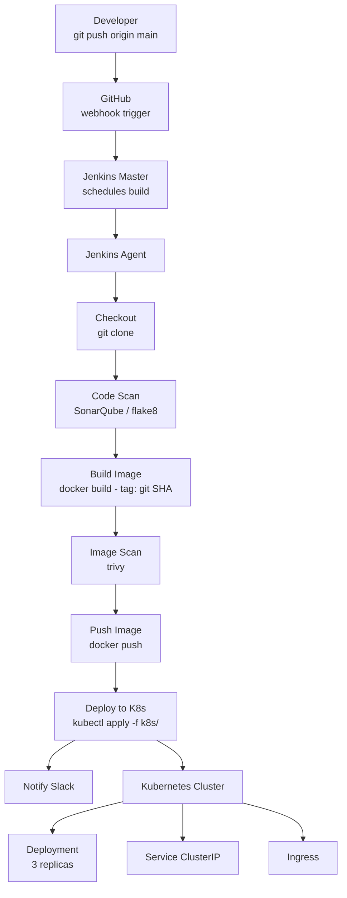

# Day 15 — Full CI/CD Pipeline: GitHub → Jenkins → Docker → Kubernetes

## What You Will Learn

- The complete path a code change travels from commit to running Pod
- How to wire GitHub webhooks to Jenkins
- How to write a production-grade declarative Jenkinsfile with all pipeline stages
- How Jenkins deploys to Kubernetes using kubectl and a stored kubeconfig
- Image tagging strategy using Git commit SHA
- Rollback strategies and when to use each
- Pipeline best practices and common failure modes

---

## 1. End-to-End Pipeline Overview



At each stage, a failure stops the pipeline immediately. Slack is notified regardless of outcome.

---

## 2. Setting Up GitHub Webhook to Trigger Jenkins

### Prerequisites

- Jenkins must be reachable from the internet (or from GitHub's IP ranges)
- The GitHub plugin must be installed in Jenkins
- Your Pipeline job must have "GitHub hook trigger for GITScm polling" enabled

### Steps

```
GitHub Repo → Settings → Webhooks → Add webhook

Payload URL:    http://your-jenkins-server:8080/github-webhook/
Content type:   application/json
Secret:         (optional but recommended — set in Jenkins GitHub plugin config)
Which events:   Just the push event
Active:         checked
```

### Verify the Webhook

After adding, GitHub will send a ping event. Check the delivery status in GitHub:
`Settings → Webhooks → your webhook → Recent Deliveries`

A green checkmark means Jenkins received the ping successfully.

### In the Jenkins Job

```
Pipeline job → Configure → Build Triggers
→ check: GitHub hook trigger for GITScm polling
```

Or declare it in the Jenkinsfile:

```groovy
triggers {
    githubPush()
}
```

---

## 3. Full Jenkinsfile — All Pipeline Stages

```groovy
pipeline {
    agent any

    // ─── Environment variables ───────────────────────────────────────────────
    environment {
        // Docker
        DOCKER_REPO    = 'myrepo/flask-app'
        DOCKER_CREDS   = 'dockerhub-creds'       // Jenkins credential ID

        // Kubernetes
        K8S_NAMESPACE  = 'production'
        K8S_DEPLOYMENT = 'flask-deployment'
        KUBECONFIG_ID  = 'kubeconfig-prod'        // Jenkins credential ID (secret file)

        // SonarQube
        SONAR_TOKEN_ID = 'sonarqube-token'        // Jenkins credential ID (secret text)
        SONAR_HOST     = 'http://sonarqube.internal:9000'

        // Slack
        SLACK_TOKEN_ID = 'slack-webhook-url'      // Jenkins credential ID (secret text)
        SLACK_CHANNEL  = '#deployments'

        // Computed at checkout time
        IMAGE_TAG      = ''
    }

    options {
        timeout(time: 30, unit: 'MINUTES')
        buildDiscarder(logRotator(numToKeepStr: '20'))
        disableConcurrentBuilds()
        ansiColor('xterm')
    }

    triggers {
        githubPush()
    }

    // ─── Stages ──────────────────────────────────────────────────────────────
    stages {

        // Stage 1: Checkout
        stage('Checkout') {
            steps {
                checkout scm
                script {
                    // Use Git commit SHA as the image tag — unique, traceable
                    env.IMAGE_TAG = sh(
                        script: 'git rev-parse --short HEAD',
                        returnStdout: true
                    ).trim()
                    env.GIT_MSG = sh(
                        script: 'git log -1 --pretty=%B',
                        returnStdout: true
                    ).trim()
                }
                echo "Commit: ${env.IMAGE_TAG}"
                echo "Message: ${env.GIT_MSG}"
            }
        }

        // Stage 2: Code Quality Scan
        stage('Code Scan') {
            parallel {
                stage('Lint') {
                    steps {
                        sh '''
                            pip install --quiet flake8
                            flake8 . --max-line-length=120 --exclude=.git,venv
                        '''
                    }
                }
                stage('SonarQube Analysis') {
                    steps {
                        withCredentials([string(
                            credentialsId: "${SONAR_TOKEN_ID}",
                            variable: 'SONAR_TOKEN'
                        )]) {
                            sh '''
                                sonar-scanner \
                                  -Dsonar.projectKey=flask-app \
                                  -Dsonar.sources=. \
                                  -Dsonar.host.url=${SONAR_HOST} \
                                  -Dsonar.login=${SONAR_TOKEN}
                            '''
                        }
                    }
                }
            }
        }

        // Stage 3: Build Docker Image
        stage('Build Image') {
            steps {
                sh """
                    docker build \
                        --build-arg BUILD_DATE=\$(date -u +%Y-%m-%dT%H:%M:%SZ) \
                        --build-arg GIT_COMMIT=${IMAGE_TAG} \
                        -t ${DOCKER_REPO}:${IMAGE_TAG} \
                        -t ${DOCKER_REPO}:latest \
                        .
                """
            }
        }

        // Stage 4: Container Image Security Scan
        stage('Image Scan') {
            steps {
                // Note: trivy exits 1 if vulnerabilities found — use --exit-code 0 to scan without failing
                sh """
                    trivy image \
                        --exit-code 1 \
                        --severity HIGH,CRITICAL \
                        --no-progress \
                        ${DOCKER_REPO}:${IMAGE_TAG}
                """
            }
        }

        // Stage 5: Push to Registry
        stage('Push Image') {
            steps {
                withCredentials([usernamePassword(
                    credentialsId: "${DOCKER_CREDS}",
                    usernameVariable: 'DOCKER_USER',
                    passwordVariable: 'DOCKER_PASS'
                )]) {
                    sh """
                        echo "\$DOCKER_PASS" | docker login -u "\$DOCKER_USER" --password-stdin
                        docker push ${DOCKER_REPO}:${IMAGE_TAG}
                        docker push ${DOCKER_REPO}:latest
                        docker logout
                    """
                }
            }
        }

        // Stage 6: Deploy to Kubernetes
        stage('Deploy to Kubernetes') {
            steps {
                withCredentials([file(
                    credentialsId: "${KUBECONFIG_ID}",
                    variable: 'KUBECONFIG'
                )]) {
                    sh """
                        # Update image tag in-place — no YAML templating tool needed
                        kubectl set image deployment/${K8S_DEPLOYMENT} \
                            flask=${DOCKER_REPO}:${IMAGE_TAG} \
                            --namespace=${K8S_NAMESPACE}

                        # Wait for the rollout to complete (fail fast if it doesn't)
                        kubectl rollout status deployment/${K8S_DEPLOYMENT} \
                            --namespace=${K8S_NAMESPACE} \
                            --timeout=5m
                    """
                }
            }
        }

        // Stage 7: Smoke Test
        stage('Smoke Test') {
            steps {
                withCredentials([file(
                    credentialsId: "${KUBECONFIG_ID}",
                    variable: 'KUBECONFIG'
                )]) {
                    sh """
                        # Port-forward and check the health endpoint
                        kubectl port-forward deployment/${K8S_DEPLOYMENT} 9999:5000 \
                            --namespace=default &
                        PF_PID=\$!

                        # Wait for port-forward to be ready (retry up to 10 times)
                        for i in \$(seq 1 10); do
                            HTTP_STATUS=\$(curl -s -o /dev/null -w "%{http_code}" http://localhost:9999/health 2>/dev/null)
                            [ "\$HTTP_STATUS" = "200" ] && break
                            sleep 2
                        done

                        kill \$PF_PID || true
                        echo "Health check returned HTTP \$HTTP_STATUS"
                        [ "\$HTTP_STATUS" = "200" ] || exit 1
                    """
                }
            }
        }
    }

    // ─── Post-build actions ───────────────────────────────────────────────────
    post {
        success {
            withCredentials([string(credentialsId: "${SLACK_TOKEN_ID}", variable: 'SLACK_URL')]) {
                sh """
                    curl -s -X POST "\$SLACK_URL" \
                        -H 'Content-type: application/json' \
                        --data '{
                            "text": ":white_check_mark: *${K8S_DEPLOYMENT}* deployed successfully",
                            "attachments": [{
                                "color": "good",
                                "fields": [
                                    {"title": "Image", "value": "${DOCKER_REPO}:${IMAGE_TAG}", "short": true},
                                    {"title": "Build", "value": "#${env.BUILD_NUMBER}", "short": true},
                                    {"title": "Commit", "value": "${env.GIT_MSG}", "short": false}
                                ]
                            }]
                        }'
                """
            }
        }
        failure {
            withCredentials([string(credentialsId: "${SLACK_TOKEN_ID}", variable: 'SLACK_URL')]) {
                sh """
                    curl -s -X POST "\$SLACK_URL" \
                        -H 'Content-type: application/json' \
                        --data '{
                            "text": ":x: *${K8S_DEPLOYMENT}* pipeline FAILED — Build #${env.BUILD_NUMBER}",
                            "attachments": [{
                                "color": "danger",
                                "fields": [
                                    {"title": "Branch", "value": "${env.GIT_BRANCH}", "short": true},
                                    {"title": "Commit", "value": "${env.IMAGE_TAG}", "short": true}
                                ]
                            }]
                        }'
                """
            }
        }
        always {
            sh "docker rmi ${DOCKER_REPO}:${IMAGE_TAG} || true"
            cleanWs()
        }
    }
}
```

> **Note:** Trivy exits with code 1 when vulnerabilities are found. In a real pipeline, use `--exit-code 0` to scan without failing the build, then review the report separately.

> **Hands-on:** Full Trivy setup and how to run image scans is covered in Week 6, Day 28.
> The stage shown above is the correct Jenkins integration — you will build and test it there.

---

## 4. Deploying to Kubernetes from Jenkins

### Store kubeconfig as a Jenkins Credential

```bash
# Get your kubeconfig content
cat ~/.kube/config

# In Jenkins:
# Manage Jenkins → Credentials → Add Credentials
# Type: Secret file
# ID: kubeconfig-prod
# File: upload your kubeconfig file
```

### Use kubectl in the Pipeline

```groovy
withCredentials([file(credentialsId: 'kubeconfig-prod', variable: 'KUBECONFIG')]) {
    sh 'kubectl get nodes'
    sh 'kubectl apply -f k8s/'
    sh 'kubectl rollout status deployment/flask-deployment --timeout=5m'
}
```

### Alternative: Apply Full YAML Instead of set image

```groovy
stage('Deploy to Kubernetes') {
    steps {
        withCredentials([file(credentialsId: 'kubeconfig-prod', variable: 'KUBECONFIG')]) {
            sh """
                # Replace the image tag placeholder in the YAML at deploy time
                sed -i 's|IMAGE_TAG_PLACEHOLDER|${IMAGE_TAG}|g' k8s/deployment.yaml
                kubectl apply -f k8s/
                kubectl rollout status deployment/flask-deployment --timeout=5m
            """
        }
    }
}
```

Your `k8s/deployment.yaml` would contain:

```yaml
containers:
  - name: flask
    image: myrepo/flask-app:IMAGE_TAG_PLACEHOLDER   # replaced by sed in pipeline
```

---

## 5. Environment Variables and Secrets in the Pipeline

```groovy
environment {
    // Static values — safe to hardcode
    APP_NAME = 'flask-app'
    K8S_NS   = 'production'

    // Dynamic values — computed during the run
    IMAGE_TAG = ''   // set in the Checkout stage using git rev-parse

    // Credential IDs — these are just string names, not the secret values themselves
    DOCKER_CREDS  = 'dockerhub-creds'
    KUBECONFIG_ID = 'kubeconfig-prod'
}
```

**Rules:**
- Static config → `environment {}` block
- Sensitive values → Jenkins Credentials, accessed via `withCredentials`
- Dynamic values (commit SHA, build timestamp) → `script {}` block using `env.VAR = ...`
- Never use `echo` to print secret variable values

---

## 6. Image Tagging Strategy

Using `latest` as your image tag is a trap. If the pull policy is `IfNotPresent`, Kubernetes may use a cached old image. You also cannot tell which code version is running.

```
BAD:   myrepo/flask-app:latest
GOOD:  myrepo/flask-app:a3f2c91    (Git commit SHA)
```

```bash
# Get the short SHA in bash
git rev-parse --short HEAD    # a3f2c91

# In the pipeline
env.IMAGE_TAG = sh(script: 'git rev-parse --short HEAD', returnStdout: true).trim()
```

**Tagging conventions:**

```
myrepo/app:a3f2c91        ← commit SHA — use for all deployments
myrepo/app:main-a3f2c91   ← branch + SHA — useful in multi-branch pipelines
myrepo/app:1.4.2          ← semver — for release pipelines
myrepo/app:latest         ← always push this too, but never deploy with it
```

---

## 7. Rollback Strategies

### Option A — kubectl rollout undo (fast, no YAML needed)

```bash
# Roll back to the previous Deployment revision
kubectl rollout undo deployment/flask-deployment --namespace=production

# Roll back to a specific revision
kubectl rollout undo deployment/flask-deployment --to-revision=3

# Check history
kubectl rollout history deployment/flask-deployment
```

Use this for immediate incident response. Takes 10 seconds.

### Option B — Redeploy a Previous Image Tag (auditable)

```bash
# Find the previously deployed image tag from build history or Docker Hub
kubectl set image deployment/flask-deployment \
    flask=myrepo/flask-app:a1b2c3d \
    --namespace=production

kubectl rollout status deployment/flask-deployment --timeout=5m
```

Use this when you know exactly which version you want.

### Option C — Git Revert + Pipeline (safest)

```bash
# Revert the bad commit in Git
git revert HEAD --no-edit
git push origin main
# → GitHub webhook triggers Jenkins → new image built with old code → deployed
```

Use this for permanent rollback where you want the code state in Git to match what's running.

### Automate Rollback in the Pipeline

```groovy
stage('Deploy to Kubernetes') {
    steps {
        withCredentials([file(credentialsId: 'kubeconfig-prod', variable: 'KUBECONFIG')]) {
            script {
                def deployResult = sh(
                    script: """
                        kubectl set image deployment/${K8S_DEPLOYMENT} \
                            flask=${DOCKER_REPO}:${IMAGE_TAG} \
                            --namespace=${K8S_NAMESPACE}
                        kubectl rollout status deployment/${K8S_DEPLOYMENT} \
                            --namespace=${K8S_NAMESPACE} --timeout=3m
                    """,
                    returnStatus: true
                )
                if (deployResult != 0) {
                    echo "Deployment failed — triggering automatic rollback"
                    sh "kubectl rollout undo deployment/${K8S_DEPLOYMENT} --namespace=${K8S_NAMESPACE}"
                    error("Deployment failed and was rolled back")
                }
            }
        }
    }
}
```

---

## 8. Pipeline Best Practices

### Fail Fast

Put cheap, fast checks first (lint, syntax, unit tests). Expensive checks (image build, scan, push) come later. Don't waste 5 minutes building an image for code that won't pass linting.

```
Checkout → Lint (parallel) → Unit Tests (parallel) → Build → Scan → Push → Deploy
                ↑ fast, cheap                          ↑ slow, expensive
```

### Parallel Stages Where Possible

```groovy
stage('Quality Gates') {
    parallel {
        stage('Lint')         { steps { sh 'flake8 .' } }
        stage('Unit Tests')   { steps { sh 'pytest tests/unit/' } }
        stage('Dependency Check') { steps { sh 'pip-audit' } }
    }
}
```

Parallel stages run simultaneously, cutting total pipeline time.

### Use Short-Lived Agent Containers

```groovy
agent {
    docker {
        image 'python:3.11-slim'
        args '--user root'
    }
}
```

The container is created fresh, runs the stage, and is discarded. No state left behind.

### Archive Artifacts and Test Reports

```groovy
post {
    always {
        junit 'test-results/*.xml'
        archiveArtifacts artifacts: 'dist/*.whl', fingerprint: true
        publishHTML(target: [
            reportName: 'Coverage Report',
            reportDir: 'htmlcov',
            reportFiles: 'index.html'
        ])
    }
}
```

### Pin Dependency Versions

```dockerfile
# Bad
FROM python:3-slim
RUN pip install flask

# Good
FROM python:3.11.9-slim
COPY requirements.txt .
RUN pip install -r requirements.txt  # requirements.txt has pinned versions
```

### Use `--timeout` on Every kubectl rollout status

Without a timeout, a stuck rollout will block the pipeline forever.

```bash
kubectl rollout status deployment/flask-deployment --timeout=5m
```

---

## 9. Common Pipeline Errors and Fixes

### Error: `docker: command not found`

Jenkins agent does not have Docker installed, or the Jenkins user is not in the `docker` group.

```bash
# Fix: add jenkins to docker group
sudo usermod -aG docker jenkins
sudo systemctl restart jenkins
```

### Error: `kubectl: command not found`

kubectl not installed on the agent.

```bash
# Fix: install kubectl on the agent
curl -LO "https://dl.k8s.io/release/$(curl -L -s https://dl.k8s.io/release/stable.txt)/bin/linux/amd64/kubectl"
sudo install -o root -g root -m 0755 kubectl /usr/local/bin/kubectl
```

### Error: `Error from server (Forbidden): deployments.apps is forbidden`

The kubeconfig used by Jenkins does not have permission to update the deployment in the target namespace.

```bash
# Fix: create a service account with limited RBAC
kubectl create serviceaccount jenkins-deployer -n production
kubectl create rolebinding jenkins-deployer-binding \
    --clusterrole=edit \
    --serviceaccount=production:jenkins-deployer \
    -n production

# Generate a kubeconfig for this service account
kubectl create token jenkins-deployer -n production --duration=8760h
```

> **Note:** A ServiceAccount alone grants no permissions. In Week 6 (Day 26), you will learn how to attach
> a Role and RoleBinding to restrict what this ServiceAccount can access. For now, the pipeline uses it
> for identity — in production, always pair a ServiceAccount with a least-privilege Role.

### Error: `ImagePullBackOff` after deploy

Wrong image tag pushed, or private registry credentials not configured in Kubernetes.

```bash
# Check what image the pods are trying to pull
kubectl describe pod <pod-name> -n production | grep Image

# Add image pull secret if registry is private
kubectl create secret docker-registry regcred \
    --docker-server=docker.io \
    --docker-username=myuser \
    --docker-password=mypass \
    -n production

# Reference it in the Deployment
spec:
  imagePullSecrets:
    - name: regcred
```

### Error: Pipeline hangs at `kubectl rollout status`

The deployment is stuck — likely because the new Pods never become Ready (failed health checks, OOMKill, CrashLoopBackOff).

```bash
# In parallel, check what's happening
kubectl get pods -n production -w
kubectl describe pod <pod-name> -n production
kubectl logs <pod-name> -n production
```

Use `--timeout=5m` so the pipeline fails cleanly rather than hanging indefinitely.

### Error: `GitHub webhook 403`

Jenkins' CSRF protection is rejecting the webhook. Either disable CSRF for the webhook endpoint (the GitHub plugin does this for `/github-webhook/`) or configure a webhook secret.

```
Manage Jenkins → Configure Global Security → CSRF Protection
→ Make sure "GitHub Hook Trigger" is whitelisted (handled by GitHub plugin automatically)
```

---

## Exercises

### Exercise 1 — Wire GitHub Webhook to Jenkins

1. Install Jenkins on a public VM (or expose with ngrok)
2. Create a GitHub repo with a simple Jenkinsfile
3. Configure the webhook in GitHub
4. Push a commit and verify Jenkins starts a build automatically within 10 seconds

```bash
# Verify ngrok is forwarding correctly
curl -s http://localhost:4040/api/tunnels | python3 -m json.tool | grep public_url
```

**Expected:** Build appears in Jenkins immediately after push, without clicking "Build Now".

---

### Exercise 2 — Add Code Scan Stage with flake8

Add a `Code Scan` stage to your Jenkinsfile that runs `flake8` on your Python code.
Intentionally introduce a linting error (line too long, unused import).
Verify the pipeline fails at the scan stage and does not proceed to build or push.
Fix the error and verify the pipeline passes.

```groovy
stage('Code Scan') {
    steps {
        sh 'pip install --quiet flake8 && flake8 . --max-line-length=100'
    }
}
```

**Expected:** Pipeline halts at Code Scan when errors exist. Green after fix.

---

### Exercise 3 — Build and Push with Git SHA Tag

Extend your Jenkinsfile to:
1. Extract the Git commit SHA in the Checkout stage
2. Build the Docker image tagged with the SHA
3. Push it to Docker Hub

```bash
# Verify the image exists on Docker Hub after the build
docker pull myrepo/flask-app:<your-sha>
docker run --rm myrepo/flask-app:<your-sha> python -c "print('works')"
```

**Expected:** Image with the commit SHA tag appears in your Docker Hub repository.

---

### Exercise 4 — Add Kubernetes Deploy Stage

1. Store your kubeconfig as a Jenkins Secret File credential
2. Add a `Deploy to Kubernetes` stage that runs `kubectl set image` and waits for rollout
3. Verify the deployment in the cluster uses the new image tag after the pipeline runs

```bash
kubectl get deployment flask-deployment -o jsonpath='{.spec.template.spec.containers[0].image}'
# Should show myrepo/flask-app:<new-sha>
```

**Expected:** Kubernetes deployment uses the image from the latest build.

---

### Exercise 5 — Implement Automatic Rollback on Deploy Failure

1. Introduce a bad image tag (e.g., set `IMAGE_TAG = "broken-does-not-exist"` temporarily)
2. Wrap the deploy stage in a `script {}` block that captures the exit code
3. On failure, run `kubectl rollout undo` and then `error()` to fail the pipeline
4. Verify the cluster rolls back to the previous working image

```bash
# Verify rollback happened
kubectl rollout history deployment/flask-deployment -n production
kubectl get deployment flask-deployment -o jsonpath='{.spec.template.spec.containers[0].image}'
```

**Expected:** Pipeline fails, cluster automatically reverts to previous image, Kubernetes shows no degraded pods.

---

## Key Takeaways

- The CI/CD pipeline is code — it lives in the repo, is code-reviewed, and evolves with the app
- GitHub webhooks trigger instant builds; never use SCM polling in production
- Always tag images with the Git commit SHA — `latest` is not a deployment strategy
- Store kubeconfig, Docker credentials, and tokens as Jenkins Credentials — never in the Jenkinsfile
- Parallel stages for independent checks (lint + tests + dependency scan) reduce total build time
- `kubectl rollout status --timeout=5m` prevents hung pipelines
- Automate rollback in the pipeline — don't rely on a human to notice and react
- The deploy stage is not done until `kubectl rollout status` reports success
- Fail fast: put cheap, quick checks before expensive, slow ones
