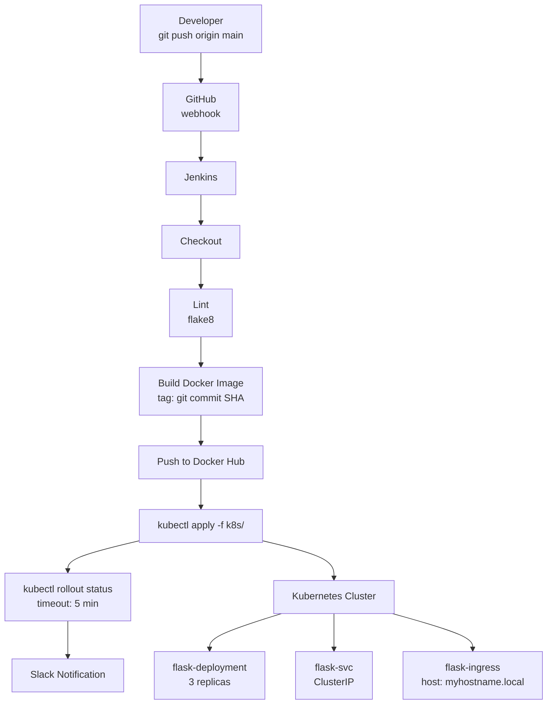

# Week 3 Mini Project — Deploy Python App to Kubernetes via Jenkins

## Objective

Build a complete CI/CD pipeline that automatically deploys the Week 2 Python hostname app to Kubernetes whenever code is pushed to the main branch.

By the end of this project you will have:
- A working Kubernetes Deployment with 3 replicas, health probes, and resource limits
- A ClusterIP Service and an Ingress for HTTP access
- A ConfigMap injecting environment-specific configuration
- A Jenkins pipeline that runs on every push: checkout → lint → build image → push → deploy → smoke test → Slack alert

---

## Architecture



---

## App Source — Week 2 Python Hostname App

If you did not complete Week 2, create this minimal app:

```python
# app.py
import os
import socket
from flask import Flask, jsonify

app = Flask(__name__)

APP_ENV  = os.environ.get("APP_ENV", "unknown")
APP_NAME = os.environ.get("APP_NAME", "unknown")
OWNER    = os.environ.get("OWNER", "unknown")

@app.route("/")
def index():
    return jsonify({
        "hostname": socket.gethostname(),
        "app_name": APP_NAME,
        "env":      APP_ENV,
        "owner":    OWNER,
    })

@app.route("/health")
def health():
    return jsonify({"status": "ok"}), 200

@app.route("/ready")
def ready():
    return jsonify({"status": "ready"}), 200

if __name__ == "__main__":
    app.run(host="0.0.0.0", port=5000)
```

```
# requirements.txt
flask==3.0.3
gunicorn==22.0.0
```

```dockerfile
# Dockerfile
FROM python:3.11-slim

WORKDIR /app

COPY requirements.txt .
RUN pip install --no-cache-dir -r requirements.txt

COPY app.py .

EXPOSE 5000

CMD ["gunicorn", "--bind", "0.0.0.0:5000", "--workers", "2", "app:app"]
```

---

## Required Kubernetes Manifests

Store all manifests in a `k8s/` directory in your repo.

### k8s/configmap.yaml

```yaml
apiVersion: v1
kind: ConfigMap
metadata:
  name: flask-config
  namespace: default
data:
  APP_ENV:  "dev"
  APP_NAME: "myhostname"
  OWNER:    "student"
```

### k8s/deployment.yaml

```yaml
apiVersion: apps/v1
kind: Deployment
metadata:
  name: flask-deployment
  namespace: default
  labels:
    app: flask
spec:
  replicas: 3

  selector:
    matchLabels:
      app: flask

  strategy:
    type: RollingUpdate
    rollingUpdate:
      maxSurge: 1
      maxUnavailable: 1

  template:
    metadata:
      labels:
        app: flask
    spec:
      containers:
        - name: flask
          image: IMAGE_TAG_PLACEHOLDER      # replaced by Jenkins at deploy time
          ports:
            - containerPort: 5000

          # Inject all keys from the ConfigMap as environment variables
          envFrom:
            - configMapRef:
                name: flask-config

          resources:
            requests:
              cpu: "100m"
              memory: "128Mi"
            limits:
              cpu: "500m"
              memory: "256Mi"

          # Liveness probe — restart the container if it stops responding
          livenessProbe:
            httpGet:
              path: /health
              port: 5000
            initialDelaySeconds: 10
            periodSeconds: 15
            failureThreshold: 3
            timeoutSeconds: 5

          # Readiness probe — only send traffic when the app is ready
          readinessProbe:
            httpGet:
              path: /ready
              port: 5000
            initialDelaySeconds: 5
            periodSeconds: 10
            failureThreshold: 3
            timeoutSeconds: 3
```

### k8s/service.yaml

```yaml
apiVersion: v1
kind: Service
metadata:
  name: flask-svc
  namespace: default
  labels:
    app: flask
spec:
  type: ClusterIP
  selector:
    app: flask             # Must match Deployment template labels
  ports:
    - protocol: TCP
      port: 80
      targetPort: 5000
```

### k8s/ingress.yaml

```yaml
apiVersion: networking.k8s.io/v1
kind: Ingress
metadata:
  name: flask-ingress
  namespace: default
  annotations:
    nginx.ingress.kubernetes.io/rewrite-target: /
spec:
  ingressClassName: nginx
  rules:
    - host: myhostname.local
      http:
        paths:
          - path: /
            pathType: Prefix
            backend:
              service:
                name: flask-svc
                port:
                  number: 80
```

Apply all manifests in one command:

```bash
kubectl apply -f k8s/
```

---

## Required Jenkinsfile

```groovy
pipeline {
    agent any

    environment {
        DOCKER_REPO   = 'your-dockerhub-username/flask-hostname'  // <-- change this
        DOCKER_CREDS  = 'dockerhub-creds'      // Jenkins credential ID
        KUBECONFIG_ID = 'kubeconfig-prod'      // Jenkins credential ID (secret file)
        K8S_NS        = 'default'
        IMAGE_TAG     = ''
    }

    options {
        timeout(time: 20, unit: 'MINUTES')
        buildDiscarder(logRotator(numToKeepStr: '10'))
        disableConcurrentBuilds()
    }

    triggers {
        githubPush()
    }

    stages {

        stage('Checkout') {
            steps {
                checkout scm
                script {
                    env.IMAGE_TAG = sh(
                        script: 'git rev-parse --short HEAD',
                        returnStdout: true
                    ).trim()
                }
                echo "Building image: ${DOCKER_REPO}:${IMAGE_TAG}"
            }
        }

        stage('Lint') {
            steps {
                sh '''
                    pip install --quiet flake8
                    flake8 app.py --max-line-length=120
                '''
            }
        }

        stage('Build Image') {
            steps {
                sh """
                    docker build \
                        -t ${DOCKER_REPO}:${IMAGE_TAG} \
                        -t ${DOCKER_REPO}:latest \
                        .
                """
            }
        }

        stage('Push Image') {
            steps {
                withCredentials([usernamePassword(
                    credentialsId: "${DOCKER_CREDS}",
                    usernameVariable: 'DOCKER_USER',
                    passwordVariable: 'DOCKER_PASS'
                )]) {
                    sh """
                        echo "\$DOCKER_PASS" | docker login -u "\$DOCKER_USER" --password-stdin
                        docker push ${DOCKER_REPO}:${IMAGE_TAG}
                        docker push ${DOCKER_REPO}:latest
                        docker logout
                    """
                }
            }
        }

        stage('Deploy to Kubernetes') {
            steps {
                withCredentials([file(
                    credentialsId: "${KUBECONFIG_ID}",
                    variable: 'KUBECONFIG'
                )]) {
                    sh """
                        # Apply ConfigMap and Service (idempotent — safe to re-apply)
                        kubectl apply -f k8s/configmap.yaml
                        kubectl apply -f k8s/service.yaml
                        kubectl apply -f k8s/ingress.yaml

                        # Substitute the image tag placeholder and apply the deployment
                        sed 's|IMAGE_TAG_PLACEHOLDER|${DOCKER_REPO}:${IMAGE_TAG}|g' \
                            k8s/deployment.yaml | kubectl apply -f -

                        # Wait for rollout to complete
                        kubectl rollout status deployment/flask-deployment \
                            --namespace=${K8S_NS} \
                            --timeout=5m
                    """
                }
            }
        }

        stage('Smoke Test') {
            steps {
                withCredentials([file(
                    credentialsId: "${KUBECONFIG_ID}",
                    variable: 'KUBECONFIG'
                )]) {
                    sh '''
                        kubectl port-forward deployment/flask-deployment 9999:5000 \
                            --namespace=default &
                        PF_PID=$!

                        for i in $(seq 1 10); do
                            HTTP_STATUS=$(curl -s -o /dev/null -w "%{http_code}" http://localhost:9999/health 2>/dev/null)
                            [ "$HTTP_STATUS" = "200" ] && break
                            sleep 2
                        done

                        kill $PF_PID || true
                        echo "Health check returned HTTP $HTTP_STATUS"
                        [ "$HTTP_STATUS" = "200" ] || exit 1
                    '''
                }
            }
        }
    }

    post {
        success {
            echo "Deployment of ${DOCKER_REPO}:${IMAGE_TAG} succeeded"
        }
        failure {
            echo "Pipeline failed — check stage logs above"
            // Add Slack notification here (see bonus section)
        }
        always {
            sh "docker rmi ${DOCKER_REPO}:${IMAGE_TAG} || true"
            cleanWs()
        }
    }
}
```

> **Note:** In production, use a private registry like AWS ECR instead of Docker Hub.
> ECR setup is covered in Week 4, Day 20.

---

## Pipeline Stages to Implement

| # | Stage | Tool | Pass Condition |
|---|---|---|---|
| 1 | Checkout | git | Code cloned, IMAGE_TAG set |
| 2 | Lint | flake8 | Exit code 0 |
| 3 | Build Image | docker build | Image built and tagged with SHA |
| 4 | Push Image | docker push | Image visible in Docker Hub |
| 5 | Deploy to K8s | kubectl | `rollout status` reports success |
| 6 | Smoke Test | curl | `/health` returns HTTP 200 |

---

## How to Verify the Deployment Works

### Check Kubernetes Resources

```bash
# All resources in default namespace
kubectl get all -n default

# Deployment is ready (3/3)
kubectl get deployment flask-deployment
# NAME               READY   UP-TO-DATE   AVAILABLE
# flask-deployment   3/3     3            3

# Pods are running
kubectl get pods -l app=flask
# NAME                                READY   STATUS    RESTARTS
# flask-deployment-7d9f6b-abc12       1/1     Running   0
# flask-deployment-7d9f6b-def34       1/1     Running   0
# flask-deployment-7d9f6b-xyz78       1/1     Running   0

# Service has endpoints
kubectl get endpoints flask-svc
# NAME        ENDPOINTS                                   AGE
# flask-svc   10.244.0.5:5000,10.244.0.6:5000,...

# Ingress has an address
kubectl get ingress flask-ingress
```

### Check ConfigMap Is Mounted

```bash
kubectl exec -it $(kubectl get pod -l app=flask -o name | head -1) -- env | grep -E "APP_ENV|APP_NAME|OWNER"
# APP_ENV=dev
# APP_NAME=myhostname
# OWNER=student
```

### Check Health and Readiness Probes

```bash
# View probe status in pod description
kubectl describe pod $(kubectl get pod -l app=flask -o name | head -1) | grep -A 8 "Liveness\|Readiness"
```

### Access the App via Ingress

```bash
# Add myhostname.local to /etc/hosts
echo "$(minikube ip)  myhostname.local" | sudo tee -a /etc/hosts

# Or for a real cluster — get the Ingress controller external IP
kubectl get service -n ingress-nginx ingress-nginx-controller
# Add the EXTERNAL-IP to /etc/hosts as myhostname.local

curl http://myhostname.local/
# {
#   "hostname": "flask-deployment-7d9f6b-abc12",
#   "app_name": "myhostname",
#   "env": "dev",
#   "owner": "student"
# }

# Make multiple requests — notice hostname changes (load balancing across pods)
for i in $(seq 1 6); do curl -s http://myhostname.local/ | python3 -m json.tool | grep hostname; done
```

### Trigger a Rolling Update

```bash
# Push a code change (e.g., add a new field to the JSON response)
git add app.py && git commit -m "add version field to response" && git push origin main

# Watch the rollout in real time
kubectl rollout status deployment/flask-deployment -w
```

### Test Rollback

```bash
# Roll back to the previous version
kubectl rollout undo deployment/flask-deployment

# Verify
kubectl rollout status deployment/flask-deployment
kubectl rollout history deployment/flask-deployment
```

---

## Completion Checklist

Work through this checklist to confirm everything is functioning end-to-end.

### Repository Setup
- [ ] GitHub repo created with `app.py`, `Dockerfile`, `requirements.txt`, `Jenkinsfile`, `k8s/` directory
- [ ] All Kubernetes manifests present: `configmap.yaml`, `deployment.yaml`, `service.yaml`, `ingress.yaml`
- [ ] `IMAGE_TAG_PLACEHOLDER` is in `deployment.yaml` (replaced by Jenkins at deploy time)

### Jenkins Setup
- [ ] Jenkins installed and accessible
- [ ] Suggested plugins installed
- [ ] `dockerhub-creds` credential created (Username with password)
- [ ] `kubeconfig-prod` credential created (Secret file — your kubeconfig)
- [ ] Pipeline job created, pointing to the GitHub repo, using the `Jenkinsfile`
- [ ] GitHub webhook configured and verified (green delivery in GitHub)

### Kubernetes Cluster
- [ ] Ingress controller installed (`minikube addons enable ingress` or nginx controller)
- [ ] `kubectl get nodes` shows nodes in Ready state
- [ ] `kubectl apply -f k8s/` runs without errors

### Pipeline Execution
- [ ] Push a commit to main → Jenkins build starts automatically
- [ ] All pipeline stages show green
- [ ] Image tagged with Git SHA appears in Docker Hub
- [ ] `kubectl get deployment flask-deployment` shows `3/3 READY`
- [ ] `kubectl get pods -l app=flask` shows 3 Running pods
- [ ] `kubectl exec ... -- env | grep APP_ENV` shows `dev`
- [ ] `curl http://myhostname.local/` returns JSON with hostname, app_name, env, owner
- [ ] Multiple curls show different hostnames (load balancing working)
- [ ] `curl http://myhostname.local/health` returns `{"status": "ok"}`

### Resilience
- [ ] Delete one pod (`kubectl delete pod <name>`) — it is replaced automatically
- [ ] Run `kubectl rollout undo deployment/flask-deployment` — app returns to previous version
- [ ] Change the image to a non-existent tag in `k8s/deployment.yaml`, run `kubectl apply`, confirm rollout fails with `kubectl rollout status`, then manually recover with `kubectl rollout undo deployment/flask-deployment`

---

## Bonus: Add Slack Notification Stage

### 1. Create a Slack Incoming Webhook

In your Slack workspace:
`Apps → Incoming Webhooks → Add to Slack → Choose channel → Copy webhook URL`

Example: `https://hooks.slack.com/services/<WORKSPACE_ID>/<CHANNEL_ID>/<TOKEN>`

### 2. Store the Webhook URL in Jenkins

```
Manage Jenkins → Credentials → Add Credentials
Type: Secret text
ID: slack-webhook-url
Secret: https://hooks.slack.com/services/...
```

### 3. Add Post-Build Slack Notification to Jenkinsfile

```groovy
environment {
    SLACK_CREDS   = 'slack-webhook-url'
    SLACK_CHANNEL = '#deployments'
    // ... other env vars
}

post {
    success {
        withCredentials([string(credentialsId: "${SLACK_CREDS}", variable: 'SLACK_URL')]) {
            sh """
                curl -s -X POST "\$SLACK_URL" \
                    -H 'Content-type: application/json' \
                    --data '{
                        "channel": "${SLACK_CHANNEL}",
                        "text": ":white_check_mark: *flask-hostname* deployed successfully",
                        "attachments": [{
                            "color": "good",
                            "fields": [
                                {"title": "Image Tag", "value": "${DOCKER_REPO}:${IMAGE_TAG}", "short": true},
                                {"title": "Build",     "value": "#${env.BUILD_NUMBER}",       "short": true},
                                {"title": "Branch",   "value": "${env.GIT_BRANCH}",           "short": true},
                                {"title": "Commit",   "value": "${env.IMAGE_TAG}",            "short": true}
                            ]
                        }]
                    }'
            """
        }
    }
    failure {
        withCredentials([string(credentialsId: "${SLACK_CREDS}", variable: 'SLACK_URL')]) {
            sh """
                curl -s -X POST "\$SLACK_URL" \
                    -H 'Content-type: application/json' \
                    --data '{
                        "channel": "${SLACK_CHANNEL}",
                        "text": ":x: *flask-hostname* pipeline FAILED — Build #${env.BUILD_NUMBER}",
                        "attachments": [{
                            "color": "danger",
                            "fields": [
                                {"title": "Branch", "value": "${env.GIT_BRANCH}", "short": true},
                                {"title": "Commit", "value": "${env.IMAGE_TAG}",  "short": true}
                            ]
                        }]
                    }'
            """
        }
    }
}
```

### Bonus Checklist
- [ ] Slack incoming webhook URL stored as Jenkins secret
- [ ] Push a commit and verify a green success message appears in Slack
- [ ] Introduce a deliberate failure (bad image tag) and verify a red failure message appears in Slack
- [ ] Slack message includes the image tag, build number, and branch name

---

## Key Takeaways

- A complete pipeline is: source → quality gate → build → scan → push → deploy → verify → notify
- All Kubernetes manifests belong in the same repo as the application code
- Image tags must use the Git commit SHA — never deploy with `latest`
- `IMAGE_TAG_PLACEHOLDER` in YAML + `sed` substitution in the pipeline is a simple, zero-dependency image tag injection strategy
- Readiness probes protect users: traffic only reaches a Pod after it passes the ready check
- ConfigMaps keep environment-specific config out of the Docker image
- `kubectl rollout status --timeout` is the gating check for every deployment — if it fails, roll back
- Slack notifications close the feedback loop — developers know within seconds if their push caused a problem
