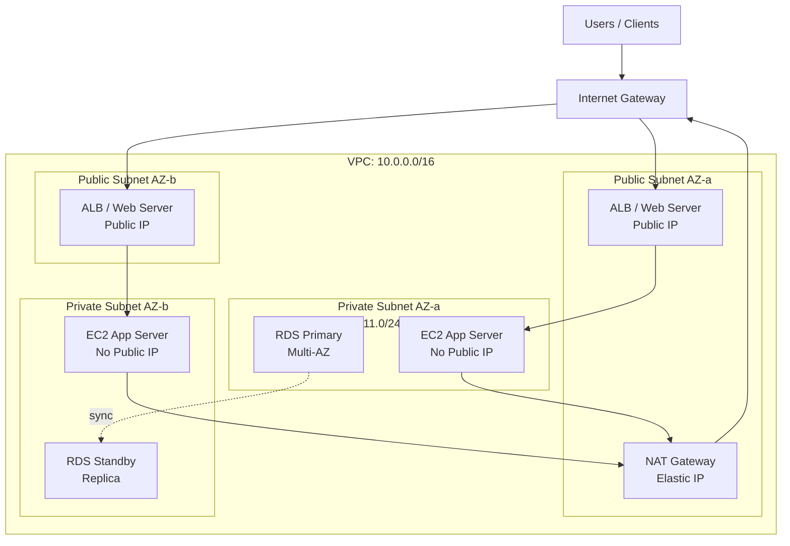

# Day 17 — EC2 + VPC Networking

## Learning Objectives

By the end of this day you will:
- Choose an appropriate EC2 instance type for a workload
- Launch an EC2 instance with a custom security group, key pair, and user data script
- SSH into an EC2 instance and understand what each part of the command does
- Describe the difference between a public and private subnet
- Explain how Internet Gateways and NAT Gateways work
- Draw a VPC architecture diagram from memory

---

## 1. EC2 Instance Types

EC2 instances are virtual machines. AWS organises them into families based on their hardware optimisation.

### Naming Convention

```
t3.micro
│ │
│ └── Size: nano, micro, small, medium, large, xlarge, 2xlarge ...
└──── Family: t (general), m (general), c (compute), r (memory), etc.
```

### Key Families

| Family | Optimised For | Examples | Use Cases |
|--------|--------------|---------|-----------|
| `t3`, `t4g` | Burstable general purpose | t3.micro, t3.small | Web servers, dev environments, low-traffic APIs |
| `m6i`, `m7g` | Balanced general purpose | m6i.large, m7g.xlarge | Production apps with balanced CPU/RAM |
| `c6i`, `c7g` | Compute optimised | c6i.large, c7i.2xlarge | Batch processing, video encoding, high-traffic APIs |
| `r6i`, `r7g` | Memory optimised | r6i.large, r6i.4xlarge | In-memory databases, Redis, large JVM apps |
| `i3`, `i4i` | Storage optimised | i3.large, i4i.xlarge | High IOPS databases, Elasticsearch |
| `p4`, `g5` | GPU | p4d.24xlarge, g5.xlarge | Machine learning training, graphics rendering |

### Burstable Instances (t family) — Important Detail

t3 instances use CPU credits. When your instance uses less than its baseline CPU, it earns credits. When it needs more CPU, it spends credits. If you run out of credits, CPU is throttled to baseline.

This makes t3 instances excellent for workloads with low average CPU but occasional spikes (web servers, CI workers). They are terrible for sustained high-CPU workloads — use `c` family instead.

**Free Tier:** `t2.micro` or `t3.micro` — 750 hours/month for 12 months.

---

## 2. Launching an EC2 Instance

### Key Components

**AMI (Amazon Machine Image):** The operating system template. Think of it like a VM snapshot. AWS provides official AMIs for Amazon Linux 2023, Ubuntu 22.04, Windows Server, etc. You can also create custom AMIs from your own configured instances.

```bash
# Find the latest Amazon Linux 2023 AMI in us-east-1
aws ec2 describe-images \
  --owners amazon \
  --filters \
    "Name=name,Values=al2023-ami-*-x86_64" \
    "Name=state,Values=available" \
  --query 'sort_by(Images, &CreationDate)[-1].ImageId' \
  --output text
```

**Key Pair:** An SSH key pair. AWS stores the public key; you keep the private key (`.pem` file). You use the private key to authenticate when connecting via SSH. AWS never has your private key.

**Security Group:** A stateful virtual firewall controlling inbound and outbound traffic to your instance. Covered in detail in section 4.

**Storage:** EC2 instances use EBS (Elastic Block Store) volumes as their root disk by default. The standard is `gp3` (General Purpose SSD).

### Launch via CLI

```bash
# Step 1: Create a key pair and save the private key
aws ec2 create-key-pair \
  --key-name my-ec2-key \
  --query 'KeyMaterial' \
  --output text > my-ec2-key.pem

chmod 400 my-ec2-key.pem

# Step 2: Create a security group
aws ec2 create-security-group \
  --group-name web-server-sg \
  --description "Security group for web server" \
  --vpc-id vpc-0abcd1234efgh5678

# Step 3: Add inbound rules
# Allow SSH from your IP only
MY_IP=$(curl -s http://checkip.amazonaws.com)/32
aws ec2 authorize-security-group-ingress \
  --group-id sg-0abcd1234efgh5678 \
  --protocol tcp --port 22 --cidr $MY_IP

# Allow HTTP from anywhere
aws ec2 authorize-security-group-ingress \
  --group-id sg-0abcd1234efgh5678 \
  --protocol tcp --port 80 --cidr 0.0.0.0/0

# Step 4: Launch the instance
aws ec2 run-instances \
  --image-id ami-0abcdef1234567890 \
  --instance-type t3.micro \
  --key-name my-ec2-key \
  --security-group-ids sg-0abcd1234efgh5678 \
  --subnet-id subnet-0abcd1234 \
  --associate-public-ip-address \
  --block-device-mappings '[{"DeviceName":"/dev/xvda","Ebs":{"VolumeSize":20,"VolumeType":"gp3"}}]' \
  --tag-specifications 'ResourceType=instance,Tags=[{Key=Name,Value=my-web-server}]' \
  --query 'Instances[0].InstanceId' \
  --output text

# Step 5: Get the public IP
aws ec2 describe-instances \
  --instance-ids i-0abcd1234efgh5678 \
  --query 'Reservations[0].Instances[0].PublicIpAddress' \
  --output text
```

---

## 3. Connecting via SSH

```bash
# Connect to an Amazon Linux instance (default user: ec2-user)
ssh -i my-ec2-key.pem ec2-user@54.210.123.45

# Connect to an Ubuntu instance (default user: ubuntu)
ssh -i my-ec2-key.pem ubuntu@54.210.123.45

# Connect to a Debian instance (default user: admin)
ssh -i my-ec2-key.pem admin@54.210.123.45
```

**Breaking down the SSH command:**
- `-i my-ec2-key.pem` — use this private key file for authentication
- `ec2-user@` — the username on the remote machine
- `54.210.123.45` — the public IP of the EC2 instance

**Common SSH error — permissions too open:**
```bash
@@@@@@@@@@@@@@@@@@@@@@@@@@@@@@@@@@@@@@@@@
@ WARNING: UNPROTECTED PRIVATE KEY FILE! @
@@@@@@@@@@@@@@@@@@@@@@@@@@@@@@@@@@@@@@@@@
```

Fix:
```bash
chmod 400 my-ec2-key.pem
```

The key file must be readable only by you. If it's world-readable, SSH refuses to use it.

---

## 4. User Data Scripts

User Data is a script that runs once when an EC2 instance first boots. Use it to install software, configure services, and set up your application without logging in manually.

```bash
# Launch with a user data script (as a file)
aws ec2 run-instances \
  --image-id ami-0abcdef1234567890 \
  --instance-type t3.micro \
  --key-name my-ec2-key \
  --security-group-ids sg-0abcd1234efgh5678 \
  --user-data file://setup.sh \
  --tag-specifications 'ResourceType=instance,Tags=[{Key=Name,Value=web-server}]'
```

```bash
#!/bin/bash
# setup.sh — runs as root on first boot

# Update packages
yum update -y

# Install Python and pip
yum install -y python3 python3-pip

# Install the application
pip3 install flask gunicorn

# Create the app directory
mkdir -p /opt/myapp
cat > /opt/myapp/app.py << 'PYEOF'
from flask import Flask
import socket

app = Flask(__name__)

@app.route('/')
def hostname():
    return f"Hello from {socket.gethostname()}\n"

@app.route('/health')
def health():
    return "OK", 200
PYEOF

# Create a systemd service so the app restarts on reboot
cat > /etc/systemd/system/myapp.service << 'SVCEOF'
[Unit]
Description=My Python App
After=network.target

[Service]
User=ec2-user
WorkingDirectory=/opt/myapp
ExecStart=/usr/local/bin/gunicorn -w 2 -b 0.0.0.0:80 app:app
Restart=always

[Install]
WantedBy=multi-user.target
SVCEOF

systemctl daemon-reload
systemctl enable myapp
systemctl start myapp
```

**View user data logs:**
```bash
# On the instance
sudo cat /var/log/cloud-init-output.log
```

---

## 5. Security Groups

A Security Group is a stateful virtual firewall attached to an EC2 instance (or other resource).

### Stateful Means

If you allow inbound TCP port 80, the return traffic (your instance sending the response back) is automatically allowed without a separate outbound rule. You do not need symmetric rules.

Compare with a Network ACL (NACL), which is stateless — you need explicit rules for both directions.

### Inbound Rules

Control traffic coming into the instance. By default, all inbound traffic is denied.

```bash
# Allow SSH from a specific IP
aws ec2 authorize-security-group-ingress \
  --group-id sg-0abc12345 \
  --protocol tcp --port 22 --cidr 203.0.113.5/32

# Allow HTTP from the internet
aws ec2 authorize-security-group-ingress \
  --group-id sg-0abc12345 \
  --protocol tcp --port 80 --cidr 0.0.0.0/0

# Allow HTTPS from the internet
aws ec2 authorize-security-group-ingress \
  --group-id sg-0abc12345 \
  --protocol tcp --port 443 --cidr 0.0.0.0/0

# Allow traffic from another security group (e.g., from ALB only)
aws ec2 authorize-security-group-ingress \
  --group-id sg-0ec2-id \
  --protocol tcp --port 8080 \
  --source-group sg-0alb-id
```

### Outbound Rules

Control traffic leaving the instance. By default, all outbound traffic is allowed.

**What does port 0-0 in outbound rules mean?**

When you see an outbound rule with protocol `-1` (all) and port range `0-0`, it means all traffic on all ports in all protocols is allowed. This is the default outbound rule AWS adds to every security group. It allows your instance to reach the internet, update packages, call external APIs, etc.

```bash
# List current security group rules
aws ec2 describe-security-groups \
  --group-ids sg-0abc12345 \
  --query 'SecurityGroups[0].{Inbound:IpPermissions,Outbound:IpPermissionsEgress}'
```

### Security Group Best Practices

- Allow SSH only from your IP, never from `0.0.0.0/0`
- Use source security group references instead of CIDR where possible (EC2 → ALB → EC2 chain)
- Separate security groups by role: one for ALB, one for EC2, one for RDS
- Remove the default `0.0.0.0/0` outbound rule if your instances don't need internet access

---

## 6. VPC — Virtual Private Cloud

A VPC is your private, isolated network inside AWS. It is logically isolated from every other customer's network.

### Default VPC vs Custom VPC

**Default VPC:** AWS creates one in every region automatically. It has public subnets, an Internet Gateway, and default route tables. It is convenient for getting started. It is not suitable for production because everything is in public subnets.

**Custom VPC:** You define the IP range, subnet layout, and routing. This is what you use in production.

### Creating a Custom VPC

```bash
# Create the VPC with CIDR 10.0.0.0/16 (65,536 addresses)
aws ec2 create-vpc \
  --cidr-block 10.0.0.0/16 \
  --tag-specifications 'ResourceType=vpc,Tags=[{Key=Name,Value=production-vpc}]' \
  --query 'Vpc.VpcId' \
  --output text
# Returns: vpc-0abc123456789

# Enable DNS hostnames (needed for EC2 instances to get public DNS names)
aws ec2 modify-vpc-attribute \
  --vpc-id vpc-0abc123456789 \
  --enable-dns-hostnames
```

---

## 7. Subnets — Public vs Private

A subnet is a range of IP addresses within your VPC. Subnets live in a single Availability Zone.

**Public Subnet:** Has a route to an Internet Gateway. Resources in public subnets can have public IP addresses and receive traffic from the internet.

**Private Subnet:** No route to an Internet Gateway. Resources here are not directly reachable from the internet. They can reach the internet via a NAT Gateway in a public subnet.

```bash
VPC: 10.0.0.0/16
├── Public Subnet AZ-a:  10.0.1.0/24  (254 addresses)
├── Public Subnet AZ-b:  10.0.2.0/24  (254 addresses)
├── Private Subnet AZ-a: 10.0.11.0/24 (254 addresses)
└── Private Subnet AZ-b: 10.0.12.0/24 (254 addresses)
```

```bash
# Create public subnet in AZ-a
aws ec2 create-subnet \
  --vpc-id vpc-0abc123456789 \
  --cidr-block 10.0.1.0/24 \
  --availability-zone us-east-1a \
  --tag-specifications 'ResourceType=subnet,Tags=[{Key=Name,Value=public-subnet-1a}]'

# Create private subnet in AZ-a
aws ec2 create-subnet \
  --vpc-id vpc-0abc123456789 \
  --cidr-block 10.0.11.0/24 \
  --availability-zone us-east-1a \
  --tag-specifications 'ResourceType=subnet,Tags=[{Key=Name,Value=private-subnet-1a}]'

# Enable auto-assign public IP for public subnets
aws ec2 modify-subnet-attribute \
  --subnet-id subnet-0abc1234def \
  --map-public-ip-on-launch
```

---

## 8. Internet Gateway

An Internet Gateway (IGW) is a horizontally scaled, redundant, highly available VPC component that allows communication between your VPC and the internet. A VPC can have only one IGW.

**The IGW performs two functions:**
1. Provides a target in route tables for internet-routable traffic
2. Performs NAT for instances with public IP addresses

```bash
# Create an Internet Gateway
aws ec2 create-internet-gateway \
  --tag-specifications 'ResourceType=internet-gateway,Tags=[{Key=Name,Value=production-igw}]' \
  --query 'InternetGateway.InternetGatewayId' \
  --output text
# Returns: igw-0abc123456789

# Attach it to the VPC
aws ec2 attach-internet-gateway \
  --internet-gateway-id igw-0abc123456789 \
  --vpc-id vpc-0abc123456789
```

---

## 9. NAT Gateway

A NAT Gateway lets instances in private subnets initiate outbound connections to the internet (for package updates, API calls, etc.) without allowing inbound connections from the internet.

**The NAT Gateway:**
- Lives in a public subnet
- Has a static Elastic IP address
- Handles the network address translation
- Is managed by AWS — no patching required

**Cost warning:** NAT Gateway costs $0.045/hour plus $0.045/GB of data. Always destroy it when not needed.

```bash
# First, create an Elastic IP for the NAT Gateway
aws ec2 allocate-address \
  --domain vpc \
  --query 'AllocationId' \
  --output text
# Returns: eipalloc-0abc123456789

# Create the NAT Gateway in the public subnet
aws ec2 create-nat-gateway \
  --subnet-id subnet-0abc1234def \
  --allocation-id eipalloc-0abc123456789 \
  --tag-specifications 'ResourceType=natgateway,Tags=[{Key=Name,Value=production-nat}]'

# Wait for it to become available (takes ~1-2 minutes)
aws ec2 wait nat-gateway-available --nat-gateway-ids nat-0abc123456789
```

---

## 10. Route Tables

Route tables control where network traffic from subnets is directed. Every subnet is associated with one route table.

```bash
# Public Route Table — routes internet traffic to IGW
Destination      Target
10.0.0.0/16     local           (traffic within VPC stays local)
0.0.0.0/0       igw-0abc...     (everything else goes to internet)

# Private Route Table — routes internet traffic to NAT
Destination      Target
10.0.0.0/16     local           (traffic within VPC stays local)
0.0.0.0/0       nat-0abc...     (outbound internet via NAT Gateway)
```

```bash
# Create a public route table
aws ec2 create-route-table \
  --vpc-id vpc-0abc123456789 \
  --tag-specifications 'ResourceType=route-table,Tags=[{Key=Name,Value=public-rt}]' \
  --query 'RouteTable.RouteTableId' \
  --output text

# Add the default route to the Internet Gateway
aws ec2 create-route \
  --route-table-id rtb-0abc1234def \
  --destination-cidr-block 0.0.0.0/0 \
  --gateway-id igw-0abc123456789

# Associate public subnets with the public route table
aws ec2 associate-route-table \
  --route-table-id rtb-0abc1234def \
  --subnet-id subnet-0abc1234def

# Create a private route table
aws ec2 create-route-table \
  --vpc-id vpc-0abc123456789 \
  --tag-specifications 'ResourceType=route-table,Tags=[{Key=Name,Value=private-rt}]'

# Add default route pointing to NAT Gateway
aws ec2 create-route \
  --route-table-id rtb-0bcd2345efa \
  --destination-cidr-block 0.0.0.0/0 \
  --nat-gateway-id nat-0abc123456789

# Associate private subnets with the private route table
aws ec2 associate-route-table \
  --route-table-id rtb-0bcd2345efa \
  --subnet-id subnet-0cde3456fab
```

---

## 11. Full VPC Architecture Diagram



**Traffic flow — inbound request:**
1. User sends HTTP request to the ALB's public IP (or domain name)
2. IGW receives the packet and forwards it to the ALB in the public subnet
3. ALB health-checks and load-balances to EC2 instances in the private subnet
4. EC2 processes the request and sends response back to ALB
5. ALB sends response back through IGW to the user

**Traffic flow — EC2 outbound (e.g., downloading packages):**
1. EC2 in private subnet sends packet to NAT Gateway in public subnet
2. NAT Gateway replaces the source IP with its Elastic IP
3. IGW forwards the packet to the internet
4. Response comes back to NAT Gateway's Elastic IP
5. NAT Gateway translates and forwards to the EC2 instance

---

## 12. Elastic IP

An Elastic IP (EIP) is a static public IPv4 address you own. Regular EC2 public IPs change when you stop and start the instance. An EIP stays the same.

**When to use:** NAT Gateways (required), EC2 instances that need a stable IP for DNS or firewall whitelisting.

**Cost:** Free while attached to a running instance. $0.005/hour when unattached or attached to a stopped instance.

```bash
# Allocate an Elastic IP
aws ec2 allocate-address --domain vpc

# Associate with an EC2 instance
aws ec2 associate-address \
  --instance-id i-0abcd1234efgh5678 \
  --allocation-id eipalloc-0abc123456789

# Release (when you no longer need it — avoid charges)
aws ec2 release-address --allocation-id eipalloc-0abc123456789
```

---

## 13. Key Pairs — Never Share Your .pem File

Your `.pem` file is your private SSH key. It cannot be regenerated from AWS. If you lose it, you cannot SSH into instances that were launched with that key pair.

**What to do:**
- Set `chmod 400` on the file immediately after download
- Store it in a secure location (password manager, encrypted volume)
- Never commit it to a git repository
- Add `*.pem` to your `.gitignore` globally

```bash
# Add to global gitignore
echo "*.pem" >> ~/.gitignore_global
git config --global core.excludesfile ~/.gitignore_global
```

If you accidentally push a `.pem` file to GitHub:
1. Delete the key pair in AWS Console immediately
2. Generate a new one
3. Rotate all instances to use the new key pair (or terminate and relaunch)
4. Assume the key is compromised — check CloudTrail for unauthorised API calls

---

## Exercises

### Exercise 1 — Build the Full VPC from the Command Line

Create the complete network stack from section 11 using AWS CLI commands. Create:
- 1 VPC (10.0.0.0/16)
- 2 public subnets (10.0.1.0/24, 10.0.2.0/24) in different AZs
- 2 private subnets (10.0.11.0/24, 10.0.12.0/24) in different AZs
- 1 Internet Gateway attached to the VPC
- 1 NAT Gateway in public subnet 1 with an Elastic IP
- Public route table with 0.0.0.0/0 → IGW, associated with both public subnets
- Private route table with 0.0.0.0/0 → NAT, associated with both private subnets

**Verify:**
```bash
aws ec2 describe-route-tables \
  --filters "Name=vpc-id,Values=YOUR-VPC-ID" \
  --query 'RouteTables[*].{ID:RouteTableId,Routes:Routes,Associations:Associations}'
```

### Exercise 2 — Launch an EC2 Instance in the Public Subnet

Using the VPC you created in Exercise 1:
1. Create a security group allowing SSH from your IP and HTTP from everywhere
2. Create a key pair
3. Launch a t3.micro Amazon Linux 2023 instance in one of the public subnets
4. SSH into it and confirm internet connectivity: `curl https://checkip.amazonaws.com`
5. Install nginx: `sudo dnf install -y nginx && sudo systemctl enable nginx && sudo systemctl start nginx`
6. Verify nginx is accessible by opening the public IP in a browser

### Exercise 3 — User Data Script

Terminate the instance from Exercise 2. Launch a new one with a User Data script that:
- Installs Python 3 and pip
- Creates a simple Flask app that returns the hostname
- Starts the app on port 80 using gunicorn
- Configures it as a systemd service

After launch (wait 2-3 minutes), access the public IP in a browser. You should see the hostname without ever having SSH'd in.

**Hint:** Look at the user data script in section 4 of this guide.

### Exercise 4 — Launch an EC2 Instance in the Private Subnet

1. Launch a t3.micro instance in the private subnet with no public IP
2. SSH into the public instance from Exercise 2 (it acts as a bastion host)
3. From the bastion host, SSH into the private instance using the same key:
   ```bash
   # Copy the key to the bastion (or use SSH agent forwarding)
   ssh -i my-ec2-key.pem -A ec2-user@PUBLIC_IP
   # Note: SSH agent forwarding (-A) requires ssh-agent running locally.
   # Start it with: eval $(ssh-agent -s) && ssh-add my-ec2-key.pem
   # Now from bastion:
   ssh ec2-user@PRIVATE_IP_OF_PRIVATE_INSTANCE
   ```
4. From the private instance, confirm internet access via NAT: `curl https://checkip.amazonaws.com`
   - The IP you see should be the Elastic IP of your NAT Gateway, not the private instance's IP

### Exercise 5 — Security Group Chaining

1. Create two security groups: `alb-sg` and `ec2-sg`
2. `alb-sg` allows inbound HTTP (80) and HTTPS (443) from `0.0.0.0/0`
3. `ec2-sg` allows inbound on port 8080 only from `alb-sg` (not from the internet)
4. Launch an EC2 instance with `ec2-sg` and a simple Python HTTP server on port 8080
5. Verify you cannot reach port 8080 directly from the internet
6. Place an Application Load Balancer with `alb-sg` in front and confirm traffic flows through

### Exercise 6 — Cleanup

Delete all resources in reverse order to avoid dependency errors:

```bash
# Terminate EC2 instances first
aws ec2 terminate-instances --instance-ids i-INSTANCE-ID

# Delete NAT Gateway (takes a few minutes)
aws ec2 delete-nat-gateway --nat-gateway-id nat-ID

# Release Elastic IP (after NAT Gateway is deleted)
aws ec2 release-address --allocation-id eipalloc-ID

# Detach and delete Internet Gateway
aws ec2 detach-internet-gateway --internet-gateway-id igw-ID --vpc-id vpc-ID
aws ec2 delete-internet-gateway --internet-gateway-id igw-ID

# Delete subnets
aws ec2 delete-subnet --subnet-id subnet-ID

# Delete route tables (not the main route table)
aws ec2 delete-route-table --route-table-id rtb-ID

# Delete security groups (not the default SG)
aws ec2 delete-security-group --group-id sg-ID

# Delete the VPC last
aws ec2 delete-vpc --vpc-id vpc-ID

# Release any Elastic IPs
aws ec2 describe-addresses --query 'Addresses[*].AllocationId' --output text
```

This cleanup sequence is the foundation for understanding why Terraform is valuable — it handles dependency ordering for you.
