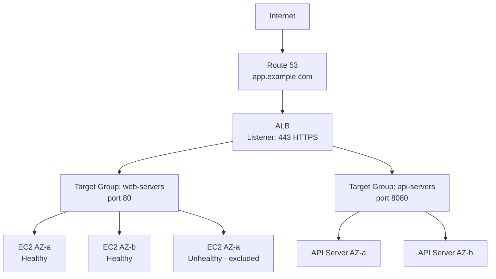
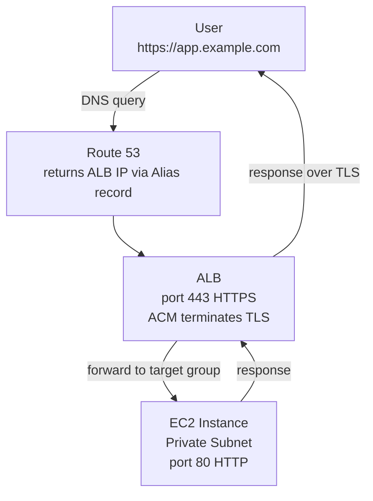

# Day 18 — AWS Storage, Databases, Load Balancing, and Route 53

## Learning Objectives

By the end of this day you will:
- Create S3 buckets, upload objects, and apply bucket policies
- Choose the right S3 storage class for a workload
- Configure an RDS database in Multi-AZ mode
- Build an Application Load Balancer with HTTPS termination
- Understand how Route 53 DNS records connect a domain to an ALB
- Configure an Auto Scaling Group with launch templates and scaling policies

---

## 1. S3 — Simple Storage Service

S3 is object storage. You store files (called objects) in containers (called buckets). There is no filesystem hierarchy — everything is flat, but object keys can contain `/` to simulate folders.

### Core Concepts

| Concept | Description |
|---------|-------------|
| Bucket | Container for objects. Name must be globally unique across all AWS accounts. |
| Object | A file and its metadata. Max size: 5 TB. |
| Key | The full path/name of an object: `logs/2025/01/app.log` |
| Versioning | Keeps all versions of an object. Deleting a versioned object creates a delete marker rather than removing data. |
| Bucket Policy | JSON policy applied to the entire bucket, controlling who can access it. |

### Basic S3 Operations

```bash
# Create a bucket (bucket names must be globally unique)
aws s3 mb s3://my-devops-practice-yourinitials-2025 --region us-east-1

# Upload a file
aws s3 cp my-file.txt s3://my-devops-practice-yourinitials-2025/

# Upload a folder recursively
aws s3 cp ./my-folder/ s3://my-devops-practice-yourinitials-2025/my-folder/ --recursive

# List bucket contents
aws s3 ls s3://my-devops-practice-yourinitials-2025/

# Download a file
aws s3 cp s3://my-devops-practice-yourinitials-2025/my-file.txt ./downloaded-file.txt

# Sync a local directory with S3 (only uploads changed/new files)
aws s3 sync ./website/ s3://my-devops-practice-yourinitials-2025/website/

# Delete an object
aws s3 rm s3://my-devops-practice-yourinitials-2025/my-file.txt

# Delete all objects and the bucket
aws s3 rb s3://my-devops-practice-yourinitials-2025 --force
```

### Enable Versioning

```bash
aws s3api put-bucket-versioning \
  --bucket my-devops-practice-yourinitials-2025 \
  --versioning-configuration Status=Enabled

# List all versions of an object
aws s3api list-object-versions \
  --bucket my-devops-practice-yourinitials-2025 \
  --prefix my-file.txt

# Restore a previous version by copying it over the current one
aws s3api copy-object \
  --bucket my-devops-practice-yourinitials-2025 \
  --copy-source my-devops-practice-yourinitials-2025/my-file.txt?versionId=VERSION_ID_HERE \
  --key my-file.txt
```

### Bucket Policies

A bucket policy controls who can access objects in the bucket. It applies at the bucket level.

**Example: Allow public read for a static website:**
```json
{
  "Version": "2012-10-17",
  "Statement": [
    {
      "Sid": "PublicReadGetObject",
      "Effect": "Allow",
      "Principal": "*",
      "Action": "s3:GetObject",
      "Resource": "arn:aws:s3:::my-devops-practice-yourinitials-2025/*"
    }
  ]
}
```

**Example: Allow only a specific IAM role to access objects:**
```json
{
  "Version": "2012-10-17",
  "Statement": [
    {
      "Sid": "AllowRoleAccess",
      "Effect": "Allow",
      "Principal": {
        "AWS": "arn:aws:iam::123456789012:role/ec2-app-role"
      },
      "Action": ["s3:GetObject", "s3:PutObject"],
      "Resource": "arn:aws:s3:::my-devops-practice-yourinitials-2025/*"
    }
  ]
}
```

```bash
# Apply a bucket policy
aws s3api put-bucket-policy \
  --bucket my-devops-practice-yourinitials-2025 \
  --policy file://bucket-policy.json

# Block all public access (recommended for non-website buckets)
aws s3api put-public-access-block \
  --bucket my-devops-practice-yourinitials-2025 \
  --public-access-block-configuration \
    "BlockPublicAcls=true,IgnorePublicAcls=true,BlockPublicPolicy=true,RestrictPublicBuckets=true"
```

---

## 2. S3 Storage Classes

S3 offers multiple storage classes with different costs and availability characteristics. Choosing correctly reduces costs significantly.

| Storage Class | Use Case | Retrieval Time | Cost (approximate) |
|---------------|----------|----------------|-------------------|
| **S3 Standard** | Frequently accessed data | Milliseconds | $0.023/GB/month |
| **S3 Standard-IA** | Infrequently accessed, must be fast when needed | Milliseconds | $0.0125/GB/month + retrieval fee |
| **S3 One Zone-IA** | Infrequently accessed, can tolerate AZ loss | Milliseconds | $0.01/GB/month + retrieval fee |
| **S3 Glacier Instant** | Archives accessed occasionally | Milliseconds | $0.004/GB/month |
| **S3 Glacier Flexible** | Long-term archives, rare access | Minutes to hours | $0.0036/GB/month |
| **S3 Glacier Deep Archive** | Regulatory archives, almost never accessed | Up to 12 hours | $0.00099/GB/month |
| **S3 Intelligent-Tiering** | Unknown access patterns | Milliseconds to hours | Monitoring fee + tiered pricing |

**Practical guidance:**
- **Application logs (current month):** S3 Standard
- **Application logs (older than 30 days):** S3 Standard-IA
- **Compliance archives (7-year retention):** S3 Glacier Deep Archive
- **Don't know access patterns:** S3 Intelligent-Tiering

### Lifecycle Rules — Automate Tier Transitions

```bash
# Create a lifecycle rule: move to IA after 30 days, Glacier after 90 days, delete after 365 days
cat > lifecycle.json << 'EOF'
{
  "Rules": [
    {
      "ID": "log-lifecycle",
      "Status": "Enabled",
      "Filter": {"Prefix": "logs/"},
      "Transitions": [
        {"Days": 30, "StorageClass": "STANDARD_IA"},
        {"Days": 90, "StorageClass": "GLACIER"}
      ],
      "Expiration": {"Days": 365}
    }
  ]
}
EOF

aws s3api put-bucket-lifecycle-configuration \
  --bucket my-devops-practice-yourinitials-2025 \
  --lifecycle-configuration file://lifecycle.json
```

---

## 3. S3 for Terraform State — Why S3 + DynamoDB

Terraform state tracks what resources Terraform manages. By default, state is stored in a local `terraform.tfstate` file. This is fine for solo learning but breaks down in teams.

**Problems with local state:**
- Team member A runs `terraform apply`, state is on their laptop
- Team member B runs `terraform apply` from a different laptop with stale state
- They now have conflicting state — resources may be duplicated or deleted

**The solution:** Store state in S3 (shared, durable) and use DynamoDB for locking (only one person can run `apply` at a time).

```bash
# Create the S3 bucket for Terraform state
aws s3 mb s3://my-terraform-state-yourinitials-2025 --region us-east-1

# Enable versioning (so you can recover previous state if corrupted)
aws s3api put-bucket-versioning \
  --bucket my-terraform-state-yourinitials-2025 \
  --versioning-configuration Status=Enabled

# Enable server-side encryption
aws s3api put-bucket-encryption \
  --bucket my-terraform-state-yourinitials-2025 \
  --server-side-encryption-configuration '{
    "Rules": [{
      "ApplyServerSideEncryptionByDefault": {
        "SSEAlgorithm": "AES256"
      }
    }]
  }'

# Block all public access
aws s3api put-public-access-block \
  --bucket my-terraform-state-yourinitials-2025 \
  --public-access-block-configuration \
    "BlockPublicAcls=true,IgnorePublicAcls=true,BlockPublicPolicy=true,RestrictPublicBuckets=true"

# Create DynamoDB table for state locking
aws dynamodb create-table \
  --table-name terraform-state-lock \
  --attribute-definitions AttributeName=LockID,AttributeType=S \
  --key-schema AttributeName=LockID,KeyType=HASH \
  --billing-mode PAY_PER_REQUEST \
  --region us-east-1
```

The Terraform backend configuration (in `provider.tf`):
```hcl
terraform {
  backend "s3" {
    bucket         = "my-terraform-state-yourinitials-2025"
    key            = "production/terraform.tfstate"
    region         = "us-east-1"
    dynamodb_table = "terraform-state-lock"
    encrypt        = true
  }
}
```

---

## 4. RDS — Relational Database Service

RDS is a managed relational database service. AWS handles provisioning, patching, backups, and failover. You focus on schema and queries.

**Supported engines:** MySQL, PostgreSQL, MariaDB, Oracle, SQL Server, Amazon Aurora

### When to Use RDS vs EC2 + Database

| Scenario | Use RDS | Use EC2 |
|----------|---------|---------|
| Standard OLTP workloads | Yes | |
| You need Multi-AZ failover | Yes | |
| You want automated backups | Yes | |
| You need a specific DB version or config not supported by RDS | | Yes |
| You need to tune kernel parameters | | Yes |
| Cost is the only constraint (RDS adds ~30% overhead) | | Yes |

**For most production workloads, use RDS.** The operational overhead of running your own database on EC2 (manual backups, patching, failover scripts) is not worth the cost savings unless you have very specific requirements.

### Multi-AZ Deployment

Multi-AZ creates a synchronous standby replica in a different AZ. If the primary fails, AWS automatically fails over to the standby in 1–2 minutes with no manual intervention needed. Your application will experience approximately 30–60 seconds of connection errors during the DNS failover.

```
Primary DB (AZ-a) --synchronous replication--> Standby DB (AZ-b)
       |
  DNS endpoint (same endpoint — your app does not change)
       |
  Failover: DNS endpoint switches to standby automatically
```

### Read Replicas

Read replicas are asynchronous copies of the primary for offloading read traffic. Unlike Multi-AZ, they serve read traffic and can be in different regions.

```bash
# Create an RDS instance (MySQL, db.t3.micro — Free Tier eligible)
aws rds create-db-instance \
  --db-instance-identifier production-db \
  --db-instance-class db.t3.micro \
  --engine mysql \
  --engine-version 8.0 \
  --master-username admin \
  --master-user-password "YourSecurePassword123!" \
  --allocated-storage 20 \
  --storage-type gp3 \
  --multi-az \
  --vpc-security-group-ids sg-0abc12345 \
  --db-subnet-group-name my-db-subnet-group \
  --backup-retention-period 7 \
  --deletion-protection \
  --no-publicly-accessible \
  --tags Key=Name,Value=production-db

# Get the endpoint (use this in your application — not the IP)
aws rds describe-db-instances \
  --db-instance-identifier production-db \
  --query 'DBInstances[0].Endpoint.Address' \
  --output text

# Create a read replica
aws rds create-db-instance-read-replica \
  --db-instance-identifier production-db-replica \
  --source-db-instance-identifier production-db \
  --db-instance-class db.t3.micro
```

**DB Subnet Group — required for RDS in a VPC:**
```bash
# Create a subnet group spanning two AZs (for Multi-AZ)
aws rds create-db-subnet-group \
  --db-subnet-group-name my-db-subnet-group \
  --db-subnet-group-description "Private subnets for RDS" \
  --subnet-ids subnet-0cde3456fab subnet-0def4567abc
```

---

## 5. Application Load Balancer (ALB)

An ALB operates at layer 7 (HTTP/HTTPS). It distributes incoming traffic across multiple targets (EC2 instances, containers, Lambda functions) in multiple AZs based on content of the request.

### Key Components

**Listener:** A process that checks for connection requests on a port and protocol. An ALB can have multiple listeners (e.g., port 80 and port 443).

**Listener Rules:** Rules on each listener that route traffic to different target groups based on conditions (path, hostname, headers).

**Target Group:** A group of resources that receive traffic. The ALB continuously health-checks targets and only sends traffic to healthy ones.

**Health Check:** The ALB periodically sends a request to each target. If the target returns a non-2xx status or times out, it is marked unhealthy and removed from rotation.

### Traffic Flow



### Creating an ALB via CLI

```bash
# Create the ALB (must reference subnets in at least 2 AZs)
aws elbv2 create-load-balancer \
  --name production-alb \
  --subnets subnet-0abc1234def subnet-0bcd2345efa \
  --security-groups sg-0alb \
  --scheme internet-facing \
  --type application \
  --ip-address-type ipv4 \
  --tags Key=Name,Value=production-alb

# Create a target group
aws elbv2 create-target-group \
  --name web-servers-tg \
  --protocol HTTP \
  --port 80 \
  --vpc-id vpc-0abc123456789 \
  --health-check-protocol HTTP \
  --health-check-path /health \
  --health-check-interval-seconds 30 \
  --health-check-timeout-seconds 5 \
  --healthy-threshold-count 2 \
  --unhealthy-threshold-count 3 \
  --matcher 'HttpCode=200' \
  --target-type instance

# Register targets manually (ASG does this automatically)
aws elbv2 register-targets \
  --target-group-arn arn:aws:elasticloadbalancing:... \
  --targets Id=i-0abc123,Port=80 Id=i-0def456,Port=80

# Create an HTTP listener (port 80) that redirects to HTTPS
aws elbv2 create-listener \
  --load-balancer-arn arn:aws:elasticloadbalancing:... \
  --protocol HTTP \
  --port 80 \
  --default-actions '[{
    "Type": "redirect",
    "RedirectConfig": {
      "Protocol": "HTTPS",
      "Port": "443",
      "StatusCode": "HTTP_301"
    }
  }]'

# Create an HTTPS listener (port 443) — requires an ACM certificate
aws elbv2 create-listener \
  --load-balancer-arn arn:aws:elasticloadbalancing:... \
  --protocol HTTPS \
  --port 443 \
  --certificates CertificateArn=arn:aws:acm:... \
  --default-actions '[{
    "Type": "forward",
    "TargetGroupArn": "arn:aws:elasticloadbalancing:..."
  }]'
```

---

## 6. SSL/TLS on ALB — AWS Certificate Manager (ACM)

ACM provides free SSL/TLS certificates for use with AWS services (ALB, CloudFront, API Gateway). These certificates are automatically renewed — you never need to worry about expiry.

**You must own the domain to get a certificate.**

### Two Validation Methods

**DNS validation (recommended):** ACM gives you a CNAME record to add to your DNS. Once it's there, ACM validates you own the domain and issues the certificate. It stays valid as long as the CNAME record exists.

**Email validation:** ACM sends a validation email to addresses at the domain (admin@, webmaster@, etc.). Less convenient.

```bash
# Request a certificate
aws acm request-certificate \
  --domain-name app.example.com \
  --validation-method DNS \
  --subject-alternative-names "*.example.com" \
  --region us-east-1

# Get the DNS validation record to add to Route 53
aws acm describe-certificate \
  --certificate-arn arn:aws:acm:us-east-1:123456789012:certificate/abc123 \
  --query 'Certificate.DomainValidationOptions[0].ResourceRecord'

# List certificates
aws acm list-certificates --region us-east-1
```

After adding the DNS validation CNAME record, the certificate moves to `ISSUED` status within minutes.

---

## 7. Auto Scaling Groups (ASG)

An ASG manages a fleet of EC2 instances. It automatically launches new instances when traffic increases and terminates them when it decreases.

### Key Concepts

**Launch Template:** Defines the instance configuration — AMI, instance type, key pair, security group, user data. Think of it as the blueprint for each instance the ASG creates.

**Min / Max / Desired:**
- **Min:** The ASG never goes below this count, even if all instances are healthy and traffic is zero.
- **Max:** The ASG never exceeds this count, even under extreme load.
- **Desired:** The target count. ASG will always try to match this by launching or terminating instances.

**Scaling Policies:**
- **Target Tracking:** "Keep average CPU at 50%." AWS adjusts desired count automatically.
- **Step Scaling:** "Add 2 instances when CPU > 70%, add 4 when CPU > 90%."
- **Scheduled Scaling:** "At 8am Monday add 5 instances; at 8pm remove them."

```bash
# Create a launch template
aws ec2 create-launch-template \
  --launch-template-name production-lt \
  --launch-template-data '{
    "ImageId": "ami-0abcdef1234567890",
    "InstanceType": "t3.micro",
    "KeyName": "my-ec2-key",
    "SecurityGroupIds": ["sg-0ec2-id"],
    "IamInstanceProfile": {"Name": "ec2-app-profile"},
    "UserData": "'$(base64 -w 0 setup.sh)'",
    "BlockDeviceMappings": [{
      "DeviceName": "/dev/xvda",
      "Ebs": {"VolumeSize": 20, "VolumeType": "gp3"}
    }],
    "TagSpecifications": [{
      "ResourceType": "instance",
      "Tags": [{"Key": "Name", "Value": "production-app"}]
    }]
  }'

# Create the Auto Scaling Group
aws autoscaling create-auto-scaling-group \
  --auto-scaling-group-name production-asg \
  --launch-template LaunchTemplateName=production-lt,Version='$Latest' \
  --min-size 1 \
  --max-size 3 \
  --desired-capacity 2 \
  --vpc-zone-identifier "subnet-0cde3456fab,subnet-0def4567abc" \
  --target-group-arns arn:aws:elasticloadbalancing:... \
  --health-check-type ELB \
  --health-check-grace-period 300 \
  --tags Key=Name,Value=production-asg,PropagateAtLaunch=true

# Add a target tracking scaling policy (keep CPU at 50%)
aws autoscaling put-scaling-policy \
  --auto-scaling-group-name production-asg \
  --policy-name cpu-target-tracking \
  --policy-type TargetTrackingScaling \
  --target-tracking-configuration '{
    "PredefinedMetricSpecification": {
      "PredefinedMetricType": "ASGAverageCPUUtilization"
    },
    "TargetValue": 50.0
  }'
```

---

## 8. Route 53 — DNS

Route 53 is AWS's DNS service. It translates domain names (app.example.com) into IP addresses.

### Key Concepts

**Hosted Zone:** A container for DNS records for a domain. When you register a domain or delegate DNS to Route 53, you create a hosted zone. There are two types:
- **Public hosted zone:** Answers DNS queries from the internet
- **Private hosted zone:** Answers DNS queries only from within your VPC

**Record Types:**

| Type | Purpose | Example |
|------|---------|---------|
| A | Maps name to IPv4 address | `app.example.com → 203.0.113.5` |
| AAAA | Maps name to IPv6 address | `app.example.com → 2001:db8::1` |
| CNAME | Maps name to another name | `www.example.com → app.example.com` |
| Alias | Like CNAME but for root domains and AWS resources | `example.com → my-alb.us-east-1.elb.amazonaws.com` |
| MX | Mail exchange records | |
| TXT | Text records (used for domain verification) | |

**Alias vs CNAME:**
- CNAME cannot point to a root domain (example.com — this is the "naked" or "apex" domain). You cannot have `example.com CNAME my-alb.elb.amazonaws.com` in DNS standards.
- Route 53 Alias records solve this. They work like CNAME but are a Route 53 extension. Use Alias for pointing to ALBs, CloudFront, S3 websites.
- Alias records are free — Route 53 does not charge for queries to Alias records pointing to AWS resources.

### Create DNS Records via CLI

```bash
# Create a hosted zone for a domain you own
aws route53 create-hosted-zone \
  --name example.com \
  --caller-reference "$(date +%s)"

# List hosted zones
aws route53 list-hosted-zones

# Create an A Alias record pointing to an ALB
aws route53 change-resource-record-sets \
  --hosted-zone-id Z1234567890ABCDEFG \
  --change-batch '{
    "Changes": [{
      "Action": "CREATE",
      "ResourceRecordSet": {
        "Name": "app.example.com",
        "Type": "A",
        "AliasTarget": {
          # Note: Z35SXDOTRQ7X7K is the hosted zone ID for us-east-1 ALBs only.
          # For other regions, get the correct ID with:
          # aws elbv2 describe-load-balancers --query 'LoadBalancers[0].CanonicalHostedZoneId'
          "HostedZoneId": "Z35SXDOTRQ7X7K",
          "DNSName": "production-alb-123456789.us-east-1.elb.amazonaws.com",
          "EvaluateTargetHealth": true
        }
      }
    }]
  }'

# Test DNS resolution
dig app.example.com
nslookup app.example.com 8.8.8.8
```

### Complete Traffic Flow



---

## Exercises

### Exercise 1 — S3 Bucket Setup with Lifecycle Rules

```bash
# Create a bucket with a unique name
BUCKET_NAME="devops-practice-$(whoami)-$(date +%Y%m)"
aws s3 mb s3://$BUCKET_NAME --region us-east-1

# Enable versioning
aws s3api put-bucket-versioning \
  --bucket $BUCKET_NAME \
  --versioning-configuration Status=Enabled

# Upload three versions of the same file
echo "version 1" > test.txt && aws s3 cp test.txt s3://$BUCKET_NAME/
echo "version 2" > test.txt && aws s3 cp test.txt s3://$BUCKET_NAME/
echo "version 3" > test.txt && aws s3 cp test.txt s3://$BUCKET_NAME/

# List all versions
aws s3api list-object-versions --bucket $BUCKET_NAME --prefix test.txt

# Create and apply a lifecycle rule that transitions objects to IA after 30 days
# (write the lifecycle.json and apply it as shown in section 3)
```

### Exercise 2 — Create an S3 + DynamoDB Backend for Terraform

Follow section 3 exactly and create:
- An S3 bucket with versioning, encryption, and public access blocked
- A DynamoDB table with `LockID` as the hash key

Test it by creating a minimal `main.tf` file:
```hcl
terraform {
  backend "s3" {
    bucket         = "YOUR-BUCKET-NAME"
    key            = "test/terraform.tfstate"
    region         = "us-east-1"
    dynamodb_table = "terraform-state-lock"
    encrypt        = true
  }
}
```

Run `terraform init` and confirm it connects to the S3 backend.

### Exercise 3 — Create an RDS MySQL Instance

1. Create a DB Subnet Group using the private subnets from Day 17
2. Create a Security Group for RDS allowing MySQL (3306) only from the EC2 security group
3. Launch a `db.t3.micro` MySQL 8.0 instance with Multi-AZ disabled (to save cost) but with automated backups enabled
4. Connect to it from an EC2 instance in the private subnet:
   ```bash
   # Install MySQL client on the EC2 instance
   sudo dnf install -y mysql

   # Connect using the RDS endpoint
   mysql -h YOUR-RDS-ENDPOINT -u admin -p
   ```
5. Create a database, a table, and insert a row.

### Exercise 4 — Build an ALB with Two EC2 Targets

1. Launch two t3.micro EC2 instances in the two private subnets, each running a Flask app on port 80 that returns its hostname
2. Create an Application Load Balancer in the two public subnets
3. Create a target group with a health check on `/health`
4. Register both EC2 instances as targets
5. Create an HTTP listener on port 80 that forwards to the target group
6. Hit the ALB's DNS name 10 times and count how many times each instance responds:
   ```bash
   for i in {1..10}; do curl -s http://YOUR-ALB-DNS/; done
   ```

### Exercise 5 — Request an ACM Certificate and Attach to ALB

1. Register a domain (or use an existing one) — you can use a free subdomain from a service like `nip.io` for testing
2. Request an ACM certificate for your domain with DNS validation
3. Add the validation CNAME record to your DNS provider
4. Wait for the certificate status to become `ISSUED`
5. Update the ALB to add an HTTPS listener on port 443 using the new certificate
6. Add an HTTP → HTTPS redirect rule to the port 80 listener
7. Verify: `curl -v https://your-domain.com` — confirm you see the ACM certificate details
