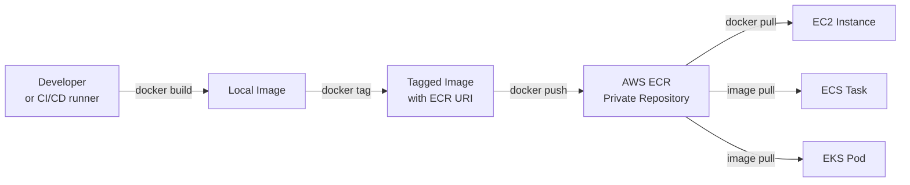

# Day 20 — AWS ECR: Private Container Registry

## Learning Objectives

By the end of this day you will:
- Explain why private registries are used in production instead of Docker Hub
- Create an ECR repository using both the AWS CLI and Terraform
- Authenticate Docker to ECR and push and pull images
- Write correct IAM policies for push and pull access
- Apply a lifecycle policy to control storage costs
- Configure Kubernetes image pull secrets for non-EKS clusters

---

## 1. What is a Container Registry

When you ran `docker pull nginx` in week 2, that image came from Docker Hub — a public registry. Anyone on the internet can pull from it, and by default anyone can see what you push to it.

In production this is a problem:
- Your application images contain your code. You do not want them public.
- You need to control who can push (developers, CI/CD) and who can pull (your servers).
- You need audit logs of every push and pull event.
- You need the registry to be in the same AWS region as your servers to avoid egress costs and latency.

**AWS Elastic Container Registry (ECR)** solves all of this. It is a private, fully managed registry that:
- Integrates with IAM — no separate username/password system
- Scans images for known CVEs on push (using Amazon Inspector)
- Integrates natively with ECS and EKS
- Supports lifecycle policies to auto-delete old images and control cost

### How the workflow fits together



---

## 2. ECR Concepts

Before running any commands, understand the structure of ECR.

**Registry**

Every AWS account has exactly one registry per region. Its address follows this pattern:

```
<account-id>.dkr.ecr.<region>.amazonaws.com
```

Example:

```
123456789012.dkr.ecr.us-east-1.amazonaws.com
```

You cannot change this address. It is derived from your account ID and region.

**Repository**

A repository holds one application's images — all versions of it. You create one repository per application. Example: `flaskapp`, `nginx-proxy`, `data-worker`.

**Image tag**

A tag is a human-readable label pointing to a specific image layer digest. Tags are mutable by default (you can push a new image under the same tag). In production, set `image_tag_mutability = IMMUTABLE` to prevent a deployed tag from ever being silently overwritten.

**Tag conventions in production**

| Tag type | Example | Use case |
|----------|---------|----------|
| Semantic version | `v1.2.3` | Stable releases |
| Git SHA | `abc1234` | Pinned, fully traceable builds |
| Branch + SHA | `main-abc1234` | Automated CI builds |
| `latest` | `latest` | Local development only — never use in production |

The `latest` tag is overwritten every push. If you deploy `latest` to production and something breaks, you cannot reliably pin back to the last known-good state because `latest` already moved. Always use a specific version or SHA in production manifests.

---

## 3. Create an ECR Repository

### Via AWS CLI

```bash
aws ecr create-repository \
  --repository-name flaskapp \
  --region us-east-1 \
  --image-scanning-configuration scanOnPush=true \
  --encryption-configuration encryptionType=AES256
```

The response is a JSON object. The important field is `repositoryUri`:

```json
{
    "repository": {
        "repositoryArn": "arn:aws:ecr:us-east-1:123456789012:repository/flaskapp",
        "registryId": "123456789012",
        "repositoryName": "flaskapp",
        "repositoryUri": "123456789012.dkr.ecr.us-east-1.amazonaws.com/flaskapp",
        "createdAt": "2024-01-15T10:30:00+00:00",
        "imageTagMutability": "MUTABLE",
        "imageScanningConfiguration": {
            "scanOnPush": true
        },
        "encryptionConfiguration": {
            "encryptionType": "AES256"
        }
    }
}
```

The `repositoryUri` is the full address you will use in every `docker tag` and `docker push` command. Copy it from this output and keep it.

### List your repositories

```bash
aws ecr describe-repositories --region us-east-1
```

### Delete a repository (including all images inside it)

```bash
aws ecr delete-repository \
  --repository-name flaskapp \
  --region us-east-1 \
  --force
```

---

## 4. Authenticate Docker to ECR

Docker does not know about IAM. To push or pull from ECR, you must give Docker a short-lived password. ECR provides one via its `get-login-password` API call.

```bash
aws ecr get-login-password --region us-east-1 | \
  docker login --username AWS --password-stdin \
  123456789012.dkr.ecr.us-east-1.amazonaws.com
```

What this does step by step:
1. `aws ecr get-login-password` calls ECR and returns a temporary token (valid for 12 hours)
2. The pipe `|` sends that token directly to `docker login` as the password
3. The username is always literally `AWS` — this is not your IAM username
4. Docker stores the credential in `~/.docker/config.json`

On success you see:

```
Login Succeeded
```

In CI/CD pipelines, run this command at the start of every job that needs to push or pull. The 12-hour window is per-token, not per-session, so it is safe to refresh it before each pipeline run.

---

## 5. Build, Tag, and Push an Image

Assume you have a Dockerfile in your current directory.

```bash
# Step 1 — Build the image locally
docker build -t flaskapp:1.0.0 .

# Step 2 — Tag the image with the full ECR URI
docker tag flaskapp:1.0.0 \
  123456789012.dkr.ecr.us-east-1.amazonaws.com/flaskapp:1.0.0

# Step 3 — Push to ECR
docker push \
  123456789012.dkr.ecr.us-east-1.amazonaws.com/flaskapp:1.0.0
```

The `docker tag` command does not copy any files. It creates a second name pointing to the same local image layers. You are just attaching an additional label that includes the ECR address so Docker knows where to send it on push.

Verify the image is in ECR:

```bash
aws ecr describe-images \
  --repository-name flaskapp \
  --region us-east-1
```

---

## 6. Pull an Image from ECR

```bash
docker pull 123456789012.dkr.ecr.us-east-1.amazonaws.com/flaskapp:1.0.0
```

This works the same on any machine that has:
1. AWS credentials configured (or an IAM role attached)
2. Run the `docker login` authentication step above

**On an EC2 instance**, the instance itself needs an IAM role attached with the pull permissions listed in the next section. When using an instance role, there is no need to manage AWS credentials manually — the instance gets them automatically from the instance metadata service.

---

## 7. IAM Permissions for ECR

ECR uses standard IAM. There are two distinct permission sets depending on what the principal needs to do.

### Push permissions (developers and CI/CD runners)

```json
{
  "Version": "2012-10-17",
  "Statement": [
    {
      "Effect": "Allow",
      "Action": [
        "ecr:GetAuthorizationToken"
      ],
      "Resource": "*"
    },
    {
      "Effect": "Allow",
      "Action": [
        "ecr:BatchCheckLayerAvailability",
        "ecr:PutImage",
        "ecr:InitiateLayerUpload",
        "ecr:UploadLayerPart",
        "ecr:CompleteLayerUpload"
      ],
      "Resource": "arn:aws:ecr:us-east-1:123456789012:repository/flaskapp"
    }
  ]
}
```

Note that `ecr:GetAuthorizationToken` requires `Resource: "*"` because it operates at the registry level, not the repository level. All other push actions can be scoped to a specific repository ARN.

### Pull permissions (EC2 instance role, ECS task role)

Attach this policy to the IAM role that is associated with the instance or task:

```json
{
  "Version": "2012-10-17",
  "Statement": [
    {
      "Effect": "Allow",
      "Action": [
        "ecr:GetAuthorizationToken"
      ],
      "Resource": "*"
    },
    {
      "Effect": "Allow",
      "Action": [
        "ecr:BatchGetImage",
        "ecr:GetDownloadUrlForLayer"
      ],
      "Resource": "arn:aws:ecr:us-east-1:123456789012:repository/flaskapp"
    }
  ]
}
```

If an EC2 instance cannot pull from ECR, check these three things in order:
1. Does the instance have an IAM role attached at all?
2. Does that role have the pull permissions above?
3. Did the instance run the `docker login` command? (Even with an IAM role, Docker still needs the token for the session.)

---

## 8. ECR in Terraform

Create a file `ecr.tf` in your existing Terraform project from day 19.

```hcl
resource "aws_ecr_repository" "flaskapp" {
  name                 = "flaskapp"
  image_tag_mutability = "IMMUTABLE"

  image_scanning_configuration {
    scan_on_push = true
  }

  encryption_configuration {
    encryption_type = "AES256"
  }

  tags = {
    Environment = "production"
    Project     = "flaskapp"
  }
}

output "ecr_repository_url" {
  value = aws_ecr_repository.flaskapp.repository_url
}
```

`image_tag_mutability = "IMMUTABLE"` prevents pushing a new image under a tag that already exists. If tag `v1.2.3` is deployed in production, no one can overwrite it — not accidentally, not in a rushed hotfix. To publish a fix you must increment the version. This is a production best practice.

After `terraform apply`, retrieve the URL:

```bash
terraform output ecr_repository_url
```

---

## 9. ECR Lifecycle Policy

Every image you push to ECR takes up storage, which you are billed for. Without a lifecycle policy, your repository fills with thousands of old images from CI/CD builds. A lifecycle policy is a set of rules that ECR evaluates daily and uses to automatically delete images that match.

Apply a lifecycle policy using the AWS CLI:

```bash
aws ecr put-lifecycle-policy \
  --repository-name flaskapp \
  --lifecycle-policy-text '{
    "rules": [
      {
        "rulePriority": 1,
        "description": "Delete untagged images older than 7 days",
        "selection": {
          "tagStatus": "untagged",
          "countType": "sinceImagePushed",
          "countUnit": "days",
          "countNumber": 7
        },
        "action": { "type": "expire" }
      },
      {
        "rulePriority": 2,
        "description": "Keep only last 10 tagged images",
        "selection": {
          "tagStatus": "tagged",
          "tagPrefixList": ["v"],
          "countType": "imageCountMoreThan",
          "countNumber": 10
        },
        "action": { "type": "expire" }
      }
    ]
  }'
```

Rule 1 targets untagged images — these are intermediate build layers and images that were pushed without an explicit tag. They accumulate quickly in active pipelines. Expiring them after 7 days is safe because no deployment should reference an untagged image.

Rule 2 keeps the 10 most recent versioned images (tags starting with `v`). Images beyond that are old enough that they would not be rolled back to in a real incident. Adjust the count based on your own rollback policy.

---

## 10. Pull Secrets in Kubernetes (non-EKS clusters)

On EKS, the node group's IAM role can be given ECR pull permissions and Kubernetes will pull images automatically. On a self-managed cluster (such as the one from week 3), you need to tell Kubernetes how to authenticate.

A `docker-registry` Secret stores the Docker credentials so the kubelet can use them when pulling images.

```bash
# Create the secret
kubectl create secret docker-registry ecr-secret \
  --docker-server=123456789012.dkr.ecr.us-east-1.amazonaws.com \
  --docker-username=AWS \
  --docker-password=$(aws ecr get-login-password --region us-east-1) \
  --namespace flask-prod
```

Reference the secret in your Pod or Deployment spec:

```yaml
apiVersion: apps/v1
kind: Deployment
metadata:
  name: flaskapp
  namespace: flask-prod
spec:
  replicas: 2
  selector:
    matchLabels:
      app: flaskapp
  template:
    metadata:
      labels:
        app: flaskapp
    spec:
      imagePullSecrets:
        - name: ecr-secret
      containers:
        - name: flaskapp
          image: 123456789012.dkr.ecr.us-east-1.amazonaws.com/flaskapp:1.0.0
          ports:
            - containerPort: 8080
```

The ECR token inside the secret expires after 12 hours. For long-running clusters you need a CronJob that refreshes the secret before it expires. This is a common automation task — it is worth knowing the problem exists even if you do not implement the solution today.

---

## Hands-on Exercise

Work through these steps in order. Replace `123456789012` with your actual AWS account ID throughout.

1. Create an ECR repository named `flaskapp` using the AWS CLI with `scanOnPush=true` and `AES256` encryption. Note the `repositoryUri` from the output.

2. Write a minimal Flask Dockerfile (or reuse the one from week 2). Build the image locally:
   ```bash
   docker build -t flaskapp:v1.0.0 .
   ```

3. Authenticate Docker to ECR:
   ```bash
   aws ecr get-login-password --region us-east-1 | \
     docker login --username AWS --password-stdin \
     123456789012.dkr.ecr.us-east-1.amazonaws.com
   ```

4. Tag the image for ECR:
   ```bash
   docker tag flaskapp:v1.0.0 \
     123456789012.dkr.ecr.us-east-1.amazonaws.com/flaskapp:v1.0.0
   ```

5. Push the image:
   ```bash
   docker push 123456789012.dkr.ecr.us-east-1.amazonaws.com/flaskapp:v1.0.0
   ```

6. Verify the image is present in ECR:
   ```bash
   aws ecr describe-images --repository-name flaskapp --region us-east-1
   ```

7. Add the ECR repository to your existing Terraform project from day 19. Create `ecr.tf` using the block from section 8 of this guide. Run `terraform plan`, review the output, then `terraform apply`.

8. Apply the lifecycle policy from section 9 to the repository.

9. Confirm the Terraform output shows the repository URL:
   ```bash
   terraform output ecr_repository_url
   ```

10. Update your Kubernetes Deployment from week 3 to use the ECR image URI instead of a Docker Hub image. Create the `ecr-secret` pull secret and add `imagePullSecrets` to the Deployment spec. Apply it and confirm the pod comes up:
    ```bash
    kubectl get pods -n flask-prod
    ```
