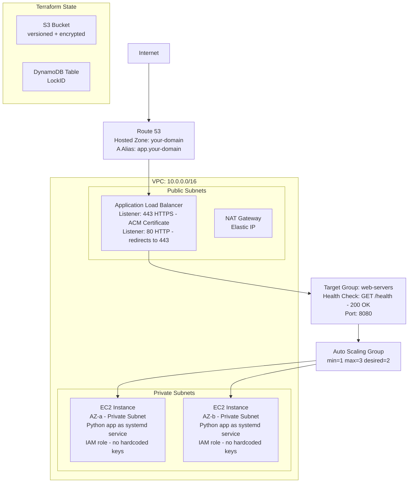

# Week 4 Capstone — Production AWS Deployment with Terraform

## Overview

This capstone deploys the Python hostname app from Week 2 into a production-grade AWS environment, fully automated with Terraform. When complete, you will have a real HTTPS endpoint backed by Auto Scaling EC2 instances behind an Application Load Balancer, with DNS managed by Route 53.

Everything is reproducible from a single `terraform apply`. Tearing it down takes a single `terraform destroy`.

---

## Architecture



---

## Prerequisites

Before writing any Terraform code, complete these steps manually:

```bash
# 1. Create the S3 bucket for Terraform state (do this once, outside of Terraform)
aws s3 mb s3://terraform-state-YOURNAME --region us-east-1

aws s3api put-bucket-versioning \
  --bucket terraform-state-YOURNAME \
  --versioning-configuration Status=Enabled

aws s3api put-bucket-encryption \
  --bucket terraform-state-YOURNAME \
  --server-side-encryption-configuration '{
    "Rules":[{"ApplyServerSideEncryptionByDefault":{"SSEAlgorithm":"AES256"}}]
  }'

aws s3api put-public-access-block \
  --bucket terraform-state-YOURNAME \
  --public-access-block-configuration \
    "BlockPublicAcls=true,IgnorePublicAcls=true,BlockPublicPolicy=true,RestrictPublicBuckets=true"

# 2. Create the DynamoDB lock table
aws dynamodb create-table \
  --table-name terraform-state-lock \
  --attribute-definitions AttributeName=LockID,AttributeType=S \
  --key-schema AttributeName=LockID,KeyType=HASH \
  --billing-mode PAY_PER_REQUEST \
  --region us-east-1

# 3. Request an ACM certificate for your domain
# You must own the domain. Register a cheap domain or use a free subdomain service for testing.
aws acm request-certificate \
  --domain-name "app.<your-domain>" \
  --validation-method DNS \
  --region us-east-1
# Note the CertificateArn — you will need it in terraform.tfvars

# After requesting the certificate, you MUST validate domain ownership before Terraform can use it.
# Step 3a: Get the DNS validation CNAME record
aws acm describe-certificate \
  --certificate-arn <certificate-arn-from-above> \
  --query 'Certificate.DomainValidationOptions[0].ResourceRecord'

# Step 3b: Add the returned CNAME record to your domain registrar (or Route 53)
# Step 3c: Wait for status to become ISSUED (5-30 minutes)
aws acm describe-certificate \
  --certificate-arn <certificate-arn-from-above> \
  --query 'Certificate.Status'
# Should return "ISSUED" before proceeding

# 4. Create a Route 53 hosted zone for your domain
aws route53 create-hosted-zone \
  --name <your-domain> \
  --caller-reference "$(date +%s)"
# Update your domain registrar to use the four name servers Route 53 provides
```

---

## File Structure

Create this directory inside `week-4/`:

```
week-4/
└── terraform/
    ├── provider.tf
    ├── variables.tf
    ├── vpc.tf
    ├── security_groups.tf
    ├── alb.tf
    ├── asg.tf
    ├── route53.tf
    ├── outputs.tf
    └── terraform.tfvars      ← gitignored
```

Add to `.gitignore`:
```
terraform/.terraform/
terraform/*.tfstate
terraform/*.tfstate.backup
terraform/terraform.tfvars
terraform/*.pem
```

---

## provider.tf

```hcl
terraform {
  required_version = ">= 1.7.0"

  required_providers {
    aws = {
      source  = "hashicorp/aws"
      version = "~> 5.0"
    }
  }

  backend "s3" {
    bucket         = "terraform-state-YOURNAME"
    key            = "production/week4-capstone/terraform.tfstate"
    region         = "us-east-1"
    dynamodb_table = "terraform-state-lock"
    encrypt        = true
  }
}

provider "aws" {
  region = var.aws_region

  default_tags {
    tags = {
      Project     = "devops-zero-to-hero"
      ManagedBy   = "terraform"
      Environment = var.environment
    }
  }
}
```

---

## variables.tf

```hcl
variable "aws_region" {
  type        = string
  description = "AWS region to deploy into"
  default     = "us-east-1"
}

variable "environment" {
  type        = string
  description = "Deployment environment"
  default     = "production"
}

variable "project" {
  type        = string
  description = "Project name (used in resource names)"
  default     = "devops-app"
}

variable "vpc_cidr" {
  type        = string
  description = "CIDR block for the VPC"
  default     = "10.0.0.0/16"
}

variable "public_subnet_cidrs" {
  type        = list(string)
  description = "CIDR blocks for public subnets (one per AZ)"
  default     = ["10.0.1.0/24", "10.0.2.0/24"]
}

variable "private_subnet_cidrs" {
  type        = list(string)
  description = "CIDR blocks for private subnets (one per AZ)"
  default     = ["10.0.11.0/24", "10.0.12.0/24"]
}

variable "availability_zones" {
  type        = list(string)
  description = "Availability zones to use"
  default     = ["us-east-1a", "us-east-1b"]
}

variable "instance_type" {
  type        = string
  description = "EC2 instance type for app servers"
  default     = "t3.micro"
}

variable "asg_min_size" {
  type        = number
  description = "Minimum number of EC2 instances in the ASG"
  default     = 1
}

variable "asg_max_size" {
  type        = number
  description = "Maximum number of EC2 instances in the ASG"
  default     = 3
}

variable "asg_desired_capacity" {
  type        = number
  description = "Desired number of EC2 instances in the ASG"
  default     = 2
}

variable "acm_certificate_arn" {
  type        = string
  description = "ARN of the ACM certificate for HTTPS on the ALB"
}

variable "domain_name" {
  type        = string
  description = "Root domain name (e.g., example.com)"
}

variable "app_subdomain" {
  type        = string
  description = "Subdomain for the application (e.g., app)"
  default     = "app"
}

variable "route53_zone_id" {
  type        = string
  description = "Route 53 Hosted Zone ID for the domain"
}
```

---

## vpc.tf

```hcl
# VPC
resource "aws_vpc" "main" {
  cidr_block           = var.vpc_cidr
  enable_dns_support   = true
  enable_dns_hostnames = true

  tags = {
    Name = "${var.project}-vpc"
  }
}

# Public Subnets (one per AZ)
resource "aws_subnet" "public" {
  count             = length(var.public_subnet_cidrs)
  vpc_id            = aws_vpc.main.id
  cidr_block        = var.public_subnet_cidrs[count.index]
  availability_zone = var.availability_zones[count.index]

  map_public_ip_on_launch = true

  tags = {
    Name = "${var.project}-public-subnet-${var.availability_zones[count.index]}"
    Tier = "public"
  }
}

# Private Subnets (one per AZ)
resource "aws_subnet" "private" {
  count             = length(var.private_subnet_cidrs)
  vpc_id            = aws_vpc.main.id
  cidr_block        = var.private_subnet_cidrs[count.index]
  availability_zone = var.availability_zones[count.index]

  tags = {
    Name = "${var.project}-private-subnet-${var.availability_zones[count.index]}"
    Tier = "private"
  }
}

# Internet Gateway
resource "aws_internet_gateway" "main" {
  vpc_id = aws_vpc.main.id

  tags = {
    Name = "${var.project}-igw"
  }
}

# Elastic IP for NAT Gateway
resource "aws_eip" "nat" {
  domain = "vpc"

  tags = {
    Name = "${var.project}-nat-eip"
  }

  depends_on = [aws_internet_gateway.main]
}

# NAT Gateway (in the first public subnet)
resource "aws_nat_gateway" "main" {
  allocation_id = aws_eip.nat.id
  subnet_id     = aws_subnet.public[0].id

  tags = {
    Name = "${var.project}-nat-gateway"
  }

  depends_on = [aws_internet_gateway.main]
}

# Public Route Table
resource "aws_route_table" "public" {
  vpc_id = aws_vpc.main.id

  route {
    cidr_block = "0.0.0.0/0"
    gateway_id = aws_internet_gateway.main.id
  }

  tags = {
    Name = "${var.project}-public-rt"
  }
}

# Associate public subnets with the public route table
resource "aws_route_table_association" "public" {
  count          = length(aws_subnet.public)
  subnet_id      = aws_subnet.public[count.index].id
  route_table_id = aws_route_table.public.id
}

# Private Route Table
resource "aws_route_table" "private" {
  vpc_id = aws_vpc.main.id

  route {
    cidr_block     = "0.0.0.0/0"
    nat_gateway_id = aws_nat_gateway.main.id
  }

  tags = {
    Name = "${var.project}-private-rt"
  }
}

# Associate private subnets with the private route table
resource "aws_route_table_association" "private" {
  count          = length(aws_subnet.private)
  subnet_id      = aws_subnet.private[count.index].id
  route_table_id = aws_route_table.private.id
}
```

---

## security_groups.tf

```hcl
# ALB Security Group — allows inbound HTTP and HTTPS from the internet
resource "aws_security_group" "alb" {
  name        = "${var.project}-alb-sg"
  description = "Allow HTTP and HTTPS inbound from internet to ALB"
  vpc_id      = aws_vpc.main.id

  ingress {
    description = "HTTP from internet"
    from_port   = 80
    to_port     = 80
    protocol    = "tcp"
    cidr_blocks = ["0.0.0.0/0"]
  }

  ingress {
    description = "HTTPS from internet"
    from_port   = 443
    to_port     = 443
    protocol    = "tcp"
    cidr_blocks = ["0.0.0.0/0"]
  }

  egress {
    description = "Allow all outbound"
    from_port   = 0
    to_port     = 0
    protocol    = "-1"
    cidr_blocks = ["0.0.0.0/0"]
  }

  tags = {
    Name = "${var.project}-alb-sg"
  }
}

# EC2 Security Group — allows inbound HTTP only from the ALB security group
resource "aws_security_group" "ec2" {
  name        = "${var.project}-ec2-sg"
  description = "Allow HTTP inbound from ALB only"
  vpc_id      = aws_vpc.main.id

  ingress {
    description     = "HTTP from ALB only"
    from_port       = 8080
    to_port         = 8080
    protocol        = "tcp"
    security_groups = [aws_security_group.alb.id]
  }

  egress {
    description = "Allow all outbound (for package installs via NAT)"
    from_port   = 0
    to_port     = 0
    protocol    = "-1"
    cidr_blocks = ["0.0.0.0/0"]
  }

  tags = {
    Name = "${var.project}-ec2-sg"
  }
}
```

---

## alb.tf

```hcl
# Application Load Balancer
resource "aws_lb" "main" {
  name               = "${var.project}-alb"
  internal           = false
  load_balancer_type = "application"
  security_groups    = [aws_security_group.alb.id]
  subnets            = aws_subnet.public[*].id

  enable_deletion_protection = false   # Set to true in real production

  tags = {
    Name = "${var.project}-alb"
  }
}

# Target Group
resource "aws_lb_target_group" "app" {
  name        = "${var.project}-tg"
  port        = 8080
  protocol    = "HTTP"
  vpc_id      = aws_vpc.main.id
  target_type = "instance"

  health_check {
    enabled             = true
    healthy_threshold   = 2
    unhealthy_threshold = 3
    timeout             = 5
    interval            = 30
    path                = "/health"
    matcher             = "200"
  }

  tags = {
    Name = "${var.project}-tg"
  }
}

# HTTP Listener — redirect all HTTP traffic to HTTPS
resource "aws_lb_listener" "http" {
  load_balancer_arn = aws_lb.main.arn
  port              = 80
  protocol          = "HTTP"

  default_action {
    type = "redirect"

    redirect {
      port        = "443"
      protocol    = "HTTPS"
      status_code = "HTTP_301"
    }
  }
}

# HTTPS Listener — forward to target group
resource "aws_lb_listener" "https" {
  load_balancer_arn = aws_lb.main.arn
  port              = 443
  protocol          = "HTTPS"
  ssl_policy        = "ELBSecurityPolicy-TLS13-1-2-2021-06"
  certificate_arn   = var.acm_certificate_arn

  default_action {
    type             = "forward"
    target_group_arn = aws_lb_target_group.app.arn
  }
}
```

---

## asg.tf

```hcl
# IAM Role for EC2 instances
resource "aws_iam_role" "ec2" {
  name = "${var.project}-ec2-role"

  assume_role_policy = jsonencode({
    Version = "2012-10-17"
    Statement = [{
      Effect    = "Allow"
      Principal = { Service = "ec2.amazonaws.com" }
      Action    = "sts:AssumeRole"
    }]
  })
}

# Attach SSM policy to allow Session Manager access (no SSH needed)
resource "aws_iam_role_policy_attachment" "ec2_ssm" {
  role       = aws_iam_role.ec2.name
  policy_arn = "arn:aws:iam::aws:policy/AmazonSSMManagedInstanceCore"
}

# Instance profile wrapping the role
resource "aws_iam_instance_profile" "ec2" {
  name = "${var.project}-ec2-profile"
  role = aws_iam_role.ec2.name
}

# Latest Amazon Linux 2023 AMI
data "aws_ami" "amazon_linux" {
  most_recent = true
  owners      = ["amazon"]

  filter {
    name   = "name"
    values = ["al2023-ami-*-x86_64"]
  }

  filter {
    name   = "state"
    values = ["available"]
  }
}

# User data script — installs the Python hostname app as a systemd service
locals {
  user_data = base64encode(<<-EOF
    #!/bin/bash
    set -e
    exec > >(tee /var/log/user-data.log | logger -t user-data -s 2>/dev/console) 2>&1

    echo "Starting user data script..."

    # Update system
    dnf update -y

    # Install Python and dependencies
    dnf install -y python3 python3-pip

    # Install gunicorn
    pip3 install flask gunicorn

    # Create application directory
    mkdir -p /opt/devops-app
    chown ec2-user:ec2-user /opt/devops-app

    # Write the Flask application
    cat > /opt/devops-app/app.py << 'PYEOF'
    from flask import Flask, jsonify
    import socket
    import os

    app = Flask(__name__)

    @app.route('/')
    def index():
        return f"Hello from {socket.gethostname()}\n"

    @app.route('/health')
    def health():
        return jsonify({"status": "ok", "hostname": socket.gethostname()}), 200

    @app.route('/info')
    def info():
        return jsonify({
            "hostname": socket.gethostname(),
            "ip": socket.gethostbyname(socket.gethostname()),
        })

    if __name__ == '__main__':
        app.run(host='0.0.0.0', port=8080)
    PYEOF

    # Create systemd service
    cat > /etc/systemd/system/devops-app.service << 'SVCEOF'
    [Unit]
    Description=DevOps App
    After=network.target

    [Service]
    Type=simple
    User=ec2-user
    WorkingDirectory=/opt/devops-app
    ExecStart=/usr/local/bin/gunicorn --workers 2 --bind 0.0.0.0:8080 app:app
    Restart=always
    RestartSec=3
    StandardOutput=journal
    StandardError=journal

    [Install]
    WantedBy=multi-user.target
    SVCEOF

    # Enable and start the service
    systemctl daemon-reload
    systemctl enable devops-app
    systemctl start devops-app

    echo "User data script complete."
  EOF
  )
}

# Launch Template
resource "aws_launch_template" "app" {
  name_prefix   = "${var.project}-lt-"
  image_id      = data.aws_ami.amazon_linux.id
  instance_type = var.instance_type

  iam_instance_profile {
    name = aws_iam_instance_profile.ec2.name
  }

  network_interfaces {
    associate_public_ip_address = false
    security_groups             = [aws_security_group.ec2.id]
  }

  user_data = local.user_data

  block_device_mappings {
    device_name = "/dev/xvda"
    ebs {
      volume_type           = "gp3"
      volume_size           = 20
      delete_on_termination = true
      encrypted             = true
    }
  }

  metadata_options {
    http_endpoint               = "enabled"
    http_tokens                 = "required"    # IMDSv2 required — security best practice
    http_put_response_hop_limit = 1
  }

  tag_specifications {
    resource_type = "instance"
    tags = {
      Name        = "${var.project}-app-server"
      Environment = var.environment
    }
  }

  lifecycle {
    create_before_destroy = true
  }
}

# Auto Scaling Group
resource "aws_autoscaling_group" "app" {
  name                = "${var.project}-asg"
  min_size            = var.asg_min_size
  max_size            = var.asg_max_size
  desired_capacity    = var.asg_desired_capacity
  vpc_zone_identifier = aws_subnet.private[*].id
  target_group_arns   = [aws_lb_target_group.app.arn]
  health_check_type   = "ELB"

  # Grace period: how long to wait before ASG health checks kick in
  # Gives user data script time to start the app
  health_check_grace_period = 300

  launch_template {
    id      = aws_launch_template.app.id
    version = "$Latest"
  }

  instance_refresh {
    strategy = "Rolling"
    preferences {
      min_healthy_percentage = 50
    }
  }

  tag {
    key                 = "Name"
    value               = "${var.project}-asg-instance"
    propagate_at_launch = true
  }

  lifecycle {
    create_before_destroy = true
  }
}

# Target Tracking Scaling Policy — maintain 50% average CPU
resource "aws_autoscaling_policy" "cpu_target_tracking" {
  name                   = "${var.project}-cpu-target-tracking"
  autoscaling_group_name = aws_autoscaling_group.app.name
  policy_type            = "TargetTrackingScaling"

  target_tracking_configuration {
    predefined_metric_specification {
      predefined_metric_type = "ASGAverageCPUUtilization"
    }
    target_value = 50.0
  }
}
```

---

## route53.tf

```hcl
# A Alias record: app.<your-domain> → ALB
resource "aws_route53_record" "app" {
  zone_id = var.route53_zone_id
  name    = "${var.app_subdomain}.${var.domain_name}"
  type    = "A"

  alias {
    name                   = aws_lb.main.dns_name
    zone_id                = aws_lb.main.zone_id
    evaluate_target_health = true
  }
}
```

---

## outputs.tf

```hcl
output "vpc_id" {
  description = "VPC ID"
  value       = aws_vpc.main.id
}

output "alb_dns_name" {
  description = "ALB DNS name (use this before Route 53 is configured)"
  value       = aws_lb.main.dns_name
}

output "alb_arn" {
  description = "ALB ARN"
  value       = aws_lb.main.arn
}

output "app_url" {
  description = "Application URL"
  value       = "https://${var.app_subdomain}.${var.domain_name}"
}

output "asg_name" {
  description = "Auto Scaling Group name"
  value       = aws_autoscaling_group.app.name
}

output "target_group_arn" {
  description = "Target Group ARN"
  value       = aws_lb_target_group.app.arn
}

output "nat_gateway_ip" {
  description = "Elastic IP of the NAT Gateway"
  value       = aws_eip.nat.public_ip
}

output "public_subnet_ids" {
  description = "Public subnet IDs"
  value       = aws_subnet.public[*].id
}

output "private_subnet_ids" {
  description = "Private subnet IDs"
  value       = aws_subnet.private[*].id
}
```

---

## terraform.tfvars

This file is gitignored. Fill in real values.

```hcl
# terraform.tfvars — DO NOT COMMIT THIS FILE

aws_region           = "us-east-1"
environment          = "production"
project              = "devops-app"

vpc_cidr             = "10.0.0.0/16"
public_subnet_cidrs  = ["10.0.1.0/24", "10.0.2.0/24"]
private_subnet_cidrs = ["10.0.11.0/24", "10.0.12.0/24"]
availability_zones   = ["us-east-1a", "us-east-1b"]

instance_type        = "t3.micro"
asg_min_size         = 1
asg_max_size         = 3
asg_desired_capacity = 2

# From: aws acm list-certificates --region us-east-1
acm_certificate_arn  = "arn:aws:acm:us-east-1:123456789012:certificate/abc-123-def"

# Your domain
domain_name          = "<your-domain>"
app_subdomain        = "app"

# From: aws route53 list-hosted-zones
route53_zone_id      = "Z1234567890ABCDEFG"
```

---

## Deployment Steps

```bash
cd week-4/terraform

# Step 1: Format and validate
terraform fmt -recursive
terraform validate

# Step 2: Initialise (connects to S3 backend)
terraform init

# Step 3: Review the plan carefully
terraform plan -out=tfplan

# Step 4: Apply
terraform apply tfplan

# Step 5: Verify — wait 3-5 minutes for ASG instances to start and pass health checks
terraform output app_url
curl $(terraform output -raw app_url)

# Check ALB directly (before DNS propagates)
curl http://$(terraform output -raw alb_dns_name)

# Step 6: Check ASG instances are healthy
aws autoscaling describe-auto-scaling-groups \
  --auto-scaling-group-names $(terraform output -raw asg_name) \
  --query 'AutoScalingGroups[0].Instances[*].{ID:InstanceId,Health:HealthStatus,State:LifecycleState}'

# Step 7: Check target group health
aws elbv2 describe-target-health \
  --target-group-arn $(terraform output -raw target_group_arn)

# Step 8: Hit the endpoint multiple times to see load balancing across hostnames
for i in {1..6}; do curl -s https://app.<your-domain>; done
```

> **Next step:** In a real CI/CD pipeline, the Docker image would be stored in ECR (Day 20) and
> pulled by EC2 at boot time via the user data script, rather than built on the instance.

---

## Completion Checklist

Work through this list after your `terraform apply` succeeds.

### Infrastructure

- [ ] VPC created with CIDR 10.0.0.0/16
- [ ] Two public subnets in different AZs (10.0.1.0/24, 10.0.2.0/24)
- [ ] Two private subnets in different AZs (10.0.11.0/24, 10.0.12.0/24)
- [ ] Internet Gateway attached to VPC
- [ ] NAT Gateway in public subnet with Elastic IP
- [ ] Public route table with 0.0.0.0/0 → IGW
- [ ] Private route table with 0.0.0.0/0 → NAT Gateway
- [ ] ALB security group allows 80 and 443 from 0.0.0.0/0
- [ ] EC2 security group allows 8080 only from ALB security group

### Application

- [ ] ASG has desired capacity of 2 — confirm with `aws autoscaling describe-auto-scaling-groups`
- [ ] Both instances pass ALB health checks — check target group health
- [ ] HTTP → HTTPS redirect works (test ALB DNS first if Route 53 not set up yet):
      `curl -v http://$(terraform output -raw alb_dns_name)` should return 301
      `curl -v http://app.<your-domain>` should return 301 (after DNS propagates)
- [ ] HTTPS works: `curl https://app.<your-domain>` returns a hostname
- [ ] Multiple requests return different hostnames (load balancing is working)
- [ ] `/health` endpoint returns 200: `curl https://app.<your-domain>/health`

### Security

- [ ] EC2 instances have no public IP addresses
- [ ] EC2 instances cannot be reached directly on port 80 from the internet
- [ ] EC2 instances use IAM role — no access keys configured on them
- [ ] IMDSv2 is enforced (http_tokens = required in launch template)
- [ ] EBS volumes are encrypted

### Terraform

- [ ] State is stored in S3, not locally: `aws s3 ls s3://your-state-bucket/production/`
- [ ] `terraform plan` after a successful apply shows "No changes"
- [ ] All `.tf` files pass `terraform fmt` with no changes
- [ ] `terraform.tfvars` is in `.gitignore` and is not committed

---

## Bonus: Jenkins Pipeline for Terraform

Add a `Jenkinsfile` at `week-4/terraform/Jenkinsfile` that:
- Runs `terraform plan` on every pull request
- Runs `terraform apply` when code merges to main

### Jenkinsfile

```groovy
pipeline {
    agent any

    environment {
        AWS_DEFAULT_REGION = 'us-east-1'
        TF_IN_AUTOMATION   = 'true'
        // Credentials stored in Jenkins as 'aws-credentials' (Username/Password type)
        // Username = AWS_ACCESS_KEY_ID, Password = AWS_SECRET_ACCESS_KEY
    }

    stages {
        stage('Checkout') {
            steps {
                checkout scm
            }
        }

        stage('Terraform Init') {
            steps {
                dir('week-4/terraform') {
                    withCredentials([[
                        $class: 'UsernamePasswordMultiBinding',
                        credentialsId: 'aws-credentials',
                        usernameVariable: 'AWS_ACCESS_KEY_ID',
                        passwordVariable: 'AWS_SECRET_ACCESS_KEY'
                    ]]) {
                        sh 'terraform init -input=false'
                    }
                }
            }
        }

        stage('Terraform Format Check') {
            steps {
                dir('week-4/terraform') {
                    sh 'terraform fmt -check -recursive'
                }
            }
        }

        stage('Terraform Validate') {
            steps {
                dir('week-4/terraform') {
                    withCredentials([[
                        $class: 'UsernamePasswordMultiBinding',
                        credentialsId: 'aws-credentials',
                        usernameVariable: 'AWS_ACCESS_KEY_ID',
                        passwordVariable: 'AWS_SECRET_ACCESS_KEY'
                    ]]) {
                        sh 'terraform validate'
                    }
                }
            }
        }

        stage('Terraform Plan') {
            steps {
                dir('week-4/terraform') {
                    withCredentials([[
                        $class: 'UsernamePasswordMultiBinding',
                        credentialsId: 'aws-credentials',
                        usernameVariable: 'AWS_ACCESS_KEY_ID',
                        passwordVariable: 'AWS_SECRET_ACCESS_KEY'
                    ]]) {
                        // Write tfvars from Jenkins secrets (avoid committing them)
                        withCredentials([
                            string(credentialsId: 'acm-certificate-arn', variable: 'ACM_ARN'),
                            string(credentialsId: 'route53-zone-id', variable: 'ZONE_ID')
                        ]) {
                            sh """
                                cat > terraform.tfvars << EOF
aws_region           = "us-east-1"
environment          = "production"
project              = "devops-app"
instance_type        = "t3.micro"
asg_min_size         = 1
asg_max_size         = 3
asg_desired_capacity = 2
domain_name          = "<your-domain>"
app_subdomain        = "app"
acm_certificate_arn  = "\${ACM_ARN}"
route53_zone_id      = "\${ZONE_ID}"
EOF
                                terraform plan -out=tfplan -input=false
                            """
                        }
                    }
                }
            }
            post {
                always {
                    // Save plan output as a build artifact
                    archiveArtifacts artifacts: 'week-4/terraform/tfplan', allowEmptyArchive: true
                }
            }
        }

        stage('Terraform Apply') {
            // Only apply on the main branch
            when {
                branch 'main'
            }
            steps {
                dir('week-4/terraform') {
                    withCredentials([[
                        $class: 'UsernamePasswordMultiBinding',
                        credentialsId: 'aws-credentials',
                        usernameVariable: 'AWS_ACCESS_KEY_ID',
                        passwordVariable: 'AWS_SECRET_ACCESS_KEY'
                    ]]) {
                        // Apply the saved plan (same plan that was reviewed)
                        sh 'terraform apply -input=false tfplan'
                    }
                }
            }
            post {
                success {
                    echo "Terraform apply succeeded. Application deployed."
                }
                failure {
                    echo "Terraform apply failed. Check logs."
                }
            }
        }
    }

    post {
        always {
            // Clean up the tfvars file (contains secrets)
            sh 'rm -f week-4/terraform/terraform.tfvars week-4/terraform/tfplan'
        }
    }
}
```

### Setting Up the Jenkins Pipeline

1. In Jenkins: New Item → Pipeline → Pipeline script from SCM
2. Set SCM to your GitHub repository
3. Set Script Path to `week-4/terraform/Jenkinsfile`
4. In Jenkins → Manage Credentials → Add:
   - `aws-credentials` — Username/Password (Access Key ID / Secret Access Key)
   - `acm-certificate-arn` — Secret text (your ACM certificate ARN)
   - `route53-zone-id` — Secret text (your Route 53 Zone ID)
5. Enable "Build on GitHub Push" for PR and push triggers

**What happens:**
- On any PR: `init → format check → validate → plan` (plan output posted to PR)
- On merge to main: `init → format check → validate → plan → apply`

---

## Teardown

After completing the capstone, destroy everything to avoid charges:

```bash
cd week-4/terraform
terraform destroy -auto-approve

# Verify nothing is left
aws ec2 describe-instances \
  --filters "Name=instance-state-name,Values=running,pending,stopped" \
  --query 'Reservations[*].Instances[*].[InstanceId,Tags[?Key==`Name`].Value|[0]]' \
  --output table

aws elbv2 describe-load-balancers --query 'LoadBalancers[*].LoadBalancerName'
aws rds describe-db-instances --query 'DBInstances[*].DBInstanceIdentifier'

# Release any unattached Elastic IPs
aws ec2 describe-addresses \
  --query 'Addresses[?AssociationId==null].AllocationId' \
  --output text | xargs -I {} aws ec2 release-address --allocation-id {}
```

The S3 state bucket and DynamoDB lock table can stay — they are cheap (near-zero cost) and will be useful for future projects.

---

## Key Takeaways

**AWS:**
- Infrastructure has a hierarchy: Region → VPC → Subnet → Instance
- Public subnets have a route to an Internet Gateway; private subnets route through NAT
- Security groups are stateful — inbound rules automatically allow return traffic
- IAM roles attached to EC2 instances eliminate the need for hardcoded credentials
- ALBs terminate TLS so your application code never handles certificates

**Terraform:**
- `terraform plan` is safe to run at any time — it never changes anything
- State is the source of truth: keep it remote, never edit it manually, never commit it
- Resources reference each other by attribute (e.g., `aws_vpc.main.id`) — Terraform builds the dependency graph from these references
- `terraform fmt` and `terraform validate` should be enforced in CI before any apply
- `count` and `for_each` let you create multiple similar resources without copy-pasting

**Production Patterns:**
- Separate provider and backend configuration from resource definitions
- Keep `terraform.tfvars` out of git; inject secrets via CI/CD environment variables
- Use the saved plan file (`terraform plan -out=tfplan`) so you apply exactly what you reviewed
- Tag every resource with `Environment`, `Project`, and `ManagedBy = terraform` for cost tracking
- Set `health_check_grace_period` long enough for your user data script to complete

**What Makes This Production-Grade:**
- Two AZs — single AZ failure does not take down the application
- Private subnets — EC2 instances are not directly reachable from the internet
- ALB health checks — unhealthy instances are removed from rotation automatically
- IMDSv2 enforced — protects against SSRF attacks targeting the metadata service
- Encrypted EBS volumes — data at rest is protected
- IAM roles — no long-term credentials on instances
- Remote state with locking — team-safe infrastructure management
- Instance refresh on launch template changes — zero-downtime deployments
