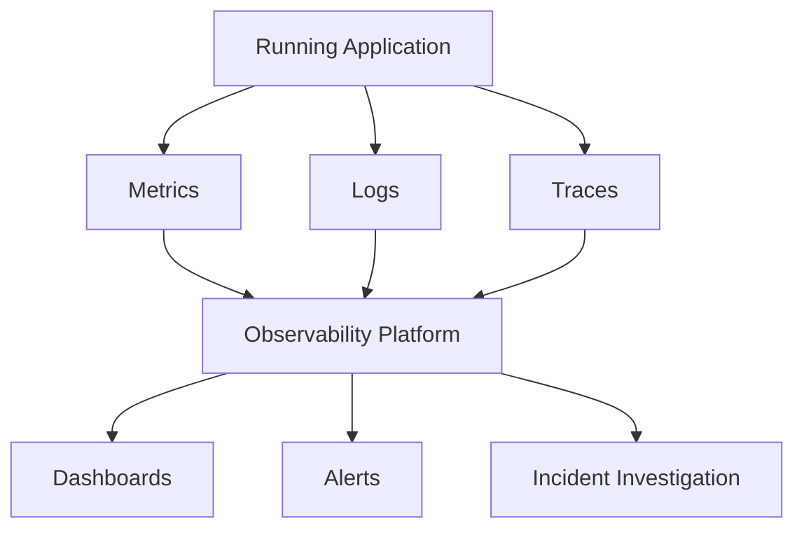
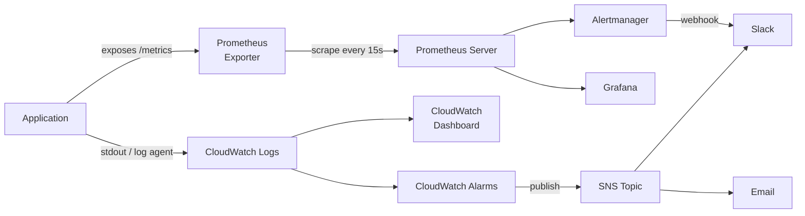

# Day 21 — Observability: Introduction

Week 5 is about knowing what your systems are doing after you deploy them. Shipping code is one half of the job. The other half is understanding whether it is actually working.

---

## The Core Principle

> You deployed it. You own it.

Once an application is running in production, you are responsible for understanding its behaviour. Without observability tooling in place you are guessing. Guessing leads to slow incident response, repeat outages, and unhappy users.

---

## The Three Pillars of Observability

Observability is built on three distinct types of data. Each answers a different question.

### 1. Metrics

Numeric measurements collected over time. Metrics tell you **how much** or **how many**.

**Example:**
```
CPU utilisation: 73%
HTTP requests per second: 420
Memory used: 6.2 GB of 8 GB
```

Metrics are cheap to store and fast to query. They are ideal for dashboards and alerts. They do not tell you *why* something is wrong — only that something is wrong.

### 2. Logs

Timestamped, structured records of discrete events. Logs tell you **what happened**.

**Example:**
```
2024-03-21T14:32:01Z ERROR [checkout-service] payment gateway timeout after 30s: order_id=8821
2024-03-21T14:32:02Z WARN  [checkout-service] retrying payment request: attempt=2
2024-03-21T14:32:33Z ERROR [checkout-service] max retries exceeded, order failed: order_id=8821
```

A log line tells you exactly which order failed, when it failed, and why. Logs are verbose and more expensive to store at scale than metrics.

### 3. Traces

A trace follows a single request as it travels through multiple services. Traces tell you **where time was spent** and **which service caused a problem**.

**Example:**
```
Request: GET /checkout (total: 2.1s)
  └── auth-service         45ms   OK
  └── product-service     120ms   OK
  └── inventory-service  1800ms   OK  <-- this is the bottleneck
  └── payment-service     135ms   OK
```

Without tracing, you would see a slow response in your metrics and grep through logs from four services trying to find the culprit. A trace surfaces that information immediately.

---

## How the Three Pillars Work Together



In practice, you start with an alert from a metric. You open the dashboard, see the problem window, then pivot to logs for that time range to find the failing request, then open the trace to confirm exactly which service and line of code broke.

---

## Monitoring vs Observability

These terms are often used interchangeably. They are not the same thing.

| Monitoring | Observability |
|---|---|
| Checks known failure modes | Helps you investigate unknown failures |
| "Is the service up?" | "Why is the service slow only for users in us-east-1?" |
| Predefined dashboards and alerts | Ad-hoc querying of raw data |
| Tells you something is wrong | Helps you understand what and why |

Monitoring is a subset of observability. A well-monitored system has predefined checks for known failure modes. An observable system gives you the raw data to answer questions you have not thought of yet.

---

## SLI, SLO, and SLA

Before you can define alerts meaningfully, you need to agree on what "working" means. These three terms give you the framework.

### SLI — Service Level Indicator

A specific, measurable metric that reflects the health of your service.

**Examples:**
- Request success rate (percentage of HTTP 200 responses)
- API latency (99th percentile response time)
- Availability (percentage of time the service responds)

### SLO — Service Level Objective

The target value you set for an SLI. This is an internal commitment your team makes.

**Examples:**
- Success rate >= 99.5% over a rolling 30-day window
- 99th percentile latency < 500ms
- Availability >= 99.9%

**What 99.9% uptime actually means:**

| Availability | Downtime per year | Downtime per month |
|---|---|---|
| 99% | 87.6 hours | 7.3 hours |
| 99.9% | 8.76 hours | 43.8 minutes |
| 99.95% | 4.38 hours | 21.9 minutes |
| 99.99% | 52.6 minutes | 4.4 minutes |

99.9% sounds high. It still allows your service to be down for 43 minutes in a single month. Know what your SLO commits to before you agree to it.

### SLA — Service Level Agreement

A contractual commitment to your customers, usually with financial penalties if breached. An SLA is derived from your SLOs but is always set lower than your SLO to give you a safety margin.

**Example:**
- SLO (internal): 99.95% availability
- SLA (customer contract): 99.9% availability with service credits if breached

You do not want your SLA to equal your SLO. If your SLO is also your SLA, any deviation from target immediately becomes a contractual breach.

---

## Error Budgets

An error budget is the amount of unreliability your SLO permits. It flips the framing from "did we fail?" to "how much runway do we have left?"

**Example:**
- SLO: 99.9% success rate over 30 days
- Total requests in 30 days: 1,000,000
- Allowed failures: 1,000 (0.1%)
- If you have already had 800 failures this month, your error budget is 80% consumed

When the error budget is nearly exhausted, the team should stop shipping new features and focus on reliability. When the budget is healthy, the team can move fast. This makes reliability a shared engineering responsibility rather than a policing exercise.

---

## The Tooling Stack for This Week

| Pillar | Tool | Where You Run It |
|---|---|---|
| Metrics | Prometheus | Self-hosted (Day 22) |
| Metrics visualisation | Grafana | Self-hosted (Day 22) |
| Logs | CloudWatch Logs | AWS managed (Day 23) |
| Logs (self-hosted) | Grafana Loki | Brief mention — production option |
| Alerts | CloudWatch Alarms | AWS managed (Day 23) |
| Alerts | Alertmanager | Paired with Prometheus (Day 22) |
| Traces | OpenTelemetry | Know it exists — deep dive is week 8 |

**A note on OpenTelemetry:** OpenTelemetry (OTel) is the open-source standard for instrumenting applications to produce traces, metrics, and logs. Major cloud providers and observability vendors all support it. You will see it referenced everywhere. You do not need to instrument an application this week, but you should know that OTel is how traces get generated in the first place.

---

## A Realistic Observability Architecture

This is what a production setup typically looks like. The pieces connect in a specific direction — data flows from the application outward.



You will build the Prometheus and Grafana side of this on Day 22. You will build the CloudWatch side on Day 23. By the end of the week both paths will be familiar.

---

## The Four Golden Signals

Google's Site Reliability Engineering book defines four signals that, if monitored, give you a complete picture of service health. If you can only instrument four things, instrument these.

### 1. Latency

How long it takes to serve a request. Track success latency and error latency separately — a request that fails in 2ms and a request that succeeds in 2ms are very different situations.

**Example metric:** `http_request_duration_seconds` — alert if p99 exceeds 1 second

### 2. Traffic

The demand being placed on your system. This gives you context for everything else. A spike in errors means something different if traffic also doubled versus if traffic is flat.

**Example metric:** `http_requests_total` — requests per second by endpoint

### 3. Errors

The rate of requests that are failing. Count explicit failures (HTTP 500) and implicit failures (HTTP 200 responses that contain an error payload or violate your SLO).

**Example metric:** `rate(http_requests_total{status=~"5.."}[5m])` — server error rate

### 4. Saturation

How full your service is. This measures the resource that is closest to its limit — CPU, memory, disk I/O, connection pool. Saturation often predicts problems before they cause errors or latency spikes.

**Example metric:** `node_memory_MemAvailable_bytes` — alert if available memory drops below 10%

---

## Hands-On Exercise: Observe a System Without Tools First

Before you automate collection, run these commands manually. The goal is to understand what you are measuring so that when Prometheus collects it automatically you know what the numbers mean.

### Install the tools

```bash
sudo apt update
sudo apt install -y htop iotop net-tools
```

### htop — interactive process viewer

```bash
htop
```

What to look at:
- Top bar: CPU bars per core. If any core is at 100%, find the process responsible.
- MEM row: how much memory is in use vs total.
- Press `F6` to sort by CPU or MEM. Press `q` to quit.

### iotop — disk I/O per process

```bash
sudo iotop -o
```

The `-o` flag shows only processes that are actively reading or writing. If a process is thrashing the disk, it appears here. This is the first place to look when a system feels slow but CPU is low.

### ss — socket statistics (replaces netstat)

```bash
# Show all listening TCP ports
ss -tlnp

# Show established connections and which process owns them
ss -tnp state established

# Count connections per state
ss -s
```

`netstat` is still installed by the `net-tools` package but `ss` is faster on modern kernels and gives the same information. Learn `ss`.

### vmstat — virtual memory statistics

```bash
vmstat 1 5
```

This runs five samples, one per second. Expected output:

```
procs -----------memory---------- ---swap-- -----io---- -system-- ------cpu-----
 r  b   swpd   free   buff  cache   si   so    bi    bo   in   cs us sy id wa st
 1  0      0 5432128 112640 1843200    0    0     0     0  312  621  2  1 97  0  0
 0  0      0 5432128 112640 1843200    0    0     0     0  298  589  1  0 99  0  0
```

Column guide:

| Column | Meaning | What to look for |
|---|---|---|
| `r` | Processes waiting for CPU | Should be close to 0; high values mean CPU contention |
| `b` | Processes in uninterruptible sleep | Usually 0; non-zero often means I/O blocking |
| `swpd` | Memory swapped to disk | Should be 0 on a healthy system with enough RAM |
| `si` / `so` | Swap in / swap out (KB/s) | Any non-zero value is a warning sign |
| `bi` / `bo` | Block device reads / writes | High `bo` during a write-heavy operation is expected |
| `us` | User-space CPU % | Your application code |
| `sy` | Kernel CPU % | High values can indicate syscall-heavy workloads |
| `id` | Idle CPU % | The leftover. 97% idle means the system is doing very little. |
| `wa` | CPU waiting for I/O | High `wa` with high `b` together means I/O bottleneck |

### Interpret a problematic sample

```
 r  b   swpd   free   buff  cache   si   so    bi    bo   in   cs us sy id wa st
 8  3  204800  65536   1024  98304  512  256  4096  8192  980 1842 45 12 20 23  0
```

Reading this: eight processes are waiting for CPU (`r=8`), three are blocked on I/O (`b=3`), the system is actively swapping (`swpd=204800`, `si=512`, `so=256`), CPU wait is 23% (`wa=23`), and idle is only 20%. This system is under severe memory pressure, is swapping to disk, and processes are queuing for both CPU and I/O. You would look at `iotop` next to find the offending process.

This is the kind of reading you will see in Grafana panels next. The difference is Grafana shows you the trend over time rather than a five-second snapshot.

---

## Summary

| Concept | One-line definition |
|---|---|
| Metrics | Numeric measurements over time |
| Logs | Timestamped records of discrete events |
| Traces | A record of one request through multiple services |
| SLI | The metric you measure |
| SLO | The target you set for that metric |
| SLA | The contractual commitment to your customer |
| Error budget | How much unreliability your SLO allows |
| Golden signals | Latency, Traffic, Errors, Saturation |

**Coming up on Day 22:** Install Prometheus and Grafana using Docker Compose, connect node-exporter, write PromQL queries, and set up your first alert.
