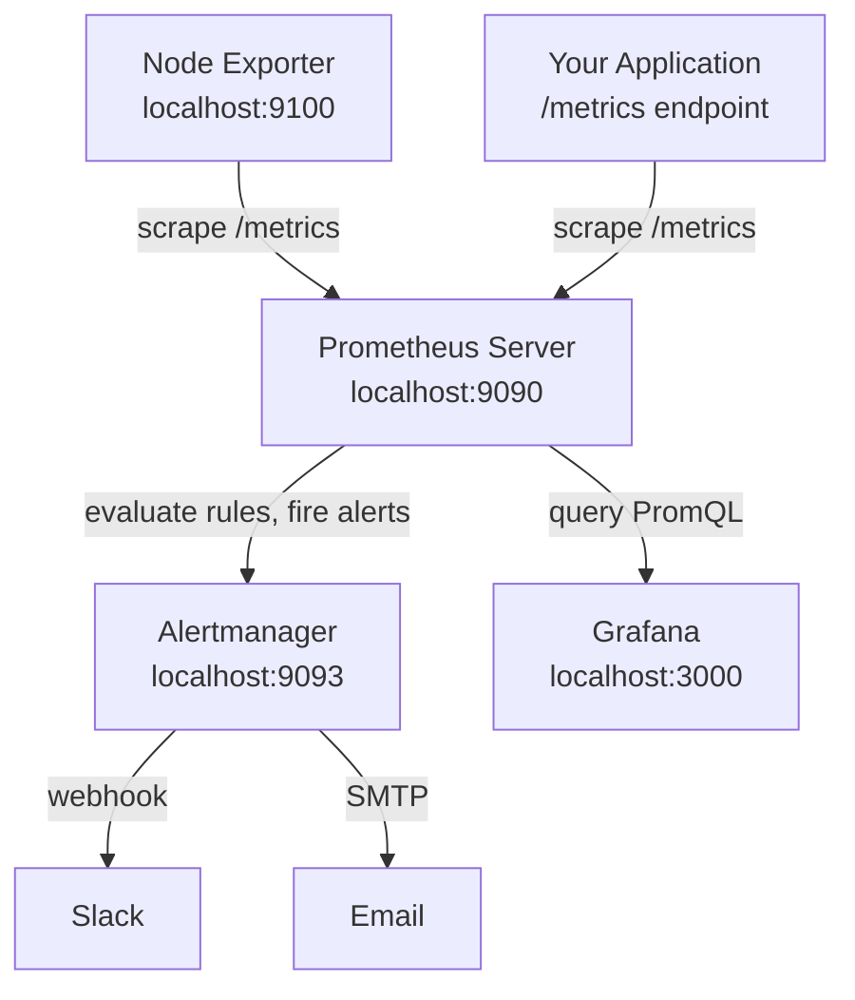

# Day 22 — Prometheus and Grafana

Today you build the metrics side of the observability stack. By the end of this session you will have a running Prometheus instance scraping a real host, a Grafana dashboard showing live data, and an alerting rule that fires when memory is under pressure.

---

## What Prometheus Is

Prometheus is a time-series database and monitoring system. The key design decision that makes it different from most monitoring tools is that **Prometheus pulls data** — it reaches out to your applications on a schedule and scrapes a metrics endpoint. Your application does not push data anywhere.

**Three things Prometheus does:**

1. **Scrapes** — at a configurable interval, Prometheus sends an HTTP GET to each configured target and reads the response
2. **Stores** — the scraped values are stored as time-series data, indexed by metric name and labels
3. **Evaluates** — Prometheus continuously evaluates alerting rules against the stored data and sends alerts to Alertmanager when rules fire

**PromQL** is the query language you use to read from Prometheus. It is purpose-built for time-series data and looks nothing like SQL. You will write a few queries today.

---

## Prometheus Architecture



**Node Exporter** is a separate process that runs alongside Prometheus and exposes host-level metrics — CPU, memory, disk, network. It is the standard way to get OS metrics into Prometheus without writing any application code.

---

## Key Concepts

### scrape_interval

How often Prometheus contacts each target. The global default is 15 seconds. You can override per job. Shorter intervals give you more resolution but increase storage and network load.

### Jobs and Targets

A **job** is a named group of targets that share the same purpose. A **target** is a specific host:port endpoint within a job.

```yaml
# This defines one job called "node" with one target
scrape_configs:
  - job_name: "node"
    static_configs:
      - targets: ["localhost:9100"]
```

Prometheus adds labels automatically: `job="node"` and `instance="localhost:9100"` are attached to every metric scraped from that target.

### Labels

Labels are key-value pairs attached to every metric. They are how you filter and aggregate in PromQL.

```
node_cpu_seconds_total{cpu="0", mode="idle", instance="localhost:9100", job="node"} 12847.3
node_cpu_seconds_total{cpu="0", mode="user", instance="localhost:9100", job="node"} 834.1
```

Same metric name, different labels — these are distinct time-series. Labels let you ask "show me idle CPU on core 0 on the node exporter instance".

### Exporters

An exporter is a process that translates an existing system's internal metrics into the Prometheus exposition format. Node Exporter exposes Linux host metrics. There are exporters for MySQL, Redis, Nginx, Postgres, Kafka, and hundreds of other systems. You point Prometheus at the exporter, not at the application directly.

---

## Setting Up the Stack with Docker Compose

You will run Prometheus, Node Exporter, and Grafana as Docker containers. This is the standard way to deploy this stack in a dev or test environment without touching your host system's configuration.

### Prerequisites

Docker and Docker Compose must be installed. If you completed week 2 these are already present.

```bash
docker --version
docker compose version
```

### Directory structure

```bash
mkdir -p ~/observability-lab
cd ~/observability-lab
```

You will create three files in this directory:
- `docker-compose.yml` — defines the containers
- `prometheus.yml` — Prometheus scrape configuration
- `.env` — secrets (never commit this file)

### docker-compose.yml

```yaml
services:
  prometheus:
    image: prom/prometheus:v2.51.0
    ports:
      - "9090:9090"
    volumes:
      - ./prometheus.yml:/etc/prometheus/prometheus.yml

  node-exporter:
    image: prom/node-exporter:v1.7.0
    ports:
      - "9100:9100"

  grafana:
    image: grafana/grafana:10.4.0
    ports:
      - "3000:3000"
    environment:
      - GF_SECURITY_ADMIN_PASSWORD=${GRAFANA_ADMIN_PASSWORD}
    volumes:
      - grafana-data:/var/lib/grafana

volumes:
  grafana-data:
```

Notice `${GRAFANA_ADMIN_PASSWORD}` — Docker Compose reads this from the `.env` file at runtime. The actual password never appears in the compose file, which means it is safe to commit `docker-compose.yml` to a repository. The `.env` file must never be committed.

### .env file

```bash
# ~/observability-lab/.env
GRAFANA_ADMIN_PASSWORD=your-strong-password-here
```

Add `.env` to your `.gitignore` immediately:

```bash
echo ".env" >> .gitignore
```

### prometheus.yml

```yaml
global:
  scrape_interval: 15s

scrape_configs:
  - job_name: "prometheus"
    static_configs:
      - targets: ["prometheus:9090"]

  - job_name: "node"
    static_configs:
      - targets: ["node-exporter:9100"]
```

Two jobs:
- `prometheus` — Prometheus scrapes its own metrics endpoint. Useful for monitoring Prometheus itself.
- `node` — Prometheus scrapes Node Exporter for host metrics.

Note the hostnames `prometheus` and `node-exporter`. Inside a Docker Compose network, containers reach each other by service name, not by `localhost`.

---

## PromQL Queries

Open the Prometheus UI at `http://localhost:9090` and use the Expression Browser to run these queries. Each one teaches you a different aspect of PromQL.

### Which targets are up?

```promql
up
```

Returns `1` for each target that was successfully scraped, `0` for targets that are down. This is the most important query to know — it tells you immediately if Prometheus can reach its targets.

Expected output when everything is healthy:
```
up{instance="node-exporter:9100", job="node"}        1
up{instance="prometheus:9090",   job="prometheus"}   1
```

### CPU usage

```promql
rate(node_cpu_seconds_total{mode="idle"}[5m])
```

`node_cpu_seconds_total` is a counter — it only ever goes up. `rate()` calculates how fast it is increasing per second over the last 5 minutes. The `mode="idle"` filter selects only the idle CPU time. A value close to 1 means the CPU is mostly idle. A value close to 0 means the CPU is saturated.

To get CPU utilisation as a percentage across all cores:

```promql
100 - (avg by (instance) (rate(node_cpu_seconds_total{mode="idle"}[5m])) * 100)
```

### Available memory percentage

```promql
node_memory_MemAvailable_bytes / node_memory_MemTotal_bytes * 100
```

`node_memory_MemAvailable_bytes` is the estimate of memory available for starting new applications without swapping. Dividing by total memory and multiplying by 100 gives you a percentage. A value below 10% warrants investigation.

### Network throughput

```promql
rate(node_network_receive_bytes_total[5m])
```

This gives you bytes per second received on each network interface over the last 5 minutes. Filter to a specific interface if needed:

```promql
rate(node_network_receive_bytes_total{device="eth0"}[5m])
```

---

## Grafana Setup

### Add Prometheus as a data source

1. Open `http://localhost:3000` in your browser
2. Log in with username `admin` and the password you set in `.env`
3. Go to **Connections > Data sources** (left sidebar)
4. Click **Add data source**
5. Select **Prometheus**
6. Set the URL to `http://prometheus:9090`

   Note: Grafana is inside the Docker Compose network, so it reaches Prometheus by service name, not by `localhost`.

7. Scroll down and click **Save and test** — you should see "Successfully queried the Prometheus API"

### Import the Node Exporter Full dashboard

Rather than building a dashboard from scratch, import a community dashboard that already covers everything Node Exporter exposes.

1. In Grafana, go to **Dashboards > Import** (left sidebar, click the `+` icon)
2. Enter dashboard ID `1860` in the "Import via grafana.com" field
3. Click **Load**
4. Select your Prometheus data source from the dropdown
5. Click **Import**

You now have a full host metrics dashboard showing CPU, memory, disk, and network panels with sensible defaults.

### Create a custom memory panel

Importing a community dashboard is useful, but you should know how to build a panel yourself.

1. Create a new dashboard: **Dashboards > New dashboard > Add visualization**
2. Select your Prometheus data source
3. In the query field, enter:
   ```promql
   node_memory_MemAvailable_bytes / node_memory_MemTotal_bytes * 100
   ```
4. In the right panel, set:
   - **Title:** Available Memory %
   - **Unit:** Percent (0-100) — found under Standard options > Unit
   - **Min:** 0, **Max:** 100
5. Click **Apply**, then save the dashboard

---

## Alerting in Prometheus

Prometheus evaluates alerting rules on each scrape cycle. When a rule condition is true for longer than the `for` duration, Prometheus sends the alert to Alertmanager.

### Alert rule file

Create `~/observability-lab/alert-rules.yml`:

```yaml
groups:
  - name: instance-health
    rules:
      - alert: InstanceDown
        expr: up == 0
        for: 5m
        labels:
          severity: critical
        annotations:
          summary: "Instance {{ $labels.instance }} is down"
          description: "{{ $labels.instance }} of job {{ $labels.job }} has been unreachable for more than 5 minutes."

  - name: memory-pressure
    rules:
      - alert: HighMemoryUsage
        expr: (node_memory_MemAvailable_bytes / node_memory_MemTotal_bytes * 100) < 20
        for: 2m
        labels:
          severity: warning
        annotations:
          summary: "High memory usage on {{ $labels.instance }}"
          description: "Available memory is below 20% on {{ $labels.instance }}. Current value: {{ $value | printf \"%.1f\" }}%"
```

Mount this file in Prometheus by updating `docker-compose.yml`:

```yaml
services:
  prometheus:
    image: prom/prometheus:v2.51.0
    ports:
      - "9090:9090"
    volumes:
      - ./prometheus.yml:/etc/prometheus/prometheus.yml
      - ./alert-rules.yml:/etc/prometheus/alert-rules.yml
```

Reference the rules file in `prometheus.yml`:

```yaml
global:
  scrape_interval: 15s

rule_files:
  - "alert-rules.yml"

scrape_configs:
  - job_name: "prometheus"
    static_configs:
      - targets: ["prometheus:9090"]

  - job_name: "node"
    static_configs:
      - targets: ["node-exporter:9100"]
```

After restarting the stack, open `http://localhost:9090/alerts` to see your rules listed. An alert in "Pending" state means the condition is true but the `for` duration has not elapsed. "Firing" means it has fired and been sent to Alertmanager.

### Alertmanager configuration for Slack

The Alertmanager configuration below routes all alerts to a Slack channel via a webhook URL. The webhook URL must come from an environment variable — never paste it directly into the config file.

```yaml
# alertmanager.yml
global:
  resolve_timeout: 5m

route:
  group_by: ["alertname", "instance"]
  group_wait: 30s
  group_interval: 5m
  repeat_interval: 4h
  receiver: "slack-notifications"

receivers:
  - name: "slack-notifications"
    slack_configs:
      - api_url: "${SLACK_WEBHOOK_URL}"
        channel: "#alerts"
        send_resolved: true
        title: '{{ if eq .Status "firing" }}FIRING{{ else }}RESOLVED{{ end }}: {{ .CommonLabels.alertname }}'
        text: "{{ range .Alerts }}{{ .Annotations.description }}\n{{ end }}"
```

Add `SLACK_WEBHOOK_URL` to your `.env` file:

```bash
SLACK_WEBHOOK_URL=https://hooks.slack.com/services/<WORKSPACE_ID>/<CHANNEL_ID>/<TOKEN>
```

Alertmanager expands environment variables from its config at startup. You configure this by passing `--config.expand-env` as a command-line flag in the container definition.

---

## Hands-On Exercise

Work through each step in order. Do not skip the verification steps — they confirm the system is behaving as expected before you move to the next stage.

### Step 1: Create the working directory and files

```bash
mkdir -p ~/observability-lab
cd ~/observability-lab
```

Create `docker-compose.yml`, `prometheus.yml`, and `alert-rules.yml` using the content from the sections above.

Create `.env`:

```bash
echo "GRAFANA_ADMIN_PASSWORD=ChangeMeNow123" > .env
echo ".env" >> .gitignore
```

Use a strong password in production. The value above is for lab use only.

### Step 2: Start the stack

```bash
docker compose up -d
```

Expected output (container IDs will differ):

```
[+] Running 4/4
 - Network observability-lab_default     Created
 - Container observability-lab-prometheus-1      Started
 - Container observability-lab-node-exporter-1   Started
 - Container observability-lab-grafana-1         Started
```

Verify all containers are running:

```bash
docker compose ps
```

All three containers should show `Up` in the Status column.

### Step 3: Verify Prometheus targets

Open `http://localhost:9090/targets` in your browser.

You should see two targets:
- `node-exporter:9100` — State: UP
- `prometheus:9090` — State: UP

If a target shows State: DOWN, check the container logs:

```bash
docker compose logs node-exporter
docker compose logs prometheus
```

### Step 4: Run the `up` query

In the Prometheus UI at `http://localhost:9090`:

1. Click **Graph** in the top navigation
2. Enter `up` in the expression field
3. Click **Execute**

You should see two series both returning `1`. This confirms Prometheus can reach both targets.

### Step 5: Connect Grafana and import the dashboard

Follow the Grafana setup steps from earlier in this document.

After importing dashboard 1860, confirm you can see data in the CPU and memory panels. If panels show "No data", check that the data source URL is `http://prometheus:9090` (not `localhost`).

### Step 6: Install the stress tool

```bash
sudo apt install -y stress
```

### Step 7: Generate CPU load and observe it

Run a 30-second CPU stress test:

```bash
stress --cpu 2 --timeout 30
```

While this runs, switch to your Grafana dashboard (Node Exporter Full, dashboard 1860) and watch the CPU panel. You should see a visible spike in CPU utilisation within one to two scrape intervals (15 to 30 seconds).

After the stress test finishes, the CPU graph should return to its baseline level.

### Step 8: Write and verify a memory alert rule

The `alert-rules.yml` you created earlier includes the `HighMemoryUsage` rule. Verify it is loaded:

1. Open `http://localhost:9090/alerts`
2. You should see both `InstanceDown` and `HighMemoryUsage` listed

`HighMemoryUsage` will show as "Inactive" on a machine with sufficient memory, meaning the condition is not currently true. This is the correct state for an alert that is not firing.

To trigger it temporarily for testing, you can lower the threshold in the rule to a value above your current memory usage, restart Prometheus, and watch the alert move through Pending to Firing. Restore the threshold to 20% when done.

Restart Prometheus after any changes to the alert rules file:

```bash
docker compose restart prometheus
```

### Step 9: Check Prometheus rule evaluation

Run this PromQL query in the Prometheus UI to see your current available memory percentage:

```promql
node_memory_MemAvailable_bytes / node_memory_MemTotal_bytes * 100
```

Compare the returned value against your alert threshold of 20. If your system has 6 GB available out of 8 GB total, the value will be approximately 75, and the alert will correctly remain inactive.

### Cleanup

When you are done with the lab:

```bash
docker compose down
```

To also remove the Grafana data volume:

```bash
docker compose down -v
```

---

## Troubleshooting Reference

| Symptom | Where to look | Likely cause |
|---|---|---|
| Target shows DOWN in Prometheus | `docker compose logs node-exporter` | Container failed to start |
| Grafana panel shows "No data" | Data source settings in Grafana | URL set to `localhost` instead of `prometheus` |
| Alert not appearing in /alerts | `docker compose logs prometheus` | Syntax error in `alert-rules.yml` |
| Can't access Grafana on port 3000 | `docker compose ps` | Container not running; check `.env` exists |
| PromQL returns empty result | Check target labels in /targets | Label selector does not match |

---

## Summary

| Component | Purpose | URL |
|---|---|---|
| Prometheus | Scrapes and stores metrics | `http://localhost:9090` |
| Node Exporter | Exposes host OS metrics | `http://localhost:9100/metrics` |
| Grafana | Visualises metrics, dashboards | `http://localhost:3000` |
| Alertmanager | Routes and deduplicates alerts | Added in a production setup |

**Key PromQL patterns learned today:**

| Query | What it shows |
|---|---|
| `up` | Target health |
| `rate(counter[5m])` | Per-second rate of a counter over 5 minutes |
| `metric_a / metric_b * 100` | Metric as a percentage of another metric |
| `avg by (label) (expr)` | Aggregate across a label dimension |

**Coming up on Day 23:** CloudWatch Logs and Alarms — the managed AWS equivalent of what you built today, and how to connect both worlds when your application runs on EC2.
