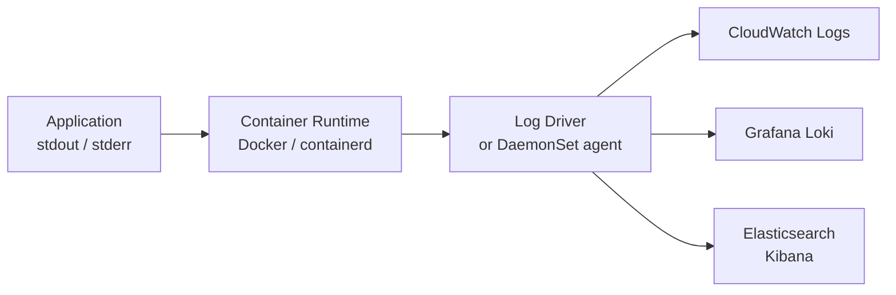

# Day 23 — Application Logging and CloudWatch Logs

Yesterday you built a metrics stack. Metrics tell you that something is wrong. Logs tell you what actually happened and why. Both are required — neither replaces the other.

---

## Why Logs Exist Separately from Metrics

A CPU spike and a payment failure can look identical in your metrics dashboard. The number goes up, an alert fires, someone pages you at 3am. Metrics cannot tell you whether the spike was caused by a memory leak, a bad database query, an unusually large batch job, or a traffic flood. Logs can.

The practical distinction is this:

| Question | Answer comes from |
|---|---|
| Is something wrong right now? | Metrics |
| What happened and when? | Logs |
| What was the user doing when it broke? | Logs |
| How long has it been broken? | Metrics |
| Which request caused the error? | Logs |

You will typically start an investigation with a metrics alert, then pivot to logs to understand the root cause. This is why they are both called "pillars of observability" — you need both.

---

## Log Levels

Every logging library uses the same standard levels. The level you assign to a message communicates its severity and tells downstream systems how to handle it.

| Level | When to use it | Example |
|---|---|---|
| `DEBUG` | Verbose detail useful when diagnosing a specific problem. Disabled in production. | "Entering payment handler, cart_id=882" |
| `INFO` | Normal, expected events that confirm the application is functioning correctly. | "Order 8821 placed successfully" |
| `WARN` | Something unexpected happened but the application recovered and continued. | "Payment gateway slow (2.1s), retrying" |
| `ERROR` | An operation failed. The application continued running but the user's request failed. | "Payment gateway timeout, order 8821 failed" |
| `FATAL` | The application cannot continue. Process is about to exit. | "Database connection pool exhausted, shutting down" |

**In production**, set your log level to `INFO`. This gives you a record of what the application did without flooding your log storage with debug noise. Switch to `DEBUG` temporarily when investigating a specific problem, then switch back.

Setting the wrong level has real costs:
- Too verbose (DEBUG in prod): you pay for log storage and ingestion per GB. A busy service can produce hundreds of GB per day at DEBUG level.
- Too quiet (WARN or ERROR only): you lose the INFO trail that shows what happened before the error.

---

## Structured Logging: JSON vs Unstructured Text

Most applications start with unstructured log lines that look like this:

```
2024-03-21 14:32:01 ERROR payment gateway timeout after 30s for order 8821
```

This is readable to a human. It is nearly impossible to query programmatically. If you want to find all orders that failed in the last hour, you have to write a regex. If you want to count errors by endpoint, you cannot.

**Structured logging** means every log line is a JSON object with consistent field names:

```json
{
  "timestamp": "2024-03-21T14:32:01Z",
  "level": "ERROR",
  "logger": "payment-service",
  "message": "payment gateway timeout",
  "order_id": "8821",
  "duration_ms": 30000,
  "endpoint": "/checkout"
}
```

Now you can query `filter order_id = "8821"` or `stats count(*) by endpoint` without any regex. CloudWatch Logs Insights, Grafana Loki, and the ELK stack all work significantly better with structured JSON logs.

### Python Flask with JSON Logging

Install the library:

```bash
pip install flask python-json-logger
```

A minimal Flask app with structured JSON logging:

```python
# app.py
import logging
import sys
from flask import Flask, jsonify, request
from pythonjsonlogger import jsonlogger

app = Flask(__name__)

# Configure the root logger to output JSON
logger = logging.getLogger()
logger.setLevel(logging.INFO)

handler = logging.StreamHandler(sys.stdout)
formatter = jsonlogger.JsonFormatter(
    fmt="%(asctime)s %(levelname)s %(name)s %(message)s",
    datefmt="%Y-%m-%dT%H:%M:%SZ"
)
handler.setFormatter(formatter)
logger.addHandler(handler)

app_logger = logging.getLogger("flaskapp")


@app.route("/")
def index():
    app_logger.info("request received", extra={"endpoint": "/", "method": request.method})
    return "Hello from Flask\n"


@app.route("/health")
def health():
    return jsonify({"status": "ok"}), 200


@app.route("/error")
def trigger_error():
    app_logger.error(
        "simulated application error",
        extra={"endpoint": "/error", "error_code": "SIM_001"}
    )
    return jsonify({"error": "something went wrong"}), 500


if __name__ == "__main__":
    app.run(host="0.0.0.0", port=5000)
```

A request to `/` produces a log line like:

```json
{"asctime": "2024-03-21T14:32:01Z", "levelname": "INFO", "name": "flaskapp", "message": "request received", "endpoint": "/", "method": "GET"}
```

A request to `/error` produces:

```json
{"asctime": "2024-03-21T14:32:05Z", "levelname": "ERROR", "name": "flaskapp", "message": "simulated application error", "endpoint": "/error", "error_code": "SIM_001"}
```

The `extra` dictionary lets you attach any fields you want. Good fields to always include: `endpoint`, `user_id` (if authenticated), `request_id` (for tracing a single request through multiple services), `duration_ms`.

---

## Docker Logging

When an application runs in Docker and writes to stdout/stderr, Docker captures those streams. This is by design — the container runtime handles log collection so your application does not need to manage log files.

### Basic commands

```bash
# Show all logs from a container
docker logs <container-name>

# Follow (tail -f equivalent) — press Ctrl+C to stop
docker logs -f <container-name>

# Show the last 100 lines and then follow
docker logs -f --tail 100 <container-name>

# Show logs from the last hour
docker logs --since 1h <container-name>

# Show logs between two timestamps
docker logs --since "2024-03-21T14:00:00" --until "2024-03-21T15:00:00" <container-name>

# Redirect both stdout and stderr to a file for analysis
docker logs <container-name> 2>&1 > app.log
```

### Why stdout matters

The convention "write logs to stdout, not to files" comes from the Twelve-Factor App methodology. When a container writes to a file inside the container, that file disappears when the container restarts. When the container writes to stdout, the container runtime collects it, and you can forward it to any log aggregation system without modifying the application.

---

## Kubernetes Logging

Kubernetes follows the same convention. Every container writes to stdout/stderr. Kubernetes stores these logs on the node where the pod runs.

```bash
# Basic pod log access
kubectl logs <pod-name>

# Follow logs live
kubectl logs -f <pod-name>

# Last 50 lines only
kubectl logs --tail 50 <pod-name>

# Logs from a deployment (picks one pod automatically)
kubectl logs -f deployment/<deployment-name>

# Logs from a crashed pod (the previous container instance)
# This is critical when a pod keeps crashing — the current instance may
# have already restarted by the time you check, so --previous gives you
# the logs from the run that actually crashed
kubectl logs --previous <pod-name>

# Multi-container pods: specify which container
kubectl logs <pod-name> -c <container-name>

# List all containers in a pod to know what to specify with -c
kubectl get pod <pod-name> -o jsonpath='{.spec.containers[*].name}'

# Logs from all pods in a deployment (useful for distributed errors)
kubectl logs -f -l app=<app-label> --all-containers=true
```

**Limitation:** `kubectl logs` only reads logs stored on the node. If the node is deleted, or the pod has been evicted and replaced multiple times, older logs are gone. This is why production clusters forward logs to a central store (CloudWatch Logs, Loki, or Elasticsearch) rather than relying on `kubectl logs` alone.

---

## Log Flow Architecture



The container runtime buffers the stdout/stderr stream. A log driver or a log collection agent (like Fluent Bit running as a DaemonSet in Kubernetes) reads from that buffer and forwards to a central store. Your application has no knowledge of or dependency on the destination — it just writes to stdout.

---

## AWS CloudWatch Logs

CloudWatch Logs is AWS's managed log aggregation service. You do not run any servers. AWS handles storage, indexing, and retention.

### Core concepts

**Log group:** A named container for related log streams. Typically one log group per application or per EC2 instance. Example: `/production/flaskapp`.

**Log stream:** A sequence of log events from a single source within a group. Each EC2 instance writes to its own stream inside the log group. Example: `/production/flaskapp/i-0abc123def456`.

**Retention policy:** How long CloudWatch keeps logs before deleting them automatically. Default is "never expire", which means indefinite storage at full cost. Always set a retention policy.

### Install and configure the CloudWatch agent on EC2

```bash
# Download and install the agent (Ubuntu 22.04/24.04)
wget https://s3.amazonaws.com/amazoncloudwatch-agent/ubuntu/amd64/latest/amazon-cloudwatch-agent.deb
sudo dpkg -i amazon-cloudwatch-agent.deb

# Verify the install
sudo /opt/aws/amazon-cloudwatch-agent/bin/amazon-cloudwatch-agent-ctl -a status
```

The agent is configured by a JSON file. Create `/opt/aws/amazon-cloudwatch-agent/etc/amazon-cloudwatch-agent.json`:

```json
{
  "logs": {
    "logs_collected": {
      "files": {
        "collect_list": [
          {
            "file_path": "/var/log/syslog",
            "log_group_name": "/production/ec2/syslog",
            "log_stream_name": "{instance_id}",
            "retention_in_days": 90
          },
          {
            "file_path": "/var/log/flaskapp.log",
            "log_group_name": "/production/flaskapp",
            "log_stream_name": "{instance_id}",
            "retention_in_days": 30,
            "timestamp_format": "%Y-%m-%dT%H:%M:%SZ",
            "multi_line_start_pattern": "^\\{"
          }
        ]
      }
    }
  }
}
```

Notes on the config:
- `{instance_id}` is a special token that CloudWatch replaces with the actual EC2 instance ID at runtime.
- `retention_in_days` sets the log retention policy directly in the agent config. No manual setup needed in the console.
- `multi_line_start_pattern` tells the agent that a new log event starts with `{`, which is the first character of each JSON log line. Without this, a multi-line stack trace would be split into separate events.

Start and enable the agent:

```bash
sudo /opt/aws/amazon-cloudwatch-agent/bin/amazon-cloudwatch-agent-ctl \
  -a fetch-config \
  -m ec2 \
  -s \
  -c file:/opt/aws/amazon-cloudwatch-agent/etc/amazon-cloudwatch-agent.json

# The agent should now be running
sudo /opt/aws/amazon-cloudwatch-agent/bin/amazon-cloudwatch-agent-ctl -a status
```

The EC2 instance needs an IAM role with the `CloudWatchAgentServerPolicy` managed policy attached. If you built the Week 4 stack with Terraform, add this to the IAM role in `asg.tf`:

```hcl
resource "aws_iam_role_policy_attachment" "ec2_cloudwatch" {
  role       = aws_iam_role.ec2.name
  policy_arn = "arn:aws:iam::aws:policy/CloudWatchAgentServerPolicy"
}
```

### Log retention policies

Do not leave retention at "Never expire". Logs are billed per GB stored per month. A moderately busy application generating 1 GB/day costs approximately $0.03/day at standard pricing — which is about $10/month per GB stored if you never delete. After 12 months of retention at that volume, you are storing 365 GB and paying roughly $11/month just for storage of one application's logs.

Recommended retention periods:

| Log type | Retention |
|---|---|
| Application DEBUG logs | 7 days |
| Application INFO/ERROR logs | 30 days |
| Security and audit logs | 365 days (or longer, depending on compliance) |
| Infrastructure logs (syslog, etc.) | 90 days |

---

## CloudWatch Logs Insights

Logs Insights is a query engine built into CloudWatch. Open it from the CloudWatch console under **Logs > Logs Insights**. You select one or more log groups and run a query against their contents.

The query language is not SQL, but it is close enough that it is readable on first encounter.

### Query 1: Find all ERROR messages in the last hour

```
fields @timestamp, @message
| filter @message like /ERROR/
| sort @timestamp desc
| limit 20
```

- `fields` selects which fields to return
- `filter` applies a condition — `like /pattern/` uses regex
- `sort @timestamp desc` gives you the most recent errors first
- `limit 20` caps the output

### Query 2: Count errors by hour to see trends

```
filter @message like /ERROR/
| stats count(*) as errorCount by bin(1h)
| sort bin(1h) asc
```

`bin(1h)` groups timestamps into 1-hour buckets. This query shows you whether your error rate is increasing, decreasing, or spiking at a specific time.

### Query 3: Find both WARN and ERROR in one query

```
fields @timestamp, @message
| filter @message like /WARN|ERROR/
| sort @timestamp desc
```

The `|` inside the regex pattern is OR. This gives you the full picture of degraded behaviour, not just hard failures.

**Querying JSON logs:** If your application writes JSON, CloudWatch Logs Insights automatically parses the fields. You can query specific keys directly:

```
fields @timestamp, level, message, endpoint
| filter level = "ERROR"
| sort @timestamp desc
| limit 50
```

This only works if the log lines are valid JSON with consistent field names — another reason structured logging matters.

---

## Intro to Loki

Grafana Loki is an open-source log aggregation system designed to work alongside Prometheus. The key difference from CloudWatch or Elasticsearch: Loki does not index the content of log lines. It only indexes the labels attached to each log stream (similar to how Prometheus labels work). This makes it dramatically cheaper to run than an Elasticsearch cluster.

You query Loki using LogQL, which looks and behaves like PromQL:

```logql
{app="flaskapp"} |= "ERROR"
```

Loki integrates directly with Grafana — you add it as a data source the same way you added Prometheus, and you can build Grafana dashboards that show both metrics panels and log panels side by side.

You will not set up Loki today. The reason to know about it now: if you are running a Kubernetes cluster and already have Grafana + Prometheus deployed, adding Loki (via Helm chart) is the natural next step. It uses the same label model and the same dashboard tool, without requiring you to run an Elasticsearch cluster.

---

## Hands-On Exercise

Work through each step in order.

### Step 1: Create the Flask app with JSON logging

```bash
mkdir -p ~/logging-lab
cd ~/logging-lab
```

Create `requirements.txt`:

```
flask==3.0.3
python-json-logger==2.0.7
```

Create `app.py` using the full example from earlier in this document.

Create `Dockerfile`:

```dockerfile
FROM python:3.12-slim
WORKDIR /app
COPY requirements.txt .
RUN pip install --no-cache-dir -r requirements.txt
COPY app.py .
CMD ["python", "app.py"]
```

### Step 2: Build and run the container

```bash
docker build -t flask-logging-lab .
docker run -d --name flaskapp -p 5000:5000 flask-logging-lab
```

### Step 3: Tail the container logs

In one terminal, start following the logs:

```bash
docker logs -f --tail 100 flaskapp
```

Leave this terminal open. You will watch it as you generate traffic.

### Step 4: Generate requests including errors

In a second terminal, send some traffic:

```bash
# Normal requests
curl http://localhost:5000/
curl http://localhost:5000/health

# Generate errors
curl http://localhost:5000/error
curl http://localhost:5000/error
curl http://localhost:5000/error

# Hit a nonexistent endpoint (produces a 404 in Flask's default handler)
curl http://localhost:5000/does-not-exist
```

Watch the first terminal. You should see JSON log lines appear for each request. The `/error` requests will produce lines with `"levelname": "ERROR"`.

### Step 5: Filter errors from log history

Stop the tail with Ctrl+C. Now filter the accumulated logs:

```bash
# Show only ERROR lines from the last 10 minutes
docker logs --since 10m flaskapp 2>&1 | grep ERROR

# Count how many errors occurred
docker logs --since 10m flaskapp 2>&1 | grep '"levelname": "ERROR"' | wc -l
```

### Step 6 (Optional — requires AWS account): Ship logs to CloudWatch

If you have an AWS account and an EC2 instance with the CloudWatch agent configured:

```bash
# Manually send a log event via the AWS CLI to test your log group
aws logs put-log-events \
  --log-group-name "/production/flaskapp" \
  --log-stream-name "test-stream-$(date +%s)" \
  --log-events '[{"timestamp":'"$(date +%s%3N)"',"message":"{\"level\":\"INFO\",\"message\":\"manual test log event\"}"}]'

# Verify it appeared
aws logs get-log-events \
  --log-group-name "/production/flaskapp" \
  --log-stream-name "test-stream-<your-timestamp>"
```

### Cleanup

```bash
docker stop flaskapp
docker rm flaskapp
```

---

## Summary

| Concept | Key point |
|---|---|
| Structured logging | Write JSON from day one. It costs nothing extra and makes every query tool work better. |
| Log levels | INFO in production. DEBUG only when diagnosing. Always attach context fields. |
| Docker logs | Container writes to stdout; `docker logs -f` tails it. Logs are gone when the container is removed unless forwarded. |
| Kubernetes logs | `kubectl logs --previous` is your first tool when a pod crashes. |
| CloudWatch log groups | One per application. Set retention — never leave it at "never expire". |
| CloudWatch Logs Insights | Use `filter`, `stats`, and `bin()` to query across time. Works best with JSON logs. |
| Loki | The Prometheus-native log backend. Cheap to run. Comes after Prometheus, not before it. |

**Coming up on Day 24:** CloudWatch Alarms and alerting — turning log patterns and metrics into automated notifications that wake someone up when the application needs attention.
