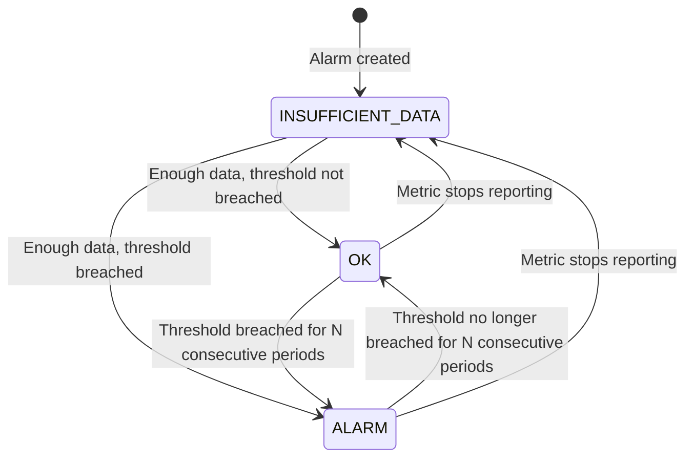

# Day 24 — CloudWatch Alarms and Alerting

Yesterday you set up structured logging and learned how to query logs in CloudWatch Logs Insights. Querying logs is reactive — you look at them after something goes wrong. Today you set up alarms so that CloudWatch tells you something is wrong before you have to look.

---

## What CloudWatch Alarms Are

A CloudWatch alarm watches a single metric and changes state based on whether that metric crosses a threshold. It is the primary mechanism for automated alerting in AWS.

An alarm does three things:
1. Reads a metric at a regular interval
2. Compares the value against a threshold you define
3. Changes state if the condition is met for a number of consecutive periods you specify

The "number of consecutive periods" part matters. If you set an alarm to fire when CPU exceeds 80% for 1 data point, any brief spike will trigger it. If you require 3 consecutive periods, you only alert on sustained problems. The right number depends on how noisy the metric is and how quickly you need to react.

---

## Alarm State Machine

A CloudWatch alarm is always in one of three states:



| State | Meaning |
|---|---|
| `OK` | The metric is within the defined threshold. Everything is normal. |
| `ALARM` | The metric has exceeded the threshold for the required number of periods. Action should be taken. |
| `INSUFFICIENT_DATA` | Not enough data points have been collected yet, or the metric has stopped reporting. New alarms start in this state. |

`INSUFFICIENT_DATA` is a signal in itself. If an alarm that was previously `OK` transitions to `INSUFFICIENT_DATA`, the metric may have stopped reporting — which can mean the application crashed or the EC2 instance was terminated.

---

## Creating a CloudWatch Alarm via AWS CLI

This alarm fires when EC2 CPU utilisation exceeds 80% for three consecutive 5-minute periods (15 minutes of sustained high CPU):

```bash
aws cloudwatch put-metric-alarm \
  --alarm-name "ec2-high-cpu-production" \
  --alarm-description "EC2 CPU above 80% for 15 minutes. Runbook: https://wiki.example.com/runbooks/high-cpu" \
  --namespace "AWS/EC2" \
  --metric-name "CPUUtilization" \
  --dimensions Name=InstanceId,Value=<your-instance-id> \
  --statistic Average \
  --period 300 \
  --evaluation-periods 3 \
  --threshold 80 \
  --comparison-operator GreaterThanThreshold \
  --treat-missing-data breaching \
  --alarm-actions arn:aws:sns:<region>:<account-id>:<sns-topic-name> \
  --ok-actions arn:aws:sns:<region>:<account-id>:<sns-topic-name> \
  --region us-east-1
```

Key parameters explained:

| Parameter | Value | Meaning |
|---|---|---|
| `--period 300` | 5 minutes | Each evaluation period is 5 minutes |
| `--evaluation-periods 3` | 3 | Must breach for 3 consecutive periods (15 min total) |
| `--threshold 80` | 80 | The value to compare against |
| `--comparison-operator` | `GreaterThanThreshold` | Fire when value > 80 |
| `--treat-missing-data breaching` | breaching | If the instance stops reporting, treat it as a breach |
| `--alarm-actions` | SNS ARN | Where to send notification when entering ALARM |
| `--ok-actions` | SNS ARN | Where to send notification when returning to OK |

Setting `--ok-actions` to the same SNS topic is important. It sends a "resolved" notification when the problem clears, so your on-call engineer knows they can stop investigating.

Verify the alarm was created:

```bash
aws cloudwatch describe-alarms \
  --alarm-names "ec2-high-cpu-production" \
  --query 'MetricAlarms[0].{Name:AlarmName,State:StateValue,Threshold:Threshold}'
```

---

## SNS Topics for Alert Delivery

Simple Notification Service (SNS) is the AWS pub/sub messaging service. You publish a message to a topic, and SNS delivers it to all subscribers. CloudWatch alarms publish to SNS topics when they change state.

### Step 1: Create the SNS topic

```bash
aws sns create-topic \
  --name "production-alerts" \
  --region us-east-1
```

This returns a TopicArn. Save it:

```bash
# The ARN looks like: arn:aws:sns:us-east-1:123456789012:production-alerts
TOPIC_ARN=$(aws sns create-topic --name "production-alerts" --region us-east-1 --query 'TopicArn' --output text)
echo $TOPIC_ARN
```

### Step 2: Subscribe an email address

```bash
aws sns subscribe \
  --topic-arn $TOPIC_ARN \
  --protocol email \
  --notification-endpoint your@email.com \
  --region us-east-1
```

Check your inbox. AWS sends a confirmation email immediately. You must click the "Confirm subscription" link before the subscription activates. Notifications are not delivered to unconfirmed subscribers.

### Step 3: Verify the subscription is confirmed

```bash
aws sns list-subscriptions-by-topic \
  --topic-arn $TOPIC_ARN \
  --query 'Subscriptions[*].{Protocol:Protocol,Endpoint:Endpoint,Status:SubscriptionArn}'
```

The `SubscriptionArn` will show as `PendingConfirmation` until you click the email link. Once confirmed it will show the full ARN.

### Step 4: Wire the alarm to the topic

In the `put-metric-alarm` command from the previous section, replace `<sns-topic-arn>` with the actual value of `$TOPIC_ARN`.

To update an existing alarm to point at the topic:

```bash
aws cloudwatch put-metric-alarm \
  --alarm-name "ec2-high-cpu-production" \
  --alarm-actions $TOPIC_ARN \
  --ok-actions $TOPIC_ARN \
  --namespace "AWS/EC2" \
  --metric-name "CPUUtilization" \
  --dimensions Name=InstanceId,Value=<your-instance-id> \
  --statistic Average \
  --period 300 \
  --evaluation-periods 3 \
  --threshold 80 \
  --comparison-operator GreaterThanThreshold \
  --treat-missing-data breaching \
  --region us-east-1
```

### Test the topic directly

Before waiting for an alarm to fire, confirm the SNS topic and email subscription work by publishing a test message manually:

```bash
aws sns publish \
  --topic-arn $TOPIC_ARN \
  --subject "Test Alert" \
  --message "This is a test notification from your CloudWatch alerting setup." \
  --region us-east-1
```

You should receive the email within a few seconds.

---

## Composite Alarms

A composite alarm combines multiple individual alarms using boolean logic (`AND`, `OR`). It only fires when its rule expression evaluates to true.

**Use case:** You have an alarm for high CPU and an alarm for high memory. You want to be paged only when both are high simultaneously — because either one alone might be acceptable, but both at the same time indicates the instance is under serious pressure.

```bash
aws cloudwatch put-composite-alarm \
  --alarm-name "ec2-resource-pressure" \
  --alarm-description "CPU AND memory both elevated. Instance likely overloaded." \
  --alarm-rule "ALARM(ec2-high-cpu-production) AND ALARM(ec2-high-memory-production)" \
  --alarm-actions $TOPIC_ARN \
  --region us-east-1
```

Composite alarms reduce alert noise. Instead of two separate pages for correlated conditions, you get one page that accurately describes the situation.

Another common pattern: composite alarm that fires when either of two redundant services is down:

```bash
--alarm-rule "ALARM(service-a-health) OR ALARM(service-b-health)"
```

---

## CloudWatch Dashboards

A CloudWatch Dashboard is a custom page in the CloudWatch console that you build from widgets. You can share dashboards across your team and embed them in internal tooling.

### Create a dashboard with a CPU widget

```bash
aws cloudwatch put-dashboard \
  --dashboard-name "production-ec2" \
  --dashboard-body '{
    "widgets": [
      {
        "type": "metric",
        "x": 0,
        "y": 0,
        "width": 12,
        "height": 6,
        "properties": {
          "title": "EC2 CPU Utilization",
          "view": "timeSeries",
          "stacked": false,
          "metrics": [
            [
              "AWS/EC2",
              "CPUUtilization",
              "InstanceId",
              "<your-instance-id>",
              {
                "stat": "Average",
                "period": 300,
                "label": "CPU %"
              }
            ]
          ],
          "period": 300,
          "yAxis": {
            "left": {
              "min": 0,
              "max": 100
            }
          }
        }
      }
    ]
  }' \
  --region us-east-1
```

The dashboard body is a JSON document. Each widget has:
- `type`: `metric`, `alarm`, `text`, or `log`
- `x`, `y`: position on the grid (0-based, 24 columns wide)
- `width`, `height`: size in grid units
- `properties`: widget-specific configuration

Verify the dashboard was created:

```bash
aws cloudwatch list-dashboards --query 'DashboardEntries[*].DashboardName'
```

Open the console at `https://console.aws.amazon.com/cloudwatch/home#dashboards:name=production-ec2` to see it rendered.

---

## Custom Application Metrics

CloudWatch Metrics is not limited to AWS infrastructure metrics. You can emit custom metrics from any application using the AWS CLI or SDK. Custom metrics go into your own namespace (not `AWS/EC2`).

### Emit a metric via AWS CLI

```bash
aws cloudwatch put-metric-data \
  --namespace "FlaskApp/Production" \
  --metric-name "RequestCount" \
  --value 42 \
  --unit Count \
  --dimensions Service=checkout,Environment=production \
  --region us-east-1
```

Run this several times with different values, then query it:

```bash
aws cloudwatch get-metric-statistics \
  --namespace "FlaskApp/Production" \
  --metric-name "RequestCount" \
  --dimensions Name=Service,Value=checkout Name=Environment,Value=production \
  --start-time $(date -u -d '30 minutes ago' +%Y-%m-%dT%H:%M:%SZ) \
  --end-time $(date -u +%Y-%m-%dT%H:%M:%SZ) \
  --period 300 \
  --statistics Sum Average \
  --region us-east-1
```

### Emit a custom metric from a Python script

```python
# emit_metrics.py
import boto3
import random
import time

cloudwatch = boto3.client("cloudwatch", region_name="us-east-1")


def emit_request_metrics(request_count: int, error_count: int) -> None:
    cloudwatch.put_metric_data(
        Namespace="FlaskApp/Production",
        MetricData=[
            {
                "MetricName": "RequestCount",
                "Dimensions": [
                    {"Name": "Service", "Value": "checkout"},
                    {"Name": "Environment", "Value": "production"},
                ],
                "Value": request_count,
                "Unit": "Count",
            },
            {
                "MetricName": "ErrorCount",
                "Dimensions": [
                    {"Name": "Service", "Value": "checkout"},
                    {"Name": "Environment", "Value": "production"},
                ],
                "Value": error_count,
                "Unit": "Count",
            },
        ],
    )
    print(f"Emitted: requests={request_count}, errors={error_count}")


if __name__ == "__main__":
    # Simulate 5 minutes of metrics
    for _ in range(5):
        requests = random.randint(80, 120)
        errors = random.randint(0, 5)
        emit_request_metrics(requests, errors)
        time.sleep(60)
```

Run this with:

```bash
pip install boto3
python emit_metrics.py
```

After running, the metrics appear in CloudWatch under the `FlaskApp/Production` namespace. You can create alarms on them exactly like you would on built-in AWS metrics:

```bash
aws cloudwatch put-metric-alarm \
  --alarm-name "flaskapp-high-error-rate" \
  --alarm-description "Flask app error count elevated. Runbook: https://wiki.example.com/runbooks/flask-errors" \
  --namespace "FlaskApp/Production" \
  --metric-name "ErrorCount" \
  --dimensions Name=Service,Value=checkout Name=Environment,Value=production \
  --statistic Sum \
  --period 300 \
  --evaluation-periods 2 \
  --threshold 10 \
  --comparison-operator GreaterThanThreshold \
  --alarm-actions $TOPIC_ARN \
  --region us-east-1
```

---

## Alerting Best Practices

Getting alerting right is harder than setting it up. The mechanics are simple. The discipline is not.

### Alert on symptoms, not causes

A symptom is something the user experiences. A cause is the underlying reason.

**Cause-based alert (avoid):** "Database CPU above 70%"
**Symptom-based alert (prefer):** "Checkout page error rate above 1% for 5 minutes"

When you alert on causes, you get woken up for things that may not actually affect users. The database CPU might spike during a batch job that has no impact on request latency. When you alert on symptoms — high error rate, high latency, degraded availability — you only get paged when users are genuinely affected.

This is the core idea behind SLO-based alerting (Service Level Objectives). Define what "good" looks like for the user (99.9% of requests succeed, p99 latency below 500ms), then alert when you are burning through your error budget faster than sustainable.

### Avoid alert fatigue

Alert fatigue happens when on-call engineers receive so many alerts that they stop treating them urgently. This is one of the most serious reliability problems an engineering team can have.

Rules to avoid it:
- Every alert that fires at night must require a human to take action. If the alert resolves on its own without human intervention, it should not page anyone.
- Set thresholds based on historical data, not guesswork. Look at your metric's normal range before setting a threshold.
- Start with conservative thresholds and tighten them over time as you learn what "normal" looks like.
- Review fired alerts weekly. If an alert fired but required no action, either raise the threshold or remove the alert.

### Runbook links in alarm descriptions

The `--alarm-description` field is not just documentation. It is the first thing an on-call engineer reads at 3am when they are half awake. Put a runbook link in every alarm description.

A minimal runbook contains:
- What this alarm means in plain language
- What to check first
- The three most common causes and their fixes
- Who to escalate to if the standard fixes do not work

### Severity levels

Not all alerts require the same urgency of response. Define levels across your team and use them consistently.

| Level | Definition | Response expectation |
|---|---|---|
| P1 | Production is down or severely degraded. Users cannot complete core workflows. | Wake someone up. Respond in minutes. |
| P2 | Production is degraded. Core workflows succeed but with errors or elevated latency. | Respond within the hour during business hours. May warrant after-hours response. |
| P3 | Warning condition. Not affecting users now but will if unaddressed. | Respond during the next business day. |

Put the severity level in the alarm name or description so the on-call engineer knows immediately how urgently to respond.

---

## Hands-On Exercise

Work through each step. Steps 1-5 require an AWS account with an EC2 instance. Step 6 can be done without an active EC2 instance.

### Step 1: Create an SNS topic and subscribe your email

```bash
TOPIC_ARN=$(aws sns create-topic \
  --name "devops-lab-alerts" \
  --region us-east-1 \
  --query 'TopicArn' \
  --output text)

echo "Topic ARN: $TOPIC_ARN"

aws sns subscribe \
  --topic-arn $TOPIC_ARN \
  --protocol email \
  --notification-endpoint your@email.com \
  --region us-east-1
```

Check your email and confirm the subscription before continuing.

### Step 2: Create a CloudWatch alarm on EC2 CPU

Replace `<instance-id>` with your actual EC2 instance ID:

```bash
INSTANCE_ID=<your-instance-id>

aws cloudwatch put-metric-alarm \
  --alarm-name "lab-ec2-high-cpu" \
  --alarm-description "P2: EC2 CPU above 70% for 10 minutes. Check running processes. Runbook: https://wiki.example.com/runbooks/high-cpu" \
  --namespace "AWS/EC2" \
  --metric-name "CPUUtilization" \
  --dimensions Name=InstanceId,Value=$INSTANCE_ID \
  --statistic Average \
  --period 300 \
  --evaluation-periods 2 \
  --threshold 70 \
  --comparison-operator GreaterThanThreshold \
  --treat-missing-data breaching \
  --alarm-actions $TOPIC_ARN \
  --ok-actions $TOPIC_ARN \
  --region us-east-1
```

Verify the alarm exists and is in OK or INSUFFICIENT_DATA state:

```bash
aws cloudwatch describe-alarms \
  --alarm-names "lab-ec2-high-cpu" \
  --query 'MetricAlarms[0].{State:StateValue,Threshold:Threshold,Period:Period,EvalPeriods:EvaluationPeriods}'
```

### Step 3: Install stress and run a CPU load test

SSH into your EC2 instance:

```bash
sudo apt-get update && sudo apt-get install -y stress
```

Run a CPU stress test for 120 seconds:

```bash
stress --cpu 2 --timeout 120
```

### Step 4: Watch the alarm transition to ALARM state

In a separate terminal on your local machine, poll the alarm state every 30 seconds:

```bash
watch -n 30 "aws cloudwatch describe-alarms \
  --alarm-names lab-ec2-high-cpu \
  --query 'MetricAlarms[0].{State:StateValue,Updated:StateUpdatedTimestamp}' \
  --region us-east-1"
```

The alarm needs to see CPU > 70% for two consecutive 5-minute periods. Depending on when your periods align, this can take 5 to 15 minutes. CloudWatch evaluation periods are fixed on the clock (e.g., 14:00-14:05, 14:05-14:10) rather than rolling windows.

When the alarm transitions to ALARM, you should receive an email from SNS within 1-2 minutes.

After the stress test ends, the alarm will return to OK and you will receive a second email confirming the resolution.

### Step 5: Force an alarm state transition manually (for testing)

CloudWatch allows you to force an alarm into any state without waiting for a metric. This is useful for testing your SNS subscription and runbooks without generating real load:

```bash
# Force the alarm into ALARM state
aws cloudwatch set-alarm-state \
  --alarm-name "lab-ec2-high-cpu" \
  --state-value ALARM \
  --state-reason "Manual test of alarm notification pipeline" \
  --region us-east-1

# Check your email, then reset it back to OK
aws cloudwatch set-alarm-state \
  --alarm-name "lab-ec2-high-cpu" \
  --state-value OK \
  --state-reason "Resetting after manual test" \
  --region us-east-1
```

Note: CloudWatch will override the forced state at the next evaluation cycle. This is for testing only.

### Step 6: Emit a custom metric and create an alarm on it

Run the Python `emit_metrics.py` script from earlier in this document (or use the AWS CLI version):

```bash
# Emit a metric that will breach the threshold
aws cloudwatch put-metric-data \
  --namespace "FlaskApp/Production" \
  --metric-name "ErrorCount" \
  --value 15 \
  --unit Count \
  --dimensions Service=checkout,Environment=production \
  --region us-east-1

# Create an alarm on it
aws cloudwatch put-metric-alarm \
  --alarm-name "flaskapp-error-count-lab" \
  --alarm-description "P2: Flask checkout error count elevated." \
  --namespace "FlaskApp/Production" \
  --metric-name "ErrorCount" \
  --dimensions Name=Service,Value=checkout Name=Environment,Value=production \
  --statistic Sum \
  --period 300 \
  --evaluation-periods 1 \
  --threshold 10 \
  --comparison-operator GreaterThanThreshold \
  --alarm-actions $TOPIC_ARN \
  --region us-east-1
```

After one evaluation period (up to 5 minutes), the alarm should fire because you emitted a value of 15, which exceeds the threshold of 10.

### Cleanup

```bash
# Delete the alarms
aws cloudwatch delete-alarms \
  --alarm-names "lab-ec2-high-cpu" "flaskapp-error-count-lab" \
  --region us-east-1

# Delete the SNS topic (this also removes all subscriptions)
aws sns delete-topic --topic-arn $TOPIC_ARN --region us-east-1
```

---

## Summary

| Concept | Key point |
|---|---|
| Alarm states | OK, ALARM, INSUFFICIENT_DATA. `INSUFFICIENT_DATA` can itself be a signal. |
| Evaluation periods | Require multiple consecutive periods to avoid alerting on transient spikes. |
| SNS | Always confirm your email subscription before relying on it. Test with `sns publish`. |
| `ok-actions` | Set this alongside `alarm-actions` so you get resolved notifications too. |
| Custom metrics | Any application can emit metrics to any namespace. Cost is per metric per month. |
| Alert on symptoms | High error rate and high latency matter more than low-level resource metrics. |
| Runbook links | Put the link in `--alarm-description`. It will be read under pressure. |
| `set-alarm-state` | Use this to test your notification pipeline without generating real load. |

**Coming up:** The Week 5 capstone exercises wire everything together — Prometheus metrics, CloudWatch Logs, and CloudWatch Alarms — on top of the production stack you built in Week 4.
