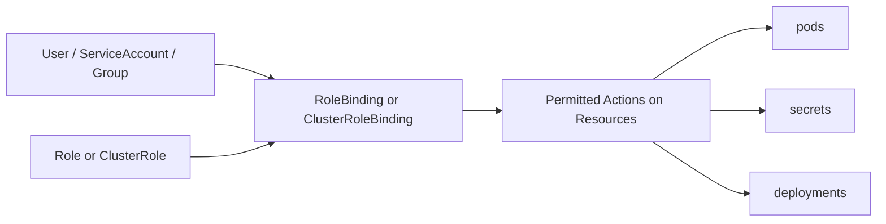

# Day 26 — Kubernetes RBAC, Secrets, and Pod Security

Week 6 starts with a question that most tutorials skip: who is allowed to do what inside your cluster, and how do you stop a compromised component from taking everything down?

---

## Why RBAC Matters

By default, every ServiceAccount in Kubernetes has almost no permissions. The problem in practice is the opposite: engineers grant `cluster-admin` to a CI/CD ServiceAccount to make things work quickly and never revisit it.

**A real incident pattern:** A Jenkins pipeline was compromised via a vulnerable Jenkins plugin. The attacker gained access to the pipeline's ServiceAccount token. Because that ServiceAccount had `cluster-admin`, the attacker used `kubectl` to deploy a cryptominer as a DaemonSet across every node in the cluster. The workload ran for three days before billing alerts triggered an investigation.

The fix is not complicated. It is giving each ServiceAccount exactly the permissions it needs and nothing more. This is the principle of least privilege.

---

## How RBAC Works



There are four objects to understand:

### Subject

Who is making the request. Three types:

- **User** — a human identity (authenticated via certificates, OIDC, etc.)
- **Group** — a collection of users
- **ServiceAccount** — an identity for a process running inside a pod

### Role

A named set of permissions scoped to a single namespace. It lists which verbs are allowed on which resources.

### ClusterRole

The same concept as a Role but applies across the entire cluster, or to cluster-level resources like nodes.

### RoleBinding and ClusterRoleBinding

The binding connects a subject to a Role or ClusterRole. Without a binding, the Role has no effect.

---

## Verbs

Every RBAC rule is built from verbs. Know what each one means:

| Verb | What it allows |
|------|----------------|
| `get` | Retrieve a single named resource |
| `list` | List all resources of a type |
| `watch` | Stream updates to a resource |
| `create` | Create a new resource |
| `update` | Replace a resource entirely |
| `patch` | Apply a partial update to a resource |
| `delete` | Remove a resource |

In practice: a monitoring agent needs `get`, `list`, `watch`. A deployment pipeline needs `create`, `update`, `patch`. Almost nothing needs `delete`.

---

## YAML Examples

### 1. Role — read-only access to pods in a namespace

```yaml
apiVersion: rbac.authorization.k8s.io/v1
kind: Role
metadata:
  name: pod-reader
  namespace: app-prod
rules:
  - apiGroups: [""]
    resources: ["pods"]
    verbs: ["get", "list", "watch"]
```

### 2. RoleBinding — attach the role to a ServiceAccount

```yaml
apiVersion: rbac.authorization.k8s.io/v1
kind: RoleBinding
metadata:
  name: pod-reader-binding
  namespace: app-prod
subjects:
  - kind: ServiceAccount
    name: app-sa
    namespace: app-prod
roleRef:
  kind: Role
  apiRef: pod-reader
  apiGroup: rbac.authorization.k8s.io
```

### 3. ClusterRole — monitoring ServiceAccount reads pods and nodes cluster-wide

```yaml
apiVersion: rbac.authorization.k8s.io/v1
kind: ClusterRole
metadata:
  name: monitoring-reader
rules:
  - apiGroups: [""]
    resources: ["pods", "nodes", "namespaces"]
    verbs: ["get", "list", "watch"]
  - apiGroups: ["metrics.k8s.io"]
    resources: ["pods", "nodes"]
    verbs: ["get", "list"]
```

```yaml
apiVersion: rbac.authorization.k8s.io/v1
kind: ClusterRoleBinding
metadata:
  name: monitoring-reader-binding
subjects:
  - kind: ServiceAccount
    name: prometheus-sa
    namespace: monitoring
roleRef:
  kind: ClusterRole
  name: monitoring-reader
  apiGroup: rbac.authorization.k8s.io
```

### 4. Jenkins CI/CD ServiceAccount — deploy in `default` namespace only

This is the pattern that prevents the cryptominer incident. The CI/CD agent can deploy workloads, but only in one namespace. It cannot touch other namespaces, nodes, or cluster-level resources.

```yaml
apiVersion: v1
kind: ServiceAccount
metadata:
  name: jenkins-sa
  namespace: default
```

```yaml
apiVersion: rbac.authorization.k8s.io/v1
kind: Role
metadata:
  name: jenkins-deploy-role
  namespace: default
rules:
  - apiGroups: ["apps"]
    resources: ["deployments"]
    verbs: ["get", "list", "create", "update", "patch"]
  - apiGroups: [""]
    resources: ["services", "configmaps"]
    verbs: ["get", "list", "create", "update", "patch"]
  - apiGroups: [""]
    resources: ["pods"]
    verbs: ["get", "list", "watch"]
```

```yaml
apiVersion: rbac.authorization.k8s.io/v1
kind: RoleBinding
metadata:
  name: jenkins-deploy-binding
  namespace: default
subjects:
  - kind: ServiceAccount
    name: jenkins-sa
    namespace: default
roleRef:
  kind: Role
  name: jenkins-deploy-role
  apiGroup: rbac.authorization.k8s.io
```

---

## Testing RBAC with `kubectl auth can-i`

Do not guess whether permissions are correct. Test them.

```bash
# Should return "yes"
kubectl auth can-i create deployments --as=system:serviceaccount:default:jenkins-sa

# Should return "no"
kubectl auth can-i delete pods --as=system:serviceaccount:default:jenkins-sa

# Should return "no" — the Jenkins SA has no cluster-wide access
kubectl auth can-i list nodes --as=system:serviceaccount:default:jenkins-sa

# Check what a ServiceAccount can do in a specific namespace
kubectl auth can-i --list --as=system:serviceaccount:default:jenkins-sa -n default
```

The `--as` flag impersonates the given identity without needing to actually be logged in as that user. Use this constantly when building RBAC rules.

---

## Pod Security: SecurityContext

RBAC controls what Kubernetes API calls a ServiceAccount can make. SecurityContext controls what a container process can do on the node it runs on.

A container with no SecurityContext settings runs as root by default. If an attacker exploits a vulnerability in your application, they are root inside the container. Depending on the node configuration, that can mean access to host files, other containers, or the kubelet.

### SecurityContext fields you must know

| Field | What it does |
|-------|--------------|
| `runAsNonRoot: true` | Refuses to start the container if the image runs as UID 0 |
| `runAsUser: 1000` | Sets the UID the container process runs as |
| `readOnlyRootFilesystem: true` | Mounts the container filesystem as read-only |
| `allowPrivilegeEscalation: false` | Prevents the process from gaining more privileges than it started with |
| `capabilities: drop: ["ALL"]` | Drops all Linux capabilities — the container cannot bind low ports, modify network config, etc. |

### Deployment with full SecurityContext

```yaml
apiVersion: apps/v1
kind: Deployment
metadata:
  name: flask-app
  namespace: default
spec:
  replicas: 2
  selector:
    matchLabels:
      app: flask-app
  template:
    metadata:
      labels:
        app: flask-app
    spec:
      serviceAccountName: app-sa
      securityContext:
        runAsNonRoot: true
        runAsUser: 1000
        fsGroup: 2000
      containers:
        - name: flask-app
          image: myrepo/flask-app:1.0.0
          ports:
            - containerPort: 5000
          securityContext:
            allowPrivilegeEscalation: false
            readOnlyRootFilesystem: true
            capabilities:
              drop:
                - ALL
          volumeMounts:
            - name: tmp-dir
              mountPath: /tmp
      volumes:
        - name: tmp-dir
          emptyDir: {}
```

The `tmp-dir` volume is needed because `readOnlyRootFilesystem: true` would otherwise block the application from writing to `/tmp`, which many web frameworks require.

---

## Kubernetes Secrets

### What not to do

```yaml
# DO NOT commit this to git
apiVersion: v1
kind: Secret
metadata:
  name: db-secret
data:
  password: cGFzc3dvcmQxMjM=   # base64 for "password123"
```

Base64 is encoding, not encryption. Anyone who can read this file — or anyone with access to your git repository — can decode it immediately with `base64 -d`. Secrets in YAML files in git repositories are one of the most common sources of credential leaks.

### Create secrets from the command line

```bash
# Create a generic secret from a literal value
kubectl create secret generic db-secret \
  --from-literal=DB_PASSWORD=mysecretpassword \
  -n default

# Create a secret from a file (useful for TLS certs, SSH keys)
kubectl create secret generic app-tls \
  --from-file=tls.crt=./server.crt \
  --from-file=tls.key=./server.key \
  -n default
```

This keeps the secret value out of version control entirely.

### Reference a secret as an environment variable

```yaml
containers:
  - name: flask-app
    image: myrepo/flask-app:1.0.0
    env:
      - name: DB_PASSWORD
        valueFrom:
          secretKeyRef:
            name: db-secret
            key: DB_PASSWORD
```

### Reference a secret as a volume mount

```yaml
containers:
  - name: flask-app
    image: myrepo/flask-app:1.0.0
    volumeMounts:
      - name: db-credentials
        mountPath: /etc/secrets
        readOnly: true
volumes:
  - name: db-credentials
    secret:
      secretName: db-secret
```

With a volume mount, the secret value appears as a file at `/etc/secrets/DB_PASSWORD`. The application reads the file. This is preferred when the secret is a certificate, a private key, or a configuration file rather than a simple string.

### AWS Secrets Manager: init container pattern

For secrets managed in AWS Secrets Manager, one approach is to fetch the value in an init container and write it to a shared volume before the main container starts.

```yaml
initContainers:
  - name: fetch-secrets
    image: amazon/aws-cli:latest
    command:
      - sh
      - -c
      - |
        aws secretsmanager get-secret-value \
          --secret-id prod/flask-app/db-password \
          --query SecretString \
          --output text > /shared/db-password
    volumeMounts:
      - name: secrets-volume
        mountPath: /shared
volumes:
  - name: secrets-volume
    emptyDir: {}
```

The main container then reads from `/shared/db-password`. This requires the pod's ServiceAccount to have an IAM role with permission to read the specific secret via IRSA (IAM Roles for Service Accounts).

### External Secrets Operator

The init container pattern is functional but manual. The External Secrets Operator is a Kubernetes controller that synchronises secrets from external systems (AWS Secrets Manager, HashiCorp Vault, GCP Secret Manager) into native Kubernetes Secrets automatically.

```yaml
apiVersion: external-secrets.io/v1beta1
kind: ExternalSecret
metadata:
  name: db-secret
  namespace: default
spec:
  refreshInterval: 1h
  secretStoreRef:
    name: aws-secrets-manager
    kind: ClusterSecretStore
  target:
    name: db-secret
  data:
    - secretKey: DB_PASSWORD
      remoteRef:
        key: prod/flask-app/db-password
```

Once applied, the operator creates and rotates the Kubernetes Secret automatically. This is the pattern used in most production environments that run on AWS. You do not need to implement it this week — knowing it exists and what the resource looks like is enough.

---

## Network Policies

### The default problem

Without any NetworkPolicy objects, every pod in every namespace can reach every other pod. A compromised frontend pod can directly connect to your database. A compromised microservice can reach the Kubernetes API server.

Network Policies are enforced by your CNI plugin (Calico, Cilium, Weave). The default CNI in many clusters (including some managed offerings) does not enforce Network Policies. Check that your cluster's CNI supports enforcement before relying on these.

### Default deny all ingress for a namespace

Apply this first, then add explicit allow rules. Anything not explicitly allowed is blocked.

```yaml
apiVersion: networking.k8s.io/v1
kind: NetworkPolicy
metadata:
  name: default-deny-ingress
  namespace: app-prod
spec:
  podSelector: {}
  policyTypes:
    - Ingress
```

An empty `podSelector` matches all pods in the namespace.

### Allow frontend to reach backend only

```yaml
apiVersion: networking.k8s.io/v1
kind: NetworkPolicy
metadata:
  name: allow-frontend-to-backend
  namespace: app-prod
spec:
  podSelector:
    matchLabels:
      app: backend
  policyTypes:
    - Ingress
  ingress:
    - from:
        - podSelector:
            matchLabels:
              app: frontend
      ports:
        - protocol: TCP
          port: 8080
```

This policy applies to pods labelled `app: backend`. It allows ingress only from pods labelled `app: frontend` on port 8080. All other ingress to backend pods is blocked.

---

## Hands-on Exercise

Work through these steps in order. Each step builds on the previous one.

**1. Create a namespace**

```bash
kubectl create namespace app-prod
```

**2. Create a ServiceAccount in the namespace**

```bash
kubectl create serviceaccount app-sa -n app-prod
```

**3. Create a Role that allows read-only access to pods**

```yaml
# role-pod-reader.yaml
apiVersion: rbac.authorization.k8s.io/v1
kind: Role
metadata:
  name: pod-reader
  namespace: app-prod
rules:
  - apiGroups: [""]
    resources: ["pods"]
    verbs: ["get", "list", "watch"]
```

```bash
kubectl apply -f role-pod-reader.yaml
```

**4. Bind the Role to the ServiceAccount**

```yaml
# rolebinding-app-sa.yaml
apiVersion: rbac.authorization.k8s.io/v1
kind: RoleBinding
metadata:
  name: app-sa-pod-reader
  namespace: app-prod
subjects:
  - kind: ServiceAccount
    name: app-sa
    namespace: app-prod
roleRef:
  kind: Role
  name: pod-reader
  apiGroup: rbac.authorization.k8s.io
```

```bash
kubectl apply -f rolebinding-app-sa.yaml
```

**5. Verify permissions with `kubectl auth can-i`**

```bash
# Should return "yes"
kubectl auth can-i get pods --as=system:serviceaccount:app-prod:app-sa -n app-prod

# Should return "no"
kubectl auth can-i delete pods --as=system:serviceaccount:app-prod:app-sa -n app-prod

# Should return "no"
kubectl auth can-i create deployments --as=system:serviceaccount:app-prod:app-sa -n app-prod
```

**6. Deploy a pod with full SecurityContext**

```yaml
# secure-pod.yaml
apiVersion: v1
kind: Pod
metadata:
  name: secure-pod
  namespace: app-prod
spec:
  serviceAccountName: app-sa
  securityContext:
    runAsNonRoot: true
    runAsUser: 1000
  containers:
    - name: nginx
      image: nginx:1.25.3
      securityContext:
        allowPrivilegeEscalation: false
        readOnlyRootFilesystem: true
        capabilities:
          drop:
            - ALL
      volumeMounts:
        - name: tmp
          mountPath: /tmp
        - name: var-cache
          mountPath: /var/cache/nginx
        - name: var-run
          mountPath: /var/run
  volumes:
    - name: tmp
      emptyDir: {}
    - name: var-cache
      emptyDir: {}
    - name: var-run
      emptyDir: {}
```

```bash
kubectl apply -f secure-pod.yaml
kubectl get pod secure-pod -n app-prod
```

**7. Create a DB password secret without a YAML file and reference it in a pod**

```bash
kubectl create secret generic db-secret \
  --from-literal=DB_PASSWORD=supersecret123 \
  -n app-prod
```

```yaml
# pod-with-secret.yaml
apiVersion: v1
kind: Pod
metadata:
  name: app-with-secret
  namespace: app-prod
spec:
  serviceAccountName: app-sa
  containers:
    - name: app
      image: busybox:1.36
      command: ["sh", "-c", "echo DB password is $DB_PASSWORD && sleep 3600"]
      env:
        - name: DB_PASSWORD
          valueFrom:
            secretKeyRef:
              name: db-secret
              key: DB_PASSWORD
```

```bash
kubectl apply -f pod-with-secret.yaml
kubectl logs app-with-secret -n app-prod
```

The log output should show the password value. In a real application you would not log secrets — this is just to confirm the injection worked.

---

## Summary

- RBAC limits what a ServiceAccount can do via the Kubernetes API. Build the smallest Role that the workload actually needs.
- Test every Role with `kubectl auth can-i --as=system:serviceaccount:...` before deploying.
- SecurityContext limits what a container process can do on the node. Enable `runAsNonRoot`, `readOnlyRootFilesystem`, and drop all capabilities as a baseline.
- Never put Kubernetes Secret YAML in git. Use `kubectl create secret` from the command line or the External Secrets Operator.
- Network Policies default to allow-all. Apply a default-deny policy to namespaces that contain sensitive workloads, then open specific paths explicitly.
