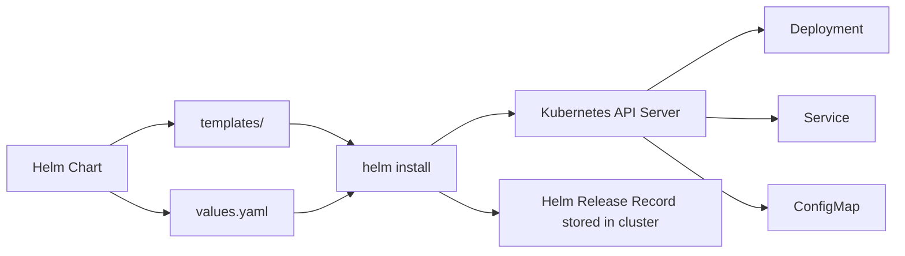

# Day 27 — Helm: Kubernetes Package Management

Managing a single application in Kubernetes eventually means managing a Deployment, a Service, a ConfigMap, an Ingress, a ServiceAccount, and a set of Secrets. Multiply that by multiple environments and multiple teams and the raw YAML approach falls apart quickly. Helm solves this by introducing templating, versioning, and a standard packaging format for Kubernetes applications.

---

## What Helm Is

Helm is a package manager for Kubernetes. The analogy to `apt` on Ubuntu is accurate: `apt install nginx` downloads a package, resolves dependencies, and installs it. `helm install my-nginx bitnami/nginx` downloads a chart, renders it into Kubernetes manifests using your configuration values, and applies them to the cluster.

Without Helm you face several problems as your applications grow:

- Dozens of YAML files with repeated values (image tag, namespace, replica count) that must be updated in sync
- No standard way to track what version of an application is running in which environment
- No built-in rollback mechanism
- Nothing that prevents you from applying an incompatible change accidentally

Helm addresses all of these.

---

## How Helm Works



When you run `helm install`, Helm reads the templates, substitutes values from `values.yaml` (and any overrides you provide), and sends the resulting manifests to the Kubernetes API server. It also stores a release record in the cluster as a Secret, which is how `helm list`, `helm rollback`, and `helm history` work.

---

## Core Concepts

### Chart

A chart is a packaged Kubernetes application. It is a directory (or a `.tgz` archive) containing:

- `Chart.yaml` — metadata: name, version, description
- `values.yaml` — default configuration values
- `templates/` — Go-templated Kubernetes manifests

### Release

When you install a chart, Helm creates a release. A release is a named, running instance of a chart. You can install the same chart multiple times under different release names (for example, installing the same application into `staging` and `production` with different values).

### Repository

A Helm repository is a collection of charts hosted at an HTTP endpoint. Artifact Hub (artifacthub.io) is the public index where most community charts are listed. Bitnami, Prometheus Community, and Ingress-NGINX all publish charts to public repositories.

### Values

Values are the configuration knobs that a chart exposes. The chart author defines what is configurable in `values.yaml` with sensible defaults. You override values at install time to customise the deployment for your environment.

---

## Install Helm

```bash
curl https://raw.githubusercontent.com/helm/helm/main/scripts/get-helm-3 | bash
helm version
```

---

## Core Commands

```bash
# Add the Bitnami chart repository
helm repo add bitnami https://charts.bitnami.com/bitnami

# Update the local cache of all repos
helm repo update

# Search for charts in your configured repos
helm search repo nginx

# Install a chart (release name: my-nginx, chart: bitnami/nginx)
helm install my-nginx bitnami/nginx

# List all releases in the current namespace
helm list

# Show the status of a specific release
helm status my-nginx

# Upgrade a release — change the replica count
helm upgrade my-nginx bitnami/nginx --set replicaCount=3

# View the history of a release
helm history my-nginx

# Roll back to revision 1
helm rollback my-nginx 1

# Remove a release
helm uninstall my-nginx
```

---

## Creating Your Own Chart

### Scaffold the structure

```bash
helm create myapp
```

This generates the following structure:

```
myapp/
  Chart.yaml          # Chart metadata
  values.yaml         # Default values
  templates/
    deployment.yaml   # Deployment template
    service.yaml      # Service template
    ingress.yaml      # Ingress template (disabled by default)
    hpa.yaml          # HorizontalPodAutoscaler (disabled by default)
    serviceaccount.yaml
    _helpers.tpl      # Template helper functions
  charts/             # Chart dependencies (empty by default)
```

### Chart.yaml

```yaml
apiVersion: v2
name: myapp
description: A Helm chart for my Flask application
type: application
version: 0.1.0
appVersion: "1.0.0"
```

`version` is the chart version. `appVersion` is the version of the application being packaged. Keep them separate — you may release chart version `0.2.0` with no change to the application itself (for example, adding a new configurable value).

### values.yaml

```yaml
replicaCount: 1

image:
  repository: myrepo/flask-app
  tag: "1.0.0"
  pullPolicy: IfNotPresent

service:
  type: ClusterIP
  port: 80
  targetPort: 5000

env:
  dbHost: postgres-service
  dbName: appdb
  dbSecretName: db-secret
```

### Deployment template

```yaml
apiVersion: apps/v1
kind: Deployment
metadata:
  name: {{ include "myapp.fullname" . }}
  labels:
    {{- include "myapp.labels" . | nindent 4 }}
spec:
  replicas: {{ .Values.replicaCount }}
  selector:
    matchLabels:
      {{- include "myapp.selectorLabels" . | nindent 6 }}
  template:
    metadata:
      labels:
        {{- include "myapp.selectorLabels" . | nindent 8 }}
    spec:
      containers:
        - name: {{ .Chart.Name }}
          image: "{{ .Values.image.repository }}:{{ .Values.image.tag }}"
          imagePullPolicy: {{ .Values.image.pullPolicy }}
          ports:
            - containerPort: {{ .Values.service.targetPort }}
          env:
            - name: DB_HOST
              value: {{ .Values.env.dbHost }}
            - name: DB_NAME
              value: {{ .Values.env.dbName }}
            - name: DB_PASSWORD
              valueFrom:
                secretKeyRef:
                  name: {{ .Values.env.dbSecretName }}
                  key: DB_PASSWORD
```

The `{{ .Values.image.repository }}:{{ .Values.image.tag }}` pattern is the core of Helm templating. At render time, Helm substitutes these with the values from `values.yaml` or any overrides you provide.

Notice that the DB password is not a value in `values.yaml` — it references a Kubernetes Secret by name. The secret name is configurable, but the secret value itself never touches Helm.

### Service template

```yaml
apiVersion: v1
kind: Service
metadata:
  name: {{ include "myapp.fullname" . }}
  labels:
    {{- include "myapp.labels" . | nindent 4 }}
spec:
  type: {{ .Values.service.type }}
  ports:
    - port: {{ .Values.service.port }}
      targetPort: {{ .Values.service.targetPort }}
      protocol: TCP
  selector:
    {{- include "myapp.selectorLabels" . | nindent 4 }}
```

### Render and validate before applying

```bash
# Render templates locally without contacting the cluster
helm template myapp ./myapp

# Validate by dry-running against the cluster (catches schema errors)
helm install myapp ./myapp --dry-run

# Install with the defaults from values.yaml
helm install myapp ./myapp
```

`helm template` is useful for debugging template syntax errors. `helm install --dry-run` goes one step further — it sends the rendered manifests to the API server for validation but does not actually create any resources.

### Override values for different environments

Create a file `values-prod.yaml` that contains only the values that differ from the defaults:

```yaml
# values-prod.yaml
replicaCount: 3

image:
  tag: "2.1.4"

service:
  type: LoadBalancer
```

```bash
helm install myapp ./myapp -f values-prod.yaml
```

Helm merges `values.yaml` with `values-prod.yaml`, with the override file taking precedence. You commit `values.yaml` and `values-prod.yaml` to git. The image tag is a value — it changes with each deployment. The secret name is a value — the secret value is not.

---

## Real Example: Flask App from Week 4

Here is a complete chart for the Flask application built in Week 4.

**Chart.yaml**

```yaml
apiVersion: v2
name: flask-app
description: Flask web application
type: application
version: 0.1.0
appVersion: "1.0.0"
```

**values.yaml**

```yaml
replicaCount: 1

image:
  repository: myrepo/flask-app
  tag: "1.0.0"
  pullPolicy: IfNotPresent

service:
  type: ClusterIP
  port: 80
  targetPort: 5000

config:
  dbHost: postgres-svc
  dbName: flaskdb
  dbSecretName: flask-db-secret
```

**templates/deployment.yaml**

```yaml
apiVersion: apps/v1
kind: Deployment
metadata:
  name: {{ include "flask-app.fullname" . }}
spec:
  replicas: {{ .Values.replicaCount }}
  selector:
    matchLabels:
      app: {{ include "flask-app.fullname" . }}
  template:
    metadata:
      labels:
        app: {{ include "flask-app.fullname" . }}
    spec:
      containers:
        - name: flask-app
          image: "{{ .Values.image.repository }}:{{ .Values.image.tag }}"
          imagePullPolicy: {{ .Values.image.pullPolicy }}
          ports:
            - containerPort: {{ .Values.service.targetPort }}
          env:
            - name: DB_HOST
              value: {{ .Values.config.dbHost }}
            - name: DB_NAME
              value: {{ .Values.config.dbName }}
            - name: DB_PASSWORD
              valueFrom:
                secretKeyRef:
                  name: {{ .Values.config.dbSecretName }}
                  key: DB_PASSWORD
```

**templates/service.yaml**

```yaml
apiVersion: v1
kind: Service
metadata:
  name: {{ include "flask-app.fullname" . }}
spec:
  type: {{ .Values.service.type }}
  ports:
    - port: {{ .Values.service.port }}
      targetPort: {{ .Values.service.targetPort }}
  selector:
    app: {{ include "flask-app.fullname" . }}
```

---

## Finding Community Charts

Artifact Hub at `artifacthub.io` is the standard place to find publicly available Helm charts. Before building a chart from scratch for infrastructure components (Prometheus, cert-manager, the Nginx Ingress controller, PostgreSQL), check whether a well-maintained chart already exists. Most do.

When evaluating a community chart, check:

- When was the last release?
- Are issues being actively responded to?
- How many stars and installs does it have?
- Does it support the Kubernetes version you are running?

Do not use community charts for your own application code — build those charts yourself so you control the structure and defaults.

---

## Hands-on Exercise

Work through these steps on a cluster where you have namespace-level create access (your minikube or a lab cluster works).

**1. Install Helm**

```bash
curl https://raw.githubusercontent.com/helm/helm/main/scripts/get-helm-3 | bash
helm version
```

**2. Add the Bitnami repo and install nginx**

```bash
helm repo add bitnami https://charts.bitnami.com/bitnami
helm repo update
helm install my-nginx bitnami/nginx
helm list
kubectl get pods
```

Wait for the pod to reach Running status, then check the service.

**3. Scaffold a new chart**

```bash
helm create flaskapp
ls flaskapp/
cat flaskapp/values.yaml
```

**4. Edit values.yaml to use a simple nginx image**

Open `flaskapp/values.yaml` and change the image repository to `nginx` and the tag to `1.25.3`. Change `service.type` to `NodePort`.

**5. Dry-run to verify no errors**

```bash
helm install flaskapp ./flaskapp --dry-run
```

If you see errors here, they are template rendering or schema validation errors. Fix them before proceeding.

**6. Install the chart**

```bash
helm install flaskapp ./flaskapp
helm list
kubectl get pods
kubectl get svc
```

**7. Upgrade to 2 replicas**

```bash
helm upgrade flaskapp ./flaskapp --set replicaCount=2
kubectl get pods
helm history flaskapp
```

You should see two revisions in the history.

**8. Roll back**

```bash
helm rollback flaskapp 1
kubectl get pods
helm history flaskapp
```

After the rollback, the pod count returns to 1 and a third revision appears in the history showing the rollback.

**9. Clean up**

```bash
helm uninstall flaskapp
helm uninstall my-nginx
kubectl get pods
```

All pods created by Helm should be gone.

---

## Summary

- Helm packages Kubernetes applications as charts: templates plus configurable values.
- A release is a deployed instance of a chart. Helm tracks revision history and supports rollback.
- Use `helm template` to render manifests locally and `helm install --dry-run` to validate before applying.
- Use separate values override files (`values-prod.yaml`, `values-staging.yaml`) rather than hardcoding environment-specific values in the chart.
- Never put secret values in `values.yaml`. Reference Kubernetes Secret names instead.
- For infrastructure components, check Artifact Hub before writing your own chart.
