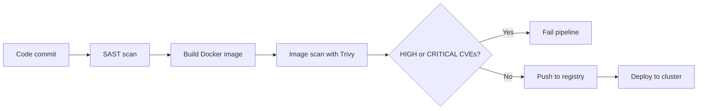

# Day 28 — Security Scanning in CI/CD

Shipping software securely does not mean running a security audit after the fact. It means catching vulnerabilities at the point where they are cheapest to fix: before they leave the developer's machine, or at the latest, before they reach production. This practice is called shifting left.

---

## Why Scanning in the Pipeline

A CVE (Common Vulnerabilities and Exposures) is a published, catalogued security vulnerability in a software component. When you install a Python package, an OS library, or pull a base Docker image, you inherit all the CVEs present in those packages at the time you pull them.

The problem compounds with container images: a typical `python:3.11` image contains hundreds of packages from the Debian base layer, plus the Python runtime. Each of those packages may have outstanding CVEs. Without scanning, you have no idea what you are deploying.

Scanning in CI/CD catches these problems at the source rather than during a production incident or a compliance audit.

---

## The Secure Pipeline



The pipeline fails at the scanning stage if high or critical vulnerabilities are found. The developer fixes the issue — typically by updating a dependency or switching to a patched base image — before the image is ever pushed to a registry.

---

## Three Types of Scanning

### 1. SAST — Static Application Security Testing

SAST tools analyse source code without running it. They look for patterns associated with vulnerabilities: SQL injection, hardcoded credentials, insecure use of cryptography, missing input validation.

Tools: Bandit (Python), Semgrep (multi-language), SonarQube (multi-language, often run as a server with a Jenkins plugin).

```bash
# Install Bandit for Python
pip install bandit

# Scan the current directory
bandit -r .

# Scan and output only HIGH severity issues
bandit -r . -l -ll
```

### 2. Container Image Scanning

After you build a Docker image, scan it before pushing it to a registry. The scanner checks every package installed in the image against a database of known CVEs. It reports the CVE ID, the severity, the affected package and version, and the version in which the vulnerability was fixed.

Tool: Trivy (covered in depth below). Alternatives: Grype, Snyk, AWS Inspector.

### 3. Dependency Scanning

Before building the image, check your application's direct dependencies for known vulnerabilities. This is different from image scanning: dependency scanning looks at your `requirements.txt` or `package.json`, not at the OS packages baked into the image.

Tools: Safety (Python), `npm audit` (Node.js), `bundler-audit` (Ruby).

---

## Trivy

Trivy is an open-source vulnerability scanner maintained by Aqua Security. It scans container images, filesystems, git repositories, and Kubernetes clusters. It is fast, easy to install, and produces output that integrates cleanly into CI/CD pipelines.

### Install Trivy

```bash
# On Ubuntu 22.04/24.04
sudo apt-get install -y wget apt-transport-https gnupg lsb-release
wget -qO - https://aquasecurity.github.io/trivy-repo/deb/public.key | sudo apt-key add -
echo "deb https://aquasecurity.github.io/trivy-repo/deb $(lsb_release -sc) main" | \
  sudo tee -a /etc/apt/sources.list.d/trivy.list
sudo apt-get update
sudo apt-get install -y trivy

# Or run via Docker without installing
docker run aquasec/trivy image nginx:latest
```

### Basic image scan

```bash
trivy image nginx:latest
```

Sample output (abbreviated):

```
nginx:latest (debian 11.8)

Total: 148 (UNKNOWN: 0, LOW: 102, MEDIUM: 32, HIGH: 11, CRITICAL: 3)

┌──────────────────────┬────────────────┬──────────┬───────────────────┬───────────────┬─────────────────────────────────────┐
│       Library        │ Vulnerability  │ Severity │ Installed Version │ Fixed Version │                Title                │
├──────────────────────┼────────────────┼──────────┼───────────────────┼───────────────┼─────────────────────────────────────┤
│ libssl3              │ CVE-2024-0727  │ HIGH     │ 3.0.11-1~deb11u2  │ 3.0.13-1      │ openssl: denial of service via      │
│                      │                │          │                   │               │ null dereference                    │
│ libcurl4             │ CVE-2023-38546 │ MEDIUM   │ 7.88.1-10+deb12u4 │ 7.88.1-10+6   │ curl: cookie injection with none    │
│                      │                │          │                   │               │ file                                │
└──────────────────────┴────────────────┴──────────┴───────────────────┴───────────────┴─────────────────────────────────────┘
```

Reading the output:

- **Library** — the package that contains the vulnerability
- **Vulnerability** — the CVE ID; search this at nvd.nist.gov for the full advisory
- **Severity** — LOW / MEDIUM / HIGH / CRITICAL
- **Installed Version** — what is currently in the image
- **Fixed Version** — the version that patches the vulnerability; if this is empty, no patch exists yet
- **Title** — a brief description of the vulnerability

### Scan only HIGH and CRITICAL

For most pipelines, you only want to gate on HIGH and CRITICAL findings. Low and Medium findings may be acceptable risk or may not have a fix available yet.

```bash
trivy image --severity HIGH,CRITICAL nginx:latest
```

### Fail the pipeline on HIGH or CRITICAL

```bash
# Exit code 1 if any HIGH or CRITICAL CVEs are found
# Exit code 0 if clean
trivy image --exit-code 1 --severity HIGH,CRITICAL myimage:latest
```

In a CI/CD pipeline, a non-zero exit code fails the stage. This is the mechanism that makes security scanning a gate rather than just a report.

### Scan a local filesystem

Run this from inside your application directory before building the image to catch vulnerable dependencies early.

```bash
trivy fs .
```

### JSON output for reporting

```bash
trivy image --format json -o trivy-report.json myimage:latest
```

The JSON report can be ingested by security dashboards, stored as a pipeline artifact, or processed by downstream tools.

---

## Adding Trivy to a Jenkins Pipeline

Add the following stage to your Jenkinsfile after the image build stage and before the push stage:

```groovy
stage('Image Scan') {
    steps {
        sh 'trivy image --exit-code 1 --severity HIGH,CRITICAL --format table ${IMAGE_NAME}:${BUILD_NUMBER}'
    }
    post {
        always {
            sh 'trivy image --format json -o trivy-report.json ${IMAGE_NAME}:${BUILD_NUMBER} || true'
            archiveArtifacts artifacts: 'trivy-report.json', allowEmptyArchive: true
        }
    }
}
```

The `post { always { ... } }` block runs regardless of whether the scan passed or failed. It saves the JSON report as a build artifact so you can review findings even when the pipeline fails. The `|| true` prevents the JSON output step from masking the actual scan failure.

A complete pipeline with scanning looks like this:

```groovy
pipeline {
    agent any
    environment {
        IMAGE_NAME = 'myrepo/flask-app'
    }
    stages {
        stage('Checkout') {
            steps {
                git branch: 'main', url: 'https://github.com/myorg/flask-app.git'
            }
        }
        stage('Dependency Scan') {
            steps {
                sh 'pip install safety && safety check -r requirements.txt'
            }
        }
        stage('Build Image') {
            steps {
                sh 'docker build -t ${IMAGE_NAME}:${BUILD_NUMBER} .'
            }
        }
        stage('Image Scan') {
            steps {
                sh 'trivy image --exit-code 1 --severity HIGH,CRITICAL --format table ${IMAGE_NAME}:${BUILD_NUMBER}'
            }
            post {
                always {
                    sh 'trivy image --format json -o trivy-report.json ${IMAGE_NAME}:${BUILD_NUMBER} || true'
                    archiveArtifacts artifacts: 'trivy-report.json', allowEmptyArchive: true
                }
            }
        }
        stage('Push Image') {
            steps {
                sh 'docker push ${IMAGE_NAME}:${BUILD_NUMBER}'
            }
        }
    }
}
```

---

## Dependency Scanning

### Python: Safety

```bash
pip install safety

# Scan the current environment
safety check

# Scan a specific requirements file
safety check -r requirements.txt
```

Safety checks your installed packages against a database of known vulnerabilities. A finding looks like:

```
-> Vulnerability found in requests version 2.18.0
   Vulnerability ID: 36020
   Affected spec: <2.20.0
   ADVISORY: Requests before 2.20.0 is vulnerable to HTTP Host header injection.
   CVE-2018-18074
```

### Node.js: npm audit

```bash
# Scan dependencies in the current directory
npm audit

# Output as JSON for processing
npm audit --json

# Fail if any HIGH or CRITICAL vulnerabilities are found
npm audit --audit-level=high
```

### Adding dependency scanning as a pipeline stage

```groovy
stage('Dependency Scan') {
    steps {
        // Python
        sh 'pip install safety && safety check -r requirements.txt'

        // Or Node.js
        // sh 'npm audit --audit-level=high'
    }
}
```

---

## Dockerfile Security Best Practices

These apply to every image you build. Most of them also reduce the number of CVE findings Trivy will report.

**Use specific image tags, not `latest`**

```dockerfile
# Bad
FROM python:latest

# Good
FROM python:3.11.8-slim-bookworm
```

`latest` is unpredictable. The image you pull today may not be the one pulled in six months. Pin the exact digest if you need full reproducibility.

**Use multi-stage builds**

Build dependencies (compilers, build tools, test libraries) are not needed in the final image. Multi-stage builds remove them:

```dockerfile
FROM python:3.11.8-slim-bookworm AS builder
WORKDIR /app
COPY requirements.txt .
RUN pip install --user -r requirements.txt

FROM python:3.11.8-slim-bookworm
WORKDIR /app
COPY --from=builder /root/.local /root/.local
COPY . .
CMD ["python", "app.py"]
```

The final image contains only the runtime, not pip's cache or any build tools.

**Run as a non-root user**

```dockerfile
RUN addgroup --system appgroup && adduser --system --ingroup appgroup appuser
USER appuser
```

**Never put secrets in ENV or COPY**

```dockerfile
# Bad — this is in the image layer permanently
ENV DB_PASSWORD=supersecret123

# Bad — this copies a file with credentials into the image
COPY .env /app/.env
```

Pass secrets at runtime via Kubernetes Secrets (as shown in Day 26), not at build time.

**Use `.dockerignore`**

```
.git
.env
*.pyc
__pycache__
.pytest_cache
*.log
node_modules
```

A missing `.dockerignore` can copy `.git` (which may contain sensitive commit history), `.env` files, or large directories into the image.

**Minimise installed packages**

```dockerfile
RUN apt-get update && apt-get install -y --no-install-recommends \
    libpq5 \
  && rm -rf /var/lib/apt/lists/*
```

Every package you install is a potential source of CVEs. `--no-install-recommends` skips optional dependencies that apt would otherwise install.

---

## Secret Scanning

Developers accidentally commit secrets to git more often than most teams acknowledge. API keys, database passwords, and AWS credentials end up in commit history. Once committed, even if the file is deleted in a later commit, the secret remains accessible in the git history.

Two tools that help:

- **git-secrets** (AWS Labs): prevents commits that contain patterns matching known secret formats
- **truffleHog**: scans git history for high-entropy strings and known credential patterns

As a quick manual check before a code review or before making a repository public:

```bash
# Check if any .env files appear anywhere in git history
git log --all --full-history -- '*.env'

# Show the actual content of those commits
git log --all --full-history -p -- '*.env'
```

If these commands return anything, the repository's history contains committed environment files. Rotation of any credentials found is mandatory — removing the file in a new commit is not sufficient.

---

## AWS ECR Image Scanning

If you push images to Amazon ECR, you can enable automated scanning without running Trivy yourself.

**Enable enhanced scanning on a repository**

```bash
aws ecr put-registry-scanning-configuration \
  --scan-type ENHANCED \
  --rules '[{"repositoryFilters":[{"filter":"*","filterType":"WILDCARD"}],"scanFrequency":"CONTINUOUS_SCAN"}]' \
  --region us-east-1
```

Enhanced scanning uses AWS Inspector and scans images continuously as new CVE data becomes available, not just at push time.

**View scan findings for an image**

```bash
aws ecr describe-image-scan-findings \
  --repository-name flask-app \
  --image-id imageTag=1.0.0 \
  --region us-east-1
```

ECR scanning integrates with AWS Security Hub, so findings appear in a central dashboard alongside other security events across your account.

---

## Hands-on Exercise

**1. Install Trivy**

```bash
sudo apt-get install -y wget apt-transport-https gnupg lsb-release
wget -qO - https://aquasecurity.github.io/trivy-repo/deb/public.key | sudo apt-key add -
echo "deb https://aquasecurity.github.io/trivy-repo/deb $(lsb_release -sc) main" | \
  sudo tee -a /etc/apt/sources.list.d/trivy.list
sudo apt-get update && sudo apt-get install -y trivy
trivy --version
```

**2. Scan `python:3.11` and note the findings**

```bash
trivy image --severity HIGH,CRITICAL python:3.11
```

Note the total number of HIGH and CRITICAL findings.

**3. Scan `python:3.11-alpine` and compare**

```bash
trivy image --severity HIGH,CRITICAL python:3.11-alpine
```

Alpine Linux uses musl libc and a minimal package set. The number of CVE findings is substantially lower than the Debian-based image. This is the primary reason many production images use Alpine as a base.

**4. Scan your Flask application directory**

From inside your Flask app directory (the one containing `requirements.txt` and your `Dockerfile`):

```bash
trivy fs .
```

This checks both your Python dependencies and any other files in the directory.

**5. Run Safety on your requirements.txt**

```bash
pip install safety
safety check -r requirements.txt
```

If your `requirements.txt` is pinned to current versions with no known CVEs, this will return clean.

**6. Add a Trivy stage to your Jenkinsfile**

Open the Jenkinsfile from your Week 5 project and add the Image Scan stage from the snippet above, placed after `Build Image` and before `Push Image`. Commit and push. Verify the scan runs in the Jenkins build log.

**7. Introduce a known vulnerable dependency and observe the alert**

Add this line to your `requirements.txt`:

```
requests==2.18.0
```

Then run:

```bash
safety check -r requirements.txt
```

You should see an advisory for CVE-2018-18074 (HTTP Host header injection in requests before 2.20.0). Remove the line and revert to a current version.

---

## Summary

- Scan at every stage: dependencies before building, the image after building, and source code for hardcoded secrets.
- Trivy is the standard open-source tool for image and filesystem scanning. Learn to read CVE output: look at the Fixed Version column first — if a fix exists, update the package.
- Gate the pipeline with `--exit-code 1 --severity HIGH,CRITICAL`. A clean scan is required before pushing to the registry.
- Alpine-based images have significantly fewer CVEs than Debian-based images because they contain fewer packages. Prefer slim or alpine base images where your application supports them.
- Never commit secrets. Scan git history before making a repository public or sharing it externally.
- On AWS, ECR enhanced scanning provides continuous CVE monitoring without any pipeline changes.
