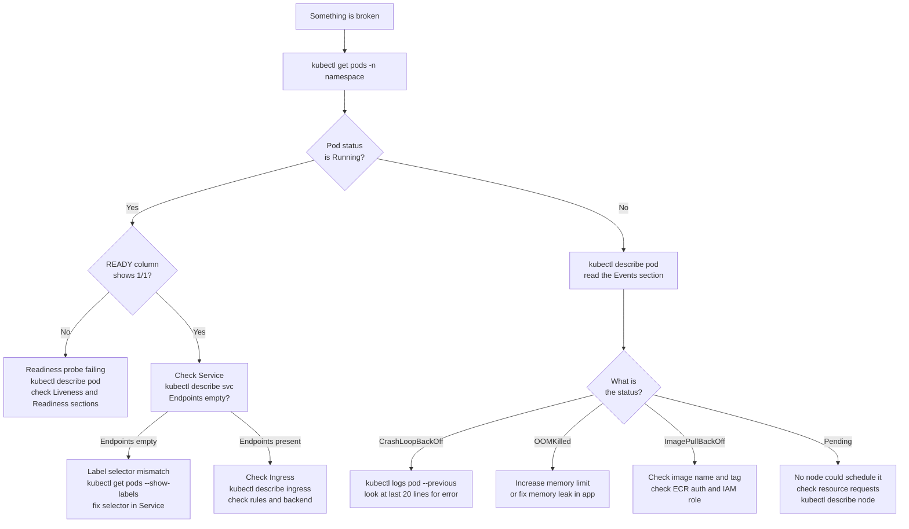
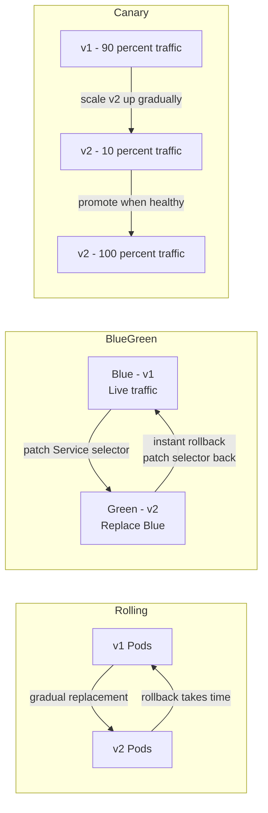

# Day 29 — Kubernetes Troubleshooting and Advanced Deployment Patterns

## Learning Objectives

By the end of this day you will:
- Apply a systematic process for diagnosing broken Kubernetes workloads
- Interpret Pod status conditions and know what each one means
- Use the core troubleshooting commands fluently: `describe`, `logs`, `exec`, `events`, `top`
- Diagnose and fix four common real-world failure scenarios
- Explain the difference between rolling, blue-green, and canary deployments
- Implement a blue-green deployment using Kubernetes Services and label selectors
- Implement a basic canary deployment using replica counts

---

## Section 1: Kubernetes Troubleshooting

### The Troubleshooting Mindset

Kubernetes has many moving parts: the scheduler, the kubelet, the container runtime, your application code, DNS, network policies, and storage. When something breaks, panic and random kubectl commands waste time.

Work from the outside in:

1. Is the Pod running and ready?
2. If not — what is the Pod status and what do the Events say?
3. If the Pod is running — is the application inside it responding?
4. If the app responds — is the Service routing to the right Pods?
5. If the Service routes correctly — is the Ingress resolving the right hostname?

This order matters. You cannot have a healthy Service if the Pod behind it is crashing. Fix the innermost problem first.

### Troubleshooting decision tree



---

### Common Pod Statuses and What They Mean

| Status | Meaning | First command to run |
|--------|---------|---------------------|
| Pending | Pod created but not yet scheduled onto a node | `kubectl describe pod` — check Events for scheduling failure reason |
| CrashLoopBackOff | Container started, crashed, restarted, crashed again — Kubernetes is backing off retries | `kubectl logs <pod> --previous` |
| OOMKilled | Container was killed by the kernel because it exceeded its memory limit | `kubectl describe pod` — check `Last State` section for exit code 137 |
| ImagePullBackOff | kubelet cannot pull the container image | Check image name and tag, check ECR authentication and IAM role |
| ErrImageNeverPull | `imagePullPolicy: Never` is set but the image is not present on the node | Fix `imagePullPolicy` or pre-load the image onto the node |
| Terminating (stuck) | A finalizer is blocking the Pod from being deleted | `kubectl patch pod <name> -p '{"metadata":{"finalizers":[]}}' --type=merge` |
| Completed | Container ran to completion (exit code 0) — expected for Jobs, not for Deployments | Check if you deployed a Job workload as a Deployment by mistake |

---

### Essential Troubleshooting Commands

```bash
# Overview of all resources in a namespace
kubectl get all -n flask-prod

# Full description of a pod — the Events section at the bottom is the most useful part
kubectl describe pod <pod-name> -n flask-prod

# Container logs (current running container)
kubectl logs <pod-name> -n flask-prod

# Logs from the previous container instance — use this after a crash
kubectl logs <pod-name> --previous -n flask-prod

# Stream logs in real time from all pods in a Deployment
kubectl logs -f deployment/flaskapp -n flask-prod

# Open a shell inside a running container for live debugging
kubectl exec -it <pod-name> -n flask-prod -- /bin/sh

# All events in a namespace, sorted by time — useful for seeing what happened and when
kubectl get events --sort-by='.lastTimestamp' -n flask-prod

# Resource usage per pod (requires metrics-server to be installed)
kubectl top pods -n flask-prod
kubectl top nodes

# Check if a Service has any Pods behind it
kubectl describe svc flaskapp -n flask-prod
# Look at the Endpoints line — if it shows <none>, no Pods match the selector

# Run a temporary debug pod inside the cluster to test connectivity
kubectl run debug --image=busybox --rm -it --restart=Never -- \
  wget -qO- http://flaskapp.flask-prod.svc.cluster.local:8080/health

# Port-forward to a Service — bypasses Ingress, useful to isolate whether Ingress is the problem
kubectl port-forward svc/flaskapp 8080:8080 -n flask-prod

# Check all Ingress rules in a namespace
kubectl describe ingress -n flask-prod
```

---

### Real Debugging Scenarios

Each scenario below is a situation you will encounter in a real job. The pattern is: observe the symptom, run the diagnosis command, interpret what you see, apply the fix.

#### Scenario 1: CrashLoopBackOff

You deployed a new version of the app and see this:

```
$ kubectl get pods -n flask-prod
NAME                        READY   STATUS             RESTARTS   AGE
flaskapp-7d4b8c9f-xvz9p     0/1     CrashLoopBackOff   5          3m
```

The container started, crashed immediately, and Kubernetes has restarted it five times. The restart backoff is now 5 minutes, which is why the pod appears stuck.

Diagnosis:

```bash
kubectl logs flaskapp-7d4b8c9f-xvz9p --previous -n flask-prod
```

The `--previous` flag gets logs from the crashed container instance, not the current (likely still-starting) one. Look at the last 20 lines. Common causes:
- A required environment variable is not set — the app cannot start without it
- A config file is missing or malformed
- The database connection string points to the wrong host and the app exits on startup failure

Fix the root cause (add the missing env var to the Deployment, fix the config, correct the DB host), then redeploy:

```bash
kubectl rollout restart deployment/flaskapp -n flask-prod
```

#### Scenario 2: Pending — cannot be scheduled

```
$ kubectl describe pod flaskapp-7d4b8c9f-xvz9p -n flask-prod
...
Events:
  Warning  FailedScheduling  default-scheduler  0/3 nodes are available:
  3 Insufficient memory.
```

The scheduler tried all three nodes and none had enough free memory to satisfy the Pod's memory request.

Fix options:
- Reduce the memory request in the Deployment spec if the request is higher than the app actually needs
- Scale the node group to add more nodes
- Check if other Pods are using more memory than they should

```bash
kubectl top nodes
kubectl top pods -n flask-prod
```

#### Scenario 3: Service has no endpoints

```
$ kubectl describe svc flaskapp -n flask-prod
Name:              flaskapp
Selector:          app=flaskapp,tier=web
Endpoints:         <none>
```

`Endpoints: <none>` means the Service selector does not match any running Pod. Traffic would reach the Service and immediately fail with a connection refused.

Diagnosis:

```bash
# What labels do the actual pods have?
kubectl get pods -n flask-prod --show-labels

# What selector does the Service use?
kubectl get svc flaskapp -n flask-prod -o yaml | grep -A5 selector
```

You might see that the Pods have `app=flaskapp` but not `tier=web`, or that `tier` is spelled `tier=backend` in the Deployment. Fix the label in either the Deployment template or the Service selector so they match.

#### Scenario 4: ImagePullBackOff

```
$ kubectl describe pod flaskapp-7d4b8c9f-xvz9p -n flask-prod
...
Events:
  Warning  Failed  kubelet  Failed to pull image
  "123456789012.dkr.ecr.us-east-1.amazonaws.com/flaskapp:v2.0.0":
  rpc error: code = Unknown desc = failed to pull and unpack image:
  failed to resolve reference: unexpected status code 403 Forbidden
```

403 Forbidden from ECR means the kubelet has no valid credentials to pull the image. Check in this order:

1. Does the Pod spec have an `imagePullSecrets` field? If not, add one pointing to the `ecr-secret` created in day 20.
2. Is the `ecr-secret` still valid? The ECR token expires after 12 hours. Delete and recreate the secret:
   ```bash
   kubectl delete secret ecr-secret -n flask-prod
   kubectl create secret docker-registry ecr-secret \
     --docker-server=123456789012.dkr.ecr.us-east-1.amazonaws.com \
     --docker-username=AWS \
     --docker-password=$(aws ecr get-login-password --region us-east-1) \
     --namespace flask-prod
   ```
3. Does the tag `v2.0.0` exist in ECR? Verify with:
   ```bash
   aws ecr describe-images --repository-name flaskapp --region us-east-1
   ```

---

### Useful Debugging Tools

**Ephemeral debug containers (Kubernetes 1.23+)**

If a container is running but has no shell (common in minimal production images), attach a debug container to it without restarting the Pod:

```bash
kubectl debug -it <pod-name> \
  --image=busybox \
  --target=<container-name> \
  -n flask-prod
```

**netshoot for network debugging**

`netshoot` is an image that contains every common network diagnostic tool: `curl`, `dig`, `nslookup`, `tcpdump`, `ping`, `netstat`, `ss`, and more. Run it as a temporary Pod inside the cluster to test DNS and connectivity:

```bash
kubectl run netshoot \
  --image=nicolaka/netshoot \
  --rm -it \
  --restart=Never \
  -n flask-prod
```

Inside the netshoot shell you can test DNS resolution, reach Services by their cluster DNS name, and trace routes.

---

## Section 2: Advanced Deployment Patterns

### Why Rolling Updates Are Not Always Enough

The rolling update strategy you used in week 3 is the right default for most workloads. Kubernetes gradually replaces old Pods with new ones, and if something goes wrong it can roll back.

Rolling updates have limits for high-risk production changes:
- Rollback is not instant — a new rollout has to complete before traffic is fully on the old version
- Both old and new versions run simultaneously during the rollout — if they are incompatible (different database schemas, different API contracts) this causes errors
- You cannot test the new version with real production traffic before committing to the full rollout

Blue-green and canary deployments address these specific situations.

### Comparison of the three patterns



---

### Blue-Green Deployment

In a blue-green deployment you run two complete, identical environments at the same time:
- **Blue** is the current live version. All production traffic goes to it.
- **Green** is the new version. It is fully deployed and tested, but receives no traffic yet.

When you are ready to cut over, you change a single field in the Service — the label selector — so that it starts sending traffic to Green instead of Blue. The switch is instant. If something goes wrong, you change the selector back and Blue is live again within seconds.

```yaml
# blue-deployment.yaml
apiVersion: apps/v1
kind: Deployment
metadata:
  name: flaskapp-blue
  namespace: flask-prod
spec:
  replicas: 3
  selector:
    matchLabels:
      app: flaskapp
      version: blue
  template:
    metadata:
      labels:
        app: flaskapp
        version: blue
    spec:
      containers:
        - name: flaskapp
          image: nginx:1.24
          ports:
            - containerPort: 80
```

```yaml
# green-deployment.yaml
apiVersion: apps/v1
kind: Deployment
metadata:
  name: flaskapp-green
  namespace: flask-prod
spec:
  replicas: 3
  selector:
    matchLabels:
      app: flaskapp
      version: green
  template:
    metadata:
      labels:
        app: flaskapp
        version: green
    spec:
      containers:
        - name: flaskapp
          image: nginx:1.25
          ports:
            - containerPort: 80
```

```yaml
# service.yaml — initially points to blue
apiVersion: v1
kind: Service
metadata:
  name: flaskapp
  namespace: flask-prod
spec:
  selector:
    app: flaskapp
    version: blue
  ports:
    - port: 80
      targetPort: 80
```

Deploy Blue, confirm it is working, deploy Green (but do not point the Service at it yet). When Green is ready and tested:

```bash
# Cut over to Green
kubectl patch svc flaskapp -n flask-prod \
  -p '{"spec":{"selector":{"version":"green"}}}'

# Verify the Service now routes to Green pods
kubectl describe svc flaskapp -n flask-prod
```

If something is wrong in Green, roll back to Blue instantly:

```bash
kubectl patch svc flaskapp -n flask-prod \
  -p '{"spec":{"selector":{"version":"blue"}}}'
```

Once Green is confirmed stable and you are no longer going to roll back, delete the Blue Deployment to reclaim compute:

```bash
kubectl delete deployment flaskapp-blue -n flask-prod
```

**Pros:** instant cutover, instant rollback, zero downtime, easy to test Green before exposing it
**Cons:** double the compute cost while both environments run, stateful applications require careful handling (both versions must be compatible with the same database schema simultaneously)

---

### Canary Deployment

A canary deployment sends a small fraction of real production traffic to the new version while the majority continues going to the stable version. You watch metrics and error rates on the canary. If it looks good, you gradually shift more traffic to it. If something is wrong, you scale the canary back to zero.

The simplest implementation in Kubernetes uses the fact that a Service with a selector distributes traffic across all matching Pods based on the number of Pods. If you have 9 v1 Pods and 1 v2 Pod behind the same selector, roughly 10% of requests go to v2.

Both Deployments share the same `app: flaskapp` label so the Service selects both:

```yaml
# v1 deployment — 9 replicas
apiVersion: apps/v1
kind: Deployment
metadata:
  name: flaskapp-v1
  namespace: flask-prod
spec:
  replicas: 9
  selector:
    matchLabels:
      app: flaskapp
      version: v1
  template:
    metadata:
      labels:
        app: flaskapp
        version: v1
    spec:
      containers:
        - name: flaskapp
          image: 123456789012.dkr.ecr.us-east-1.amazonaws.com/flaskapp:v1.0.0
          ports:
            - containerPort: 8080
```

```yaml
# v2 canary deployment — start with 1 replica
apiVersion: apps/v1
kind: Deployment
metadata:
  name: flaskapp-v2
  namespace: flask-prod
spec:
  replicas: 1
  selector:
    matchLabels:
      app: flaskapp
      version: v2
  template:
    metadata:
      labels:
        app: flaskapp
        version: v2
    spec:
      containers:
        - name: flaskapp
          image: 123456789012.dkr.ecr.us-east-1.amazonaws.com/flaskapp:v2.0.0
          ports:
            - containerPort: 8080
```

```yaml
# Service selects ALL flaskapp pods (both v1 and v2)
apiVersion: v1
kind: Service
metadata:
  name: flaskapp
  namespace: flask-prod
spec:
  selector:
    app: flaskapp   # matches both v1 and v2 pods
  ports:
    - port: 80
      targetPort: 8080
```

Gradually promote the canary:

```bash
# Start: 1 out of 10 pods is v2 = approximately 10% canary traffic
kubectl scale deployment flaskapp-v2 --replicas=1 -n flask-prod
kubectl scale deployment flaskapp-v1 --replicas=9 -n flask-prod

# After monitoring — shift to 50/50
kubectl scale deployment flaskapp-v2 --replicas=5 -n flask-prod
kubectl scale deployment flaskapp-v1 --replicas=5 -n flask-prod

# Full promotion — all traffic to v2
kubectl scale deployment flaskapp-v2 --replicas=10 -n flask-prod
kubectl scale deployment flaskapp-v1 --replicas=0 -n flask-prod

# Clean up v1 once promotion is stable
kubectl delete deployment flaskapp-v1 -n flask-prod
```

Abort the canary at any point by scaling v2 back to zero:

```bash
kubectl scale deployment flaskapp-v2 --replicas=0 -n flask-prod
```

**Note on more advanced canary routing:** The replica-based approach distributes traffic by Pod count, which is approximate and only controls percentages at the granularity of whole Pods. For precise percentage-based routing (e.g. exactly 5% to the canary) or header-based routing (e.g. only requests with `X-Canary: true` go to v2), use nginx-ingress annotations or Argo Rollouts, which is covered in day 30.

---

### Choosing the Right Deployment Pattern

| Pattern | Rollback speed | Compute cost | Complexity | Best for |
|---------|---------------|-------------|------------|---------|
| Rolling update | Slow — a new rollout must complete | Normal — old Pods terminate as new ones start | Low | Most deployments, stateless apps |
| Blue-Green | Instant — one Service patch | 2x during deployment window | Medium | Stateless apps, when you need guaranteed instant rollback |
| Canary | Instant — scale canary to zero | Slightly more than normal | Medium-High | High-risk changes, gradual validation against real traffic |

There is no universally correct choice. Many teams use rolling updates for routine version bumps, blue-green for major releases, and canary when they are uncertain about a change and want real user validation before full rollout.

---

## Hands-on Exercise

Work through these in order. All commands use the `flask-prod` namespace.

**Exercise 1: Simulate and diagnose CrashLoopBackOff**

Deploy a Pod with a deliberately broken command:

```yaml
apiVersion: v1
kind: Pod
metadata:
  name: crash-demo
  namespace: flask-prod
spec:
  containers:
    - name: app
      image: busybox
      command: ["sh", "-c", "echo 'starting up'; sleep 2; exit 1"]
```

```bash
kubectl apply -f crash-demo.yaml
# Wait 30 seconds
kubectl get pods -n flask-prod
# Observe CrashLoopBackOff
kubectl logs crash-demo --previous -n flask-prod
kubectl describe pod crash-demo -n flask-prod
kubectl delete pod crash-demo -n flask-prod
```

**Exercise 2: Simulate and fix a Service selector mismatch**

```bash
# Deploy a pod with label app=myapp
kubectl run myapp --image=nginx --labels="app=myapp" -n flask-prod

# Create a Service with a mistyped selector
kubectl expose pod myapp --name=myapp-svc \
  --port=80 --target-port=80 \
  --selector="app=my-app" \
  -n flask-prod

# Observe: no endpoints
kubectl describe svc myapp-svc -n flask-prod

# Diagnose
kubectl get pods -n flask-prod --show-labels

# Fix: patch the Service selector to the correct label
kubectl patch svc myapp-svc -n flask-prod \
  -p '{"spec":{"selector":{"app":"myapp"}}}'

# Verify endpoints are now populated
kubectl describe svc myapp-svc -n flask-prod

# Clean up
kubectl delete pod myapp -n flask-prod
kubectl delete svc myapp-svc -n flask-prod
```

**Exercise 3: Blue-Green deployment**

```bash
# Create the Blue Deployment (nginx:1.24)
kubectl create deployment flaskapp-blue \
  --image=nginx:1.24 \
  --replicas=2 \
  -n flask-prod
kubectl label pods -l app=flaskapp-blue version=blue -n flask-prod
# Note: for a proper blue-green use the full YAML from section 2 so labels are in the pod template

# Apply the Service pointing to version=blue using the YAML from section 2
kubectl apply -f service.yaml

# Verify service endpoints point to blue pods
kubectl describe svc flaskapp -n flask-prod

# Deploy Green (nginx:1.25) — do NOT change the Service yet
kubectl apply -f green-deployment.yaml

# Simulate a green smoke test
kubectl port-forward deployment/flaskapp-green 8080:80 -n flask-prod &
curl http://localhost:8080
kill %1

# Cut over
kubectl patch svc flaskapp -n flask-prod \
  -p '{"spec":{"selector":{"version":"green"}}}'
kubectl describe svc flaskapp -n flask-prod

# Rollback to blue
kubectl patch svc flaskapp -n flask-prod \
  -p '{"spec":{"selector":{"version":"blue"}}}'
kubectl describe svc flaskapp -n flask-prod

# Clean up
kubectl delete deployment flaskapp-blue flaskapp-green -n flask-prod
kubectl delete svc flaskapp -n flask-prod
```

**Exercise 4: Observe resource usage**

```bash
# This requires metrics-server to be installed on your cluster
kubectl top pods -n flask-prod
kubectl top nodes
```

If `kubectl top` returns `error: Metrics API not available`, install metrics-server:

```bash
kubectl apply -f https://github.com/kubernetes-sigs/metrics-server/releases/latest/download/components.yaml
```

Wait 60 seconds for it to collect data, then run `kubectl top` again.
