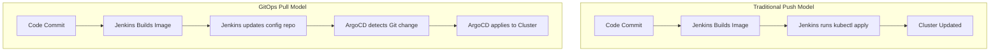
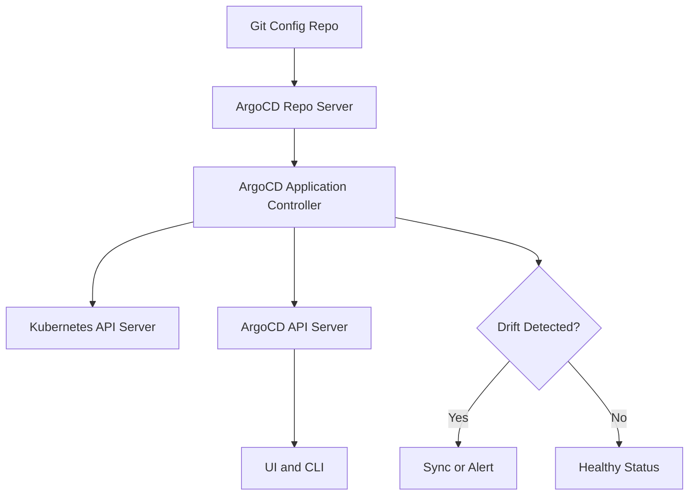
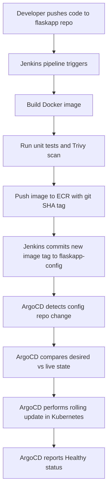

# Day 30 — GitOps and ArgoCD

Day 30 is the final day of the 30-day DevOps program. Today you close the loop on everything: code, containers, pipelines, and Kubernetes — all connected through GitOps.

---

## What is GitOps

GitOps is an operating model where Git is the single source of truth for both application code and the desired state of your infrastructure and cluster.

Two core rules:

1. Everything is declared in Git. If it is not in Git, it does not exist as far as the system is concerned.
2. The cluster always converges to what Git says. Automated agents continuously reconcile the live state against the desired state.

Why it matters: there are no more `kubectl apply` commands from a laptop or from a CI server reaching into production. There is no more "what is actually running in prod?" — you read the Git history.

---

## GitOps vs Traditional CI/CD

In a traditional push-based pipeline, the CI server has cluster credentials and pushes changes directly. In a GitOps pull-based model, nothing pushes to the cluster. An agent running inside the cluster watches Git and pulls changes in.



Key difference: the cluster never accepts pushes from outside. ArgoCD is the only thing that writes to the cluster, and it only does so because Git told it to.

---

## ArgoCD Architecture

ArgoCD is a declarative GitOps continuous delivery tool for Kubernetes. It runs inside the cluster and manages itself as a set of Kubernetes resources.



- **Repo Server**: clones the Git repository and generates the Kubernetes manifests (raw YAML, Helm, or Kustomize)
- **Application Controller**: compares the desired state from Git against the live state in the cluster
- **API Server**: serves the web UI and CLI; handles authentication
- **Redis**: caches state so the controller is not hitting Git and the Kubernetes API on every loop

---

## Install ArgoCD

```bash
kubectl create namespace argocd
kubectl apply -n argocd -f https://raw.githubusercontent.com/argoproj/argo-cd/stable/manifests/install.yaml

# Wait for all pods to be ready
kubectl wait --for=condition=Ready pods --all -n argocd --timeout=300s

# Port-forward the UI to localhost
kubectl port-forward svc/argocd-server -n argocd 8080:443
```

Get the initial admin password:

```bash
kubectl -n argocd get secret argocd-initial-admin-secret \
  -o jsonpath="{.data.password}" | base64 -d && echo
```

Log in at `https://localhost:8080`. The browser will warn about a self-signed certificate — proceed anyway. Change the admin password on first login under **User Info > Update Password**.

---

## The Config Repo Pattern

A core GitOps practice is separating the application code repository from the deployment configuration repository.

| Repository | Contents | Owned by |
|---|---|---|
| `flaskapp` | Python source, Dockerfile, Jenkinsfile | Developers |
| `flaskapp-config` | Helm chart, values per environment | DevOps team |

Why keep them separate?

- A code change does not automatically trigger a deploy. The CI pipeline decides when to update the config repo.
- The config repo is the audit trail for production. You can look at the Git log and know exactly what image tag was running at any point in time.
- Access control is cleaner. Developers do not need write access to the config repo.

---

## ArgoCD Application Resource

The `Application` is a Kubernetes CRD (Custom Resource Definition) that tells ArgoCD what to deploy, from where, and to which cluster and namespace.

```yaml
apiVersion: argoproj.io/v1alpha1
kind: Application
metadata:
  name: flaskapp
  namespace: argocd
spec:
  project: default
  source:
    repoURL: https://github.com/<your-github-username>/flaskapp-config
    targetRevision: HEAD
    path: helm/flaskapp
  destination:
    server: https://kubernetes.default.svc
    namespace: default
  syncPolicy:
    automated:
      prune: true       # Delete resources that exist in the cluster but not in Git
      selfHeal: true    # Revert manual kubectl changes automatically
    syncOptions:
      - CreateNamespace=true
```

Apply it:

```bash
kubectl apply -f application.yaml
```

After a few seconds, ArgoCD will clone the config repo, render the Helm chart, and apply the resulting manifests.

---

## Key ArgoCD Concepts

| Concept | Meaning |
|---|---|
| Desired state | What the Git repository declares |
| Live state | What is actually running in the cluster |
| Sync | The act of making live state match desired state |
| Prune | Deleting cluster resources that no longer exist in Git |
| Self-heal | Automatically reverting manual changes made outside of Git |
| Health status | Healthy / Progressing / Degraded / Suspended / Missing |

**Drift** means the live state has diverged from the desired state. ArgoCD detects drift on every reconciliation loop (roughly every 3 minutes by default, or immediately via webhook).

---

## ArgoCD CLI

```bash
# Install the CLI
curl -sSL -o argocd https://github.com/argoproj/argo-cd/releases/latest/download/argocd-linux-amd64
chmod +x argocd && sudo mv argocd /usr/local/bin/

# Log in
argocd login localhost:8080 --username admin --password <password> --insecure

# List all applications
argocd app list

# Get detailed status of an application
argocd app get flaskapp

# Trigger a manual sync
argocd app sync flaskapp

# View deployment history
argocd app history flaskapp

# Roll back to a previous revision
argocd app rollback flaskapp 3
```

---

## The Full GitOps Workflow End-to-End

This is how a single developer commit flows all the way to a running pod in production without anyone running `kubectl apply` manually.



The Jenkins pipeline stage that updates the config repo:

```groovy
stage('Update Config Repo') {
    steps {
        withCredentials([string(credentialsId: 'github-token', variable: 'GIT_TOKEN')]) {
            sh """
                git clone https://${GIT_TOKEN}@github.com/<your-github-username>/flaskapp-config.git
                cd flaskapp-config
                sed -i 's|tag: .*|tag: "${env.IMAGE_TAG}"|' helm/flaskapp/values.yaml
                git config user.email "ci@yourcompany.com"
                git config user.name "Jenkins CI"
                git add helm/flaskapp/values.yaml
                git commit -m "chore: update flaskapp image to ${env.IMAGE_TAG}"
                git push
            """
        }
    }
}
```

`IMAGE_TAG` should be set earlier in the pipeline as the short Git SHA: `env.IMAGE_TAG = sh(script: 'git rev-parse --short HEAD', returnStdout: true).trim()`.

---

## What Happens When You kubectl apply Manually

With `selfHeal: true`, ArgoCD will detect the drift on its next reconciliation loop (within 3 minutes) and revert the change. This is intentional — it enforces the rule that Git is the only source of truth.

For a genuine emergency where you need to make a temporary manual change:

```bash
# Disable auto-sync for this application
argocd app set flaskapp --sync-policy none

# Make the emergency change
kubectl scale deployment flaskapp --replicas=0 -n flask-prod

# Re-enable auto-sync when done
argocd app set flaskapp --sync-policy automated
```

Any emergency change should be followed immediately by a commit to Git that formalises the change, so the config repo stays accurate.

---

## Hands-on Exercise

1. Install ArgoCD in your local Kubernetes cluster (minikube or kind).
2. Get the admin password and log into the UI at `https://localhost:8080`.
3. Create a public GitHub repository named `flaskapp-config`.
4. Add the Helm chart from Day 27 to `helm/flaskapp/` in that repository.
5. Create an ArgoCD `Application` resource pointing at your config repo and apply it.
6. Verify that ArgoCD syncs successfully and the application shows as **Healthy** in the UI.
7. Make a change: edit `replicaCount` in `values.yaml`, commit, and push to GitHub.
8. Watch ArgoCD auto-sync within 3 minutes, or trigger it manually with `argocd app sync flaskapp`.
9. Demonstrate self-heal: run `kubectl scale deployment flaskapp --replicas=10 -n default`, then watch ArgoCD revert the replica count back to what `values.yaml` declares.

---

*Day 30 complete. That is the full 30-day program.*
